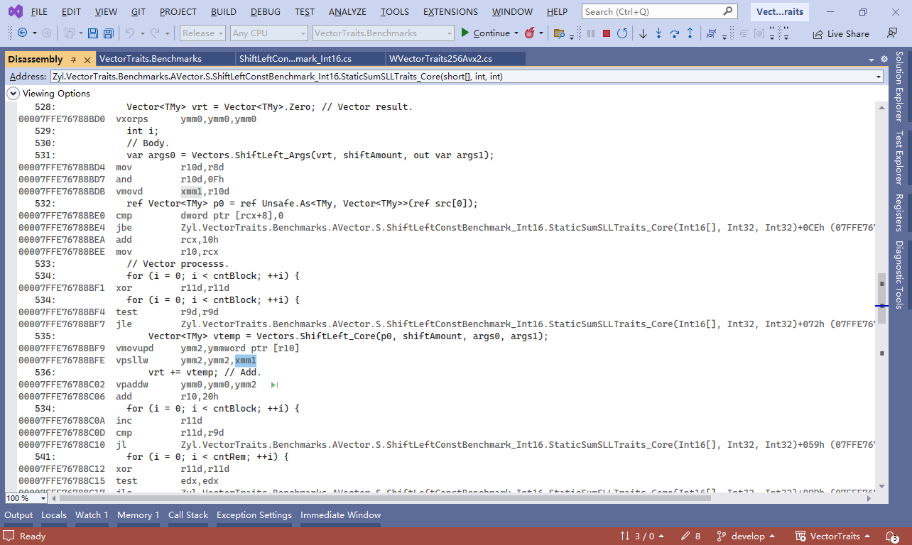

# VectorTraits
English | [Chinese(中文)](README_Chinese.md)

VectorTraits: SIMD Vector type traits methods (SIMD向量类型的特征方法).

[](https://www.nuget.org/packages/VectorTraits)

This library provides many important arithmetic methods(e.g. Shift, Shuffle, NarrowSaturate) and constants for vector types, making it easier for you to write cross-platform SIMD code. It takes full advantage of the X86 and Arm architectures' intrinsic functions to achieve hardware acceleration and can enjoy inline compilation optimization.

Commonly Used Types:
- `Vectors`: For vector types, common tool functions are provided, e.g. Create(T/T[]/Span/ReadOnlySpan), CreatePadding, CreateRotate, CreateByFunc, CreateByDouble ... It also provides traits methods for vectors, e.g. ShiftLeft、ShiftRightArithmetic、ShiftRightLogical、Shuffle ...
- `Vectors<T>`: For vector types, constants are provided for various element types. e.g. Serial, SerialDesc, XyzwWMask, MantissaMask, MaxValue, MinValue, NormOne, FixedOne, E, Pi, Tau, VMaxByte, VReciprocalMaxSByte ...
- `Vector64s/Vector128s/Vector256s`: Common tool functions and traits methods are provided for vectors of fixed bit width (Vector64/Vector128/Vector256).
- `Vector64s<T>/Vector128s<T>/Vector256s<T>`: Provides constants of various element types for vectors of fixed bit width.
- `Scalars`: For scalar types, various tool functions are provided. e.g. GetByDouble, GetFixedByDouble, GetByBits, GetBitsMask ...
- `Scalars<T>`: For scalar types, a number of constants are provided. e.g. ExponentBits, MantissaBits, MantissaMask, MaxValue, MinValue, NormOne, FixedOne, E, Pi, Tau, VMaxByte, VReciprocalMaxSByte ...
- `VectorTextUtil`: Provides some textual instrumental functions for vectors. e.g. GetHex, Format, WriteLine ...

Traits methods:
- Support for `.NET Standard 2.1` new vector methods: ConvertToDouble, ConvertToInt32, ConvertToInt64, ConvertToSingle, ConvertToUInt32, ConvertToUInt64, Narrow, Widen .
- Support for `.NET 5.0` new vector methods: Ceiling, Floor .
- Support for `.NET 6.0` new vector methods: Sum .
- Support for `.NET 7.0` new vector methods: ExtractMostSignificantBits, Shuffle, ShiftLeft, ShiftRightArithmetic, ShiftRightLogical .
- Provides the vector methods of narrow saturate: YNarrowSaturate, YNarrowSaturateUnsigned .
- Provides the vector methods of round: YRoundToEven, YRoundToZero .
- Provides the vector methods of shuffle: YShuffleInsert, YShuffleKernel, YShuffleG2, YShuffleG4, YShuffleG4X2 . Also provides ShuffleControlG2/ShuffleControlG4 enum.
- ...
- Full list: [TraitsMethodList](TraitsMethodList.md)

Supported instruction set:
- x86
  - 128-bit vector: Sse, Sse2, Sse3, Ssse3, Sse41, Sse42, Avx, Avx2 .
  - 256-bit vector: Avx, Avx2 .
- Arm
  - 128-bit vector: AdvSimd .

## Purpose
The SIMD instruction set is known to accelerate multimedia processing (graphics, images, audio, video, ...) , artificial intelligence, scientific computing, etc.
However, traditional SIMD programming suffers from the following pain points.
- Difficult to cross-platform. Because different CPU systems provide different SIMD instruction sets, for example, there are many differences between the SIMD instruction sets of X86 and Arm platforms. If you want to port the program to another platform, you need to find the SIMD instruction set manual of that platform and develop it again.
- Bit widths are difficult to upgrade. Even for the same platform, as it evolves, instruction sets with wider bit widths are gradually added. For example, the X86 platform, in addition to the obsolete 64-bit MMX series instructions, provides a 128-bit SSE instruction set, a 256-bit AVX instruction set, and some high-end processors are starting to support the 512-bit AVX-512 instruction set. Algorithms previously written with 128-bit SSE series instructions need to be redeveloped to take full advantage of the wider SIMD instruction set if they are to be ported to the 256-bit AVX instruction set.
- Poor code readability and high development threshold. Many modern C compilers map `Intrinsic Functions` for SIMD instructions, which is much easier and more readable than writing assembly code. However, due to the use of some obscure abbreviations for function names, and the fact that C does not support function name overloading, as well as the complexity of the C language itself, there is still a high threshold for code readability and development difficulty.

`NET Core 1.0` in 2016 added vector types such as `Vector<T>`, which largely solves the above pain points.
- Easy cross-platform. NET platform is run by JIT (Just-In-Time Compiler). Only one set of algorithms based on vector methods is written and compiled into only one set of programs. When that program is subsequently run on a different platform, the vector method is compiled by JIT into a platform-specific SIMD instruction set, thus taking full advantage of hardware acceleration.
- Bitwidth can be upgraded automatically. For the `Vector<T>` type, its length is not fixed, but is the same as the longest vector register for that processor. Specifically, if the CPU supports the AVX instruction set (strictly AVX2 and above), the `Vector<T>` type is 256 bits; if the CPU only supports the SSE instruction set (strictly SSE2 and above), the `Vector<T>` type is 128 bits. Simply put, you can write your program using only the `Vector<T>` type, and when the program runs, JIT will automatically use the widest SIMD instruction set.
- The code is more readable and lowers the development threshold. `.NET` platform, the method names of vector types are composed of complete English words, and make full use of C# syntax features such as function name overloading, so that these method names are both concise and clear. The readability of the code has been greatly improved.

The vector type `Vector<T>` although well designed, it lacks many important vector functions such as Ceiling, Sum, Shift, Shuffle, etc. This led to many algorithms that were difficult to implement with vector types.
When `.NET` platform versions are upgraded, sometimes several vector methods are added. `.NET 7.0` released in 2022, for example, added ShiftRightArithmetic, Shuffle and other methods. However, there are still few vector methods, such as the lack of saturation processing.
To address the lack of vector methods, `.NET Core 3.0` starts to support intrinsic functions. This allows developers to use the SIMD instruction set directly, but again, this faces problems such as difficulty in cross-platform and bit-width upgrades. As the `.NET` platform is upgraded, more intrinsic functions will be added. For example, `.NET 5.0` adds intrinsic functions for the Arm platform.
For developing libraries, you can't just support `.NET 7.0`, but you need to support multiple `.NET` versions. So you will face tedious version checking and conditional processing. And the highest version of the `.NET Standard` class library (2.1) still does not support vector methods like Ceiling, which makes version checking even more tedious. 

This library is dedicated to solve the above troubles, so that you can write cross-platform SIMD algorithms more easily.
Feature:
- Support for low versions of `.NET` programs (`.NET Standard 1.1`, `.NET Core 1.0`, `.NET Framework 4.5`, ...).  Enables low version of `.NET` programs to use the latest vector functions.  For example, ShiftRightArithmetic, Shuffle, etc. are new in `.NET 7.0`.
- Powerful functions . In addition to referencing vector methods from higher versions of `.NET`, this library also provides many useful vector methods by referring to intrinsic functions. e.g. ShiftLeft_Fast, YNarrowSaturate ...
- High performance. This library can take full advantage of the X86 and Arm architecture's intrinsic functions for hardware acceleration of vector type computations, and can enjoy inline compilation optimization. This library solves the problem that some of BCL's vector methods (e.g. Multiply, Shuffle, etc.) are not hardware-accelerated on some platforms, because it supplements the hardware-accelerated algorithms.
- Software algorithms are also fast. If you find a method of vector type does not support hardware acceleration, `.NET Bcl` will switch to software algorithm, but many of its software algorithms contain branching statements, so the performance is poor.  The software algorithm of this library is a highly optimized branchless algorithm.
- Easy to use. This library supports not only `Vector<T>`, but also `Vector128<T>`/`Vector256<T>` and other vector types. The class name of the tool class is easy to remember (Vectors/Vector64s/Vector128s/Vector256s) and provides many common vector constants through a generic class of the same name.
- For each traits method, some properties are added to obtain information. e.g. `_AcceleratedTypes`, `_FullAcceleratedTypes` .

Tip: The Disassembly window in Visual Studio allows you to view the assembly code at runtime.  For example, when running on a machine that supports the Avx instruction set, `Vectors.ShiftLeft_Const` will be compiled inline and optimized to use the `vpsllw` instruction. And for constant value(1), it will be compiled as the immediate number of the instruction.


Example 2: Using `Vectors.ShiftLeft_Args` and `Vectors.ShiftLeft_Core`, you can move some of the operations outside the loop to be processed earlier.   For example, when running on a machine that supports the Avx instruction set, `xmm1` is set outside the loop, and then used it in the `vpsllw` instruction of the inner loop.   And here it is shown: the inline compilation optimization eliminates redundant xmm/ymm conversions.


## Getting started

### 1) Install via NuGet
Either open the 'Package Management Console' and enter the following or use the built-in GUI

NuGet: `PM> Install-Package VectorTraits` 

### 2) Usage examples

The static class  `Vectors` provides some methods. e.g. CreateRotate, ShiftLeft, Shuffle.
The generic structure 'Vectors<T>' provides fields for commonly used constants.

The example code is in the `samples/VectorTraits.Sample` folder. The source code is as follows.
```cs
using System;
using System.IO;
using System.Numerics;
#if NETCOREAPP3_0_OR_GREATER
using System.Runtime.Intrinsics;
#endif
using Zyl.VectorTraits;

namespace Zyl.VectorTraits.Sample {
    class Program {
        private static readonly TextWriter writer = Console.Out;
        static void Main(string[] args) {
            writer.WriteLine("VectorTraits.Sample");
            writer.WriteLine();
            VectorTraitsGlobal.Init(); // Initialization .
            TraitsOutput.OutputEnvironment(writer); // // Output environment info. It depends on `VectorTraits.InfoInc`. This row can be deleted when only VectorTraits are used.
            writer.WriteLine();

            // -- Start --
            Vector<short> src = Vectors.CreateRotate<short>(0, 1, 2, 3, 4, 5, 6, 7); // The `Vectors` class provides some methods. For example, 'CreateRotate' is rotate fill .
            VectorTextUtil.WriteLine(writer, "src:\t{0}", src); // It can not only format the string, but also display the hexadecimal of each element in the vector on the right Easy to view vector data .

            // ShiftLeft. It is a new vector method in `.NET 7.0`
            const int shiftAmount = 1;
            Vector<short> shifted = Vectors.ShiftLeft(src, shiftAmount); // shifted[i] = src[i] << shiftAmount.
            VectorTextUtil.WriteLine(writer, "ShiftLeft:\t{0}", shifted);
#if NET7_0_OR_GREATER
            // Compare BCL function .
            Vector<short> shiftedBCL = Vector.ShiftLeft(src, shiftAmount);
            VectorTextUtil.WriteLine(writer, "Equals to BCL ShiftLeft:\t{0}", shifted.Equals(shiftedBCL));
#endif
            // ShiftLeft_Const
            VectorTextUtil.WriteLine(writer, "Equals to ShiftLeft_Const:\t{0}", shifted.Equals(Vectors.ShiftLeft_Const(src, shiftAmount))); // If the parameter shiftAmount is a constant, you can also use the Vectors' ShiftLeft_Const method. It is faster in many scenarios .
            writer.WriteLine();

            // Shuffle. It is a new vector method in `.NET 7.0`
            Vector<short> desc = Vectors<short>.SerialDesc; // The generic structure 'Vectors<T>' provides fields for commonly used constants. For example, 'SerialDesc' is a descending order value .
            VectorTextUtil.WriteLine(writer, "desc:\t{0}", desc);
            Vector<short> dst = Vectors.Shuffle(shifted, desc); // dst[i] = shifted[desc[i]].
            VectorTextUtil.WriteLine(writer, "Shuffle:\t{0}", dst);
#if NET7_0_OR_GREATER
            // Compare BCL function . 
            Vector<short> dstBCL = default; // Since `.NET 7.0`, the Shuffle method has been provided in Vector128/Vector256, but the Shuffle method has not yet been provided in Vector .
            if (Vector<short>.Count == Vector128<short>.Count) {
                dstBCL = Vector128.Shuffle(shifted.AsVector128(), desc.AsVector128()).AsVector();
            } else if (Vector<short>.Count == Vector256<short>.Count) {
                dstBCL = Vector256.Shuffle(shifted.AsVector256(), desc.AsVector256()).AsVector();
            }
            VectorTextUtil.WriteLine(writer, "Equals to BCL Shuffle:\t{0}", dst.Equals(dstBCL));
#endif
            // Shuffle_Args and Shuffle_Core
            Vectors.Shuffle_Args(desc, out var args0, out var args1); // The suffix is the `Args' method used for parameter calculation, which involves processing such as parameter transformation in advance It is suitable for external loop .
            Vector<short> dst2 = Vectors.Shuffle_Core(shifted, args0, args1); // The suffix is the `Core` method used for core calculations, which calculates based on cached parameters It is suitable for internal loop to improve performance .
            VectorTextUtil.WriteLine(writer, "Equals to Shuffle_Core:\t{0}", dst.Equals(dst2));
            writer.WriteLine();

            // Show AcceleratedTypes.
            VectorTextUtil.WriteLine(writer, "ShiftLeft_AcceleratedTypes:\t{0}", Vectors.ShiftLeft_AcceleratedTypes);
            VectorTextUtil.WriteLine(writer, "Shuffle_AcceleratedTypes:\t{0}", Vectors.Shuffle_AcceleratedTypes);
        }
    }
}
```

### 3) Example results
#### `.NET7.0` on X86
Program: `VectorTraits.Sample`

```
VectorTraits.Sample

IsRelease:      True
EnvironmentVariable(PROCESSOR_IDENTIFIER):      Intel64 Family 6 Model 142 Stepping 10, GenuineIntel
Environment.ProcessorCount:     8
Environment.Is64BitProcess:     True
Environment.OSVersion:  Microsoft Windows NT 10.0.19045.0
Environment.Version:    7.0.3
Stopwatch.Frequency:    10000000
RuntimeEnvironment.GetRuntimeDirectory: C:\Program Files\dotnet\shared\Microsoft.NETCore.App\7.0.3\
RuntimeInformation.FrameworkDescription:        .NET 7.0.3
RuntimeInformation.OSArchitecture:      X64
RuntimeInformation.OSDescription:       Microsoft Windows 10.0.19045
RuntimeInformation.RuntimeIdentifier:   win10-x64
IntPtr.Size:    8
BitConverter.IsLittleEndian:    True
Vector.IsHardwareAccelerated:   True
Vector<byte>.Count:     32      # 256bit
Vector<float>.Count:    8       # 256bit
VectorTraitsGlobal.InitCheckSum:        7960959 # 0x0079797F
Vector<T>.Assembly.CodeBase:    file:///C:/Program Files/dotnet/shared/Microsoft.NETCore.App/7.0.3/System.Private.CoreLib.dll
GetTargetFrameworkDisplayName(VectorTextUtil):  .NET 7.0
GetTargetFrameworkDisplayName(TraitsOutput):    .NET 7.0
Vectors.Instance:       VectorTraits256Avx2

src:    <0, 1, 2, 3, 4, 5, 6, 7, 0, 1, 2, 3, 4, 5, 6, 7>        # (0000 0001 0002 0003 0004 0005 0006 0007 0000 0001 0002 0003 0004 0005 0006 0007)
ShiftLeft:      <0, 2, 4, 6, 8, 10, 12, 14, 0, 2, 4, 6, 8, 10, 12, 14>  # (0000 0002 0004 0006 0008 000A 000C 000E 0000 0002 0004 0006 0008 000A 000C 000E)
Equals to BCL ShiftLeft:        True
Equals to ShiftLeft_Const:      True

desc:   <15, 14, 13, 12, 11, 10, 9, 8, 7, 6, 5, 4, 3, 2, 1, 0>  # (000F 000E 000D 000C 000B 000A 0009 0008 0007 0006 0005 0004 0003 0002 0001 0000)
Shuffle:        <14, 12, 10, 8, 6, 4, 2, 0, 14, 12, 10, 8, 6, 4, 2, 0>  # (000E 000C 000A 0008 0006 0004 0002 0000 000E 000C 000A 0008 0006 0004 0002 0000)
Equals to BCL Shuffle:  True
Equals to Shuffle_Core: True

ShiftLeft_AcceleratedTypes:     SByte, Byte, Int16, UInt16, Int32, UInt32, Int64, UInt64        # (00001FE0)
Shuffle_AcceleratedTypes:       SByte, Byte, Int16, UInt16, Int32, UInt32, Int64, UInt64, Single, Double        # (00007FE0)
```

Note: The text before `Vectors.Instance` is the environment information output by `TraitsOutput.OutputEnvironment`. OutputEnvironment`. The text starting from `src` is the main code of the example.
Since the CPU supports the X86 Avx2 instruction set, `Vector<byte>.Count` is 32(256bit), and `Vectors.Instance` is `VectorTraits256Avx2`.

#### `.NET7.0` on Arm
Program: `VectorTraits.Sample`

```
VectorTraits.Sample

IsRelease:	True
EnvironmentVariable(PROCESSOR_IDENTIFIER):	
Environment.ProcessorCount:	2
Environment.Is64BitProcess:	True
Environment.OSVersion:	Unix 5.19.0.1025
Environment.Version:	7.0.8
Stopwatch.Frequency:	1000000000
RuntimeEnvironment.GetRuntimeDirectory:	/home/ubuntu/.dotnet/shared/Microsoft.NETCore.App/7.0.8/
RuntimeInformation.FrameworkDescription:	.NET 7.0.8
RuntimeInformation.OSArchitecture:	Arm64
RuntimeInformation.OSDescription:	Linux 5.19.0-1025-aws #26~22.04.1-Ubuntu SMP Mon Apr 24 01:58:03 UTC 2023
RuntimeInformation.RuntimeIdentifier:	ubuntu.22.04-arm64
IntPtr.Size:	8
BitConverter.IsLittleEndian:	True
Vector.IsHardwareAccelerated:	True
Vector<byte>.Count:	16	# 128bit
Vector<float>.Count:	4	# 128bit
VectorTraitsGlobal.InitCheckSum:	7960961	# 0x00797981
Vector<T>.Assembly.CodeBase:	file:///home/ubuntu/.dotnet/shared/Microsoft.NETCore.App/7.0.8/System.Private.CoreLib.dll
GetTargetFrameworkDisplayName(VectorTextUtil):	.NET 7.0
GetTargetFrameworkDisplayName(TraitsOutput):	.NET 7.0
Vectors.Instance:	VectorTraits128AdvSimdB64

src:	<0, 1, 2, 3, 4, 5, 6, 7>	# (0000 0001 0002 0003 0004 0005 0006 0007)
ShiftLeft:	<0, 2, 4, 6, 8, 10, 12, 14>	# (0000 0002 0004 0006 0008 000A 000C 000E)
Equals to BCL ShiftLeft:	True
Equals to ShiftLeft_Const:	True

desc:	<7, 6, 5, 4, 3, 2, 1, 0>	# (0007 0006 0005 0004 0003 0002 0001 0000)
Shuffle:	<14, 12, 10, 8, 6, 4, 2, 0>	# (000E 000C 000A 0008 0006 0004 0002 0000)
Equals to BCL Shuffle:	True
Equals to Shuffle_Core:	True

ShiftLeft_AcceleratedTypes:	SByte, Byte, Int16, UInt16, Int32, UInt32, Int64, UInt64	# (00001FE0)
Shuffle_AcceleratedTypes:	SByte, Byte, Int16, UInt16, Int32, UInt32, Int64, UInt64, Single, Double	# (00007FE0)
```

The result is the same as the X86 one, only the environment information is different.
Since the CPU supports Arm's AdvSimd instruction set, `Vector<byte>.Count` is 16(128bit) and `Vectors.Instance` is `VectorTraits128AdvSimdB64`.

#### `.NET Framework 4.5` on X86
Program: `VectorTraits.Sample.NetFw`.

```
VectorTraits.Sample

IsRelease:      True
EnvironmentVariable(PROCESSOR_IDENTIFIER):      Intel64 Family 6 Model 142 Stepping 10, GenuineIntel
Environment.ProcessorCount:     8
Environment.Is64BitProcess:     True
Environment.OSVersion:  Microsoft Windows NT 6.2.9200.0
Environment.Version:    4.0.30319.42000
Stopwatch.Frequency:    10000000
RuntimeEnvironment.GetRuntimeDirectory: C:\Windows\Microsoft.NET\Framework64\v4.0.30319\
RuntimeInformation.FrameworkDescription:        .NET Framework 4.8.9167.0
RuntimeInformation.OSArchitecture:      X64
RuntimeInformation.OSDescription:       Microsoft Windows 10.0.19045
IntPtr.Size:    8
BitConverter.IsLittleEndian:    True
Vector.IsHardwareAccelerated:   True
Vector<byte>.Count:     32      # 256bit
Vector<float>.Count:    8       # 256bit
VectorTraitsGlobal.InitCheckSum:        -25396097       # 0xFE7C7C7F
Vector<T>.Assembly.CodeBase:    file:///E:/zylSelf/Code/cs/base/VectorTraits/samples/VectorTraits.Sample.NetFw/bin/Release/System.Numerics.Vectors.DLL
GetTargetFrameworkDisplayName(VectorTextUtil):  .NET Standard 1.1
GetTargetFrameworkDisplayName(TraitsOutput):    .NET Framework 4.5
Vectors.Instance:       VectorTraits256Base

src:    <0, 1, 2, 3, 4, 5, 6, 7, 0, 1, 2, 3, 4, 5, 6, 7>        # (0000 0001 0002 0003 0004 0005 0006 0007 0000 0001 0002 0003 0004 0005 0006 0007)
ShiftLeft:      <0, 2, 4, 6, 8, 10, 12, 14, 0, 2, 4, 6, 8, 10, 12, 14>  # (0000 0002 0004 0006 0008 000A 000C 000E 0000 0002 0004 0006 0008 000A 000C 000E)
Equals to ShiftLeft_Const:      True

desc:   <15, 14, 13, 12, 11, 10, 9, 8, 7, 6, 5, 4, 3, 2, 1, 0>  # (000F 000E 000D 000C 000B 000A 0009 0008 0007 0006 0005 0004 0003 0002 0001 0000)
Shuffle:        <14, 12, 10, 8, 6, 4, 2, 0, 14, 12, 10, 8, 6, 4, 2, 0>  # (000E 000C 000A 0008 0006 0004 0002 0000 000E 000C 000A 0008 0006 0004 0002 0000)
Equals to Shuffle_Core: True

ShiftLeft_AcceleratedTypes:     SByte, Byte, Int16, UInt16, Int32, UInt32       # (000007E0)
Shuffle_AcceleratedTypes:       None    # (00000000)
```
ShiftLeft/Shuffle of Vectors works fine.
Since the CPU supports the X86 Avx2 instruction set, `Vector<byte>.Count` is 32 (256bit). Vectors.Instance` is `VectorTraits256Base`. It's not `VectorTraits256Avx2` because the intrinsic function wasn't supported until `.NET Core 3.0`.
The value of ShiftLeft_AcceleratedTypes contains types such as "Int16", which means that ShiftLeft is hardware-accelerated when using these types. The library makes clever use of vector algorithms to try to achieve hardware acceleration even without intrinsic functions.

## Results of benchmark
Unit of data: Million operations per second. The larger the number, the better the performance.

### ShiftLeft
ShiftLeft: Shifts each element of a vector left by the specified amount.
It is a new vector method in `.NET 7.0`.

#### ShiftLeft - x86 - lntel Core i5-8250U
| Type  | Method                 | .NET Framework | .NET Core 2.1 | .NET Core 3.1 |  .NET 5.0 |  .NET 6.0 |  .NET 7.0 |
| :---- | :--------------------- | -------------: | ------------: | ------------: | --------: | --------: | --------: |
| Byte  | SumSLLScalar           |        853.802 |       817.528 |      1104.993 |  1118.381 |  1374.255 |  1480.225 |
| Byte  | SumSLLNetBcl           |                |               |               |           |           |  1128.290 |
| Byte  | SumSLLNetBcl_Const     |                |               |               |           |           |  1137.564 |
| Byte  | SumSLLTraits           |       8296.682 |      8114.085 |     21811.573 | 19960.732 | 21044.192 | 23074.627 |
| Byte  | SumSLLTraits_Core      |      33328.333 |     35503.285 |     41644.146 | 35703.816 | 36615.138 | 32872.874 |
| Byte  | SumSLLConstTraits      |      10849.899 |     10168.754 |     25029.290 | 29761.737 | 33785.502 | 32862.094 |
| Byte  | SumSLLConstTraits_Core |      36537.668 |     31837.586 |     39307.523 | 35698.909 | 35679.744 | 33994.997 |
| Int16 | SumSLLScalar           |        823.668 |       806.395 |      1176.133 |  1183.966 |  1379.498 |  1486.900 |
| Int16 | SumSLLNetBcl           |                |               |               |           |           | 18445.571 |
| Int16 | SumSLLNetBcl_Const     |                |               |               |           |           | 19054.243 |
| Int16 | SumSLLTraits           |       5076.036 |      5047.453 |     16986.361 | 16653.329 | 16496.182 | 16114.543 |
| Int16 | SumSLLTraits_Core      |      20318.984 |     18959.033 |     20182.655 | 17683.717 | 18500.302 | 18439.182 |
| Int16 | SumSLLConstTraits      |       5899.256 |      5693.084 |     16944.673 | 19378.434 | 21059.682 | 19572.551 |
| Int16 | SumSLLConstTraits_Core |      20172.952 |     19339.311 |     18407.673 | 19850.711 | 21232.279 | 18136.492 |
| Int32 | SumSLLScalar           |        803.506 |       820.639 |      1307.614 |  1328.703 |  2199.685 |  1587.071 |
| Int32 | SumSLLNetBcl           |                |               |               |           |           |  9469.894 |
| Int32 | SumSLLNetBcl_Const     |                |               |               |           |           | 10657.900 |
| Int32 | SumSLLTraits           |       2571.456 |      2678.866 |      8246.402 |  7799.748 |  8221.382 |  9594.126 |
| Int32 | SumSLLTraits_Core      |       8574.361 |      8465.712 |     10320.833 | 10408.381 | 10626.910 | 10035.217 |
| Int32 | SumSLLConstTraits      |       1493.590 |      2922.103 |      8155.046 |  9293.148 | 10579.400 | 10185.431 |
| Int32 | SumSLLConstTraits_Core |       8467.974 |      8554.920 |      9784.699 | 10384.732 |  9790.898 | 10329.112 |
| Int64 | SumSLLScalar           |        797.703 |       816.504 |      1295.009 |  1305.611 |  2043.527 |  1535.809 |
| Int64 | SumSLLNetBcl           |                |               |               |           |           |  4143.077 |
| Int64 | SumSLLNetBcl_Const     |                |               |               |           |           |  4903.130 |
| Int64 | SumSLLTraits           |        426.950 |       458.517 |      3867.136 |  3941.999 |  3964.762 |  3713.754 |
| Int64 | SumSLLTraits_Core      |        441.378 |       463.537 |      4802.911 |  4813.018 |  4776.182 |  4653.104 |
| Int64 | SumSLLConstTraits      |        490.135 |       536.949 |      3929.109 |  4018.072 |  4725.293 |  4712.366 |
| Int64 | SumSLLConstTraits_Core |        491.263 |       531.946 |      4930.099 |  4737.462 |  4782.430 |  4371.649 |

Description.
- SumSLLScalar: Use scalar algorithm.
- SumSLLNetBcl: Use the BCL method (`Vector.ShiftLeft`) with variable arguments. Note that this method is only available in `.NET 7.0`.
- SumSLLNetBcl_Const: Use the BCL method (`Vector.ShiftLeft`) with constant arguments. Note that this method is only available in `.NET 7.0`.
- SumSLLTraits: Use this library's normal method (`Vectors.ShiftLeft`) with variable arguments.
- SumSLLTraits_Core: Use this library's `Core` suffixed methods (`Vectors.ShiftLeft_Args`, `Vectors.ShiftLeft_Core`) with variable arguments.
- SumSLLConstTraits: Use this library's `Const` suffixed method (`Vectors.ShiftLeft_Const`) with constants arguments.
- SumSLLConstTraits_Core: Use this library's `ConstCore` suffixed methods (`Vectors.ShiftLeft_Args`, `Vectors.ShiftLeft_ConstCore`) with constant arguments.

BCL's method (`Vector.ShiftLeft`) runs on X86 platform, only Int16/Int32/Int64 are hardware accelerated, while Byte is not hardware accelerated.   This is probably because the Avx2 instruction set only has 16-64 bit left shift instructions, and does not provide other types of instructions, so the BCL is converted to a software algorithm.
For these types of numbers, this library will replace them with efficient algorithms realized by combinations of other instructions.   For example, for Byte type, SumSLLConstTraits_Core in `.  NET 7.0` has the value of `32872.874`, which is `32872.874/1480.225≈22.2080` times the performance of scalar algorithm, and `32872.874/1137` times the performance of BCL method.   32872.874/1137.564≈28.8976` times.
Because X86 intrinsic functions have only been available since `.NET Core 3.0`. Therefore, for Int64 types, hardware acceleration is not available until after `.NET Core 3.0`.

For ShiftLeft, when `shiftAmount` is a constant, the performance is generally better than when it is a variable. This is true for both BCL and this library methods.
Using this library's `Core` suffix optimizes performance by moving some operations out of the loop to be processed earlier. When the CPU provides instructions with constant parameters (the technical term is "immediate parameters"), the performance of the instructions is generally higher. So the library also provides a `ConstCore` suffix method, which selects the fastest instruction for that platform.
Sometimes the performance fluctuates due to "CPU Turbo Boost", "other processes taking CPU resources", etc.  But rest assured, after checking the assembly instructions of the Release's program runtime, it is already running on the best hardware instructions.   An example of this is the following figure.


#### ShiftLeft - Arm - AWS Arm t4g.small
| Type  | Method                 | .NET Core 3.1 |  .NET 5.0 |  .NET 6.0 |  .NET 7.0 |
| :---- | :--------------------- | ------------: | --------: | --------: | --------: |
| Byte  | SumSLLScalar           |       610.192 |   610.563 |   653.197 |   891.088 |
| Byte  | SumSLLNetBcl           |               |           |           | 19580.464 |
| Byte  | SumSLLNetBcl_Const     |               |           |           | 19599.073 |
| Byte  | SumSLLTraits           |      5668.036 | 13252.891 | 13253.575 | 13241.598 |
| Byte  | SumSLLTraits_Core      |     14341.895 | 15888.315 | 15887.520 | 19595.005 |
| Byte  | SumSLLConstTraits      |      9946.663 | 13243.304 | 15895.672 | 19466.408 |
| Byte  | SumSLLConstTraits_Core |     13201.657 | 15896.748 | 15894.093 | 19447.318 |
| Int16 | SumSLLScalar           |       606.942 |   607.226 |   607.742 |   765.154 |
| Int16 | SumSLLNetBcl           |               |           |           |  9332.186 |
| Int16 | SumSLLNetBcl_Const     |               |           |           |  9240.256 |
| Int16 | SumSLLTraits           |      4231.310 |  6553.072 |  6603.431 |  9351.061 |
| Int16 | SumSLLTraits_Core      |      7881.834 |  7897.878 |  8449.502 |  9356.142 |
| Int16 | SumSLLConstTraits      |      6577.829 |  6620.078 |  8444.304 |  9359.246 |
| Int16 | SumSLLConstTraits_Core |      8383.107 |  7923.119 |  8443.802 |  9317.663 |
| Int32 | SumSLLScalar           |       749.491 |   746.414 |   747.273 |  1403.533 |
| Int32 | SumSLLNetBcl           |               |           |           |  4537.804 |
| Int32 | SumSLLNetBcl_Const     |               |           |           |  4533.257 |
| Int32 | SumSLLTraits           |      3233.214 |  3531.441 |  3530.389 |  4545.497 |
| Int32 | SumSLLTraits_Core      |      3901.975 |  4140.171 |  4142.377 |  4505.555 |
| Int32 | SumSLLConstTraits      |      3510.471 |  3865.285 |  4134.108 |  4568.054 |
| Int32 | SumSLLConstTraits_Core |      3905.829 |  3895.898 |  3896.719 |  4547.294 |
| Int64 | SumSLLScalar           |       743.187 |   742.685 |   743.760 |  1372.299 |
| Int64 | SumSLLNetBcl           |               |           |           |  2473.172 |
| Int64 | SumSLLNetBcl_Const     |               |           |           |  2468.456 |
| Int64 | SumSLLTraits           |       482.056 |  1637.232 |  1640.547 |  1981.831 |
| Int64 | SumSLLTraits_Core      |       488.072 |  1970.152 |  2088.793 |  2468.202 |
| Int64 | SumSLLConstTraits      |       467.942 |  1958.432 |  2099.095 |  2460.619 |
| Int64 | SumSLLConstTraits_Core |       470.112 |  1971.898 |  2097.693 |  2465.419 |

Description.
- SumSLLScalar: Use scalar algorithm.
- SumSLLNetBcl: Use the BCL method (`Vector.ShiftLeft`) with variable arguments. Note that this method is only available in `.NET 7.0`.
- SumSLLNetBcl_Const: Use the BCL method (`Vector.ShiftLeft`) with constant arguments. Note that this method is only available in `.NET 7.0`.
- SumSLLTraits: Use this library's normal method (`Vectors.ShiftLeft`) with variable arguments.
- SumSLLTraits_Core: Use this library's `Core` suffixed methods (`Vectors.ShiftLeft_Args`, `Vectors.ShiftLeft_Core`) with variable arguments.
- SumSLLConstTraits: Use this library's `Const` suffixed method (`Vectors.ShiftLeft_Const`) with constants arguments.
- SumSLLConstTraits_Core: Use this library's `ConstCore` suffixed methods (`Vectors.ShiftLeft_Args`, `Vectors.ShiftLeft_ConstCore`) with constant arguments.

The BCL method (`Vector.ShiftLeft`) runs on the Arm platform with hardware acceleration for integer types. The AdvSimd instruction set provides special instructions for left shifting of 8 to 64 bit integers.
This library uses the same instructions when running on the Arm platform. The performance is close.
Because Arm's intrinsic functions have only been available since `.NET 5.0`. The hardware acceleration for Int64 types is not available until after `.NET 5.0'.


### ShiftRightArithmetic
ShiftRightArithmetic: Shifts (signed) each element of a vector right by the specified amount.
It is a new vector method in `.NET 7.0`.

#### ShiftRightArithmetic - x86 - lntel Core i5-8250U
| Type  | Method                 | .NET Framework | .NET Core 2.1 | .NET Core 3.1 |  .NET 5.0 |  .NET 6.0 |  .NET 7.0 |
| :---- | :--------------------- | -------------: | ------------: | ------------: | --------: | --------: | --------: |
| Int16 | SumSRAScalar           |        823.804 |       827.734 |      1180.933 |  1182.307 |  1341.171 |  1592.939 |
| Int16 | SumSRANetBcl           |                |               |               |           |           | 18480.038 |
| Int16 | SumSRANetBcl_Const     |                |               |               |           |           | 21052.686 |
| Int16 | SumSRATraits           |       1557.132 |      1559.674 |     17325.184 | 17699.944 | 16372.799 | 17193.661 |
| Int16 | SumSRATraits_Core      |       1653.816 |      1653.714 |     18414.632 | 19664.147 | 17938.068 | 18476.248 |
| Int16 | SumSRAConstTraits      |       1672.258 |      1675.044 |     17658.703 | 20409.889 | 20233.738 | 20835.294 |
| Int16 | SumSRAConstTraits_Core |       1714.582 |      1667.090 |     20076.043 | 20212.774 | 20994.717 | 21053.837 |
| Int32 | SumSRAScalar           |        825.056 |       829.789 |      1275.799 |  1342.349 |  1621.295 |  1620.315 |
| Int32 | SumSRANetBcl           |                |               |               |           |           | 10132.774 |
| Int32 | SumSRANetBcl_Const     |                |               |               |           |           | 11033.258 |
| Int32 | SumSRATraits           |        764.013 |       759.588 |      8195.470 |  8298.404 |  8314.921 |  9937.082 |
| Int32 | SumSRATraits_Core      |        826.612 |       825.854 |     10576.367 | 10449.535 |  9783.716 | 11108.074 |
| Int32 | SumSRAConstTraits      |        837.650 |       834.126 |      8484.959 |  9238.089 |  9979.236 | 10053.944 |
| Int32 | SumSRAConstTraits_Core |        856.397 |       859.426 |     10201.125 | 10314.334 | 11009.384 | 10772.948 |
| Int64 | SumSRAScalar           |        815.238 |       811.645 |      1300.052 |  1280.982 |  1322.441 |  1602.916 |
| Int64 | SumSRANetBcl           |                |               |               |           |           |   578.499 |
| Int64 | SumSRANetBcl_Const     |                |               |               |           |           |   553.963 |
| Int64 | SumSRATraits           |        447.196 |       441.690 |      3032.903 |  2830.935 |  2988.130 |  2922.851 |
| Int64 | SumSRATraits_Core      |        459.781 |       458.269 |      3639.092 |  3352.255 |  3336.974 |  3488.018 |
| Int64 | SumSRAConstTraits      |        491.449 |       491.420 |      3074.926 |  2820.864 |  3365.642 |  3397.660 |
| Int64 | SumSRAConstTraits_Core |        496.174 |       491.022 |      3660.380 |  3365.210 |  3398.657 |  3237.150 |
| SByte | SumSRAScalar           |        827.231 |       823.643 |      1101.518 |  1105.244 |  1348.340 |  1619.984 |
| SByte | SumSRANetBcl           |                |               |               |           |           |  1161.428 |
| SByte | SumSRANetBcl_Const     |                |               |               |           |           |  1156.552 |
| SByte | SumSRATraits           |       3108.569 |      3100.703 |     17944.555 | 17103.399 | 17926.975 | 20115.939 |
| SByte | SumSRATraits_Core      |       3298.491 |      3288.742 |     30742.095 | 30212.469 | 29604.498 | 33040.654 |
| SByte | SumSRAConstTraits      |       3320.813 |      3327.910 |     18297.669 | 25989.446 | 28437.425 | 31118.235 |
| SByte | SumSRAConstTraits_Core |       3423.868 |      3427.681 |     29454.032 | 27559.316 | 30075.338 | 30565.076 |

Description.
- SumSRAScalar: Use scalar algorithm.
- SumSRANetBcl: Use the BCL method (`Vector.ShiftRight`) with variable arguments. Note that this method is only available in `.NET 7.0`.
- SumSRANetBcl_Const: Use the BCL method (`Vector.ShiftRight`) with constant arguments. Note that this method is only available in `.NET 7.0`.
- SumSRATraits: Use this library's normal method (`Vectors.ShiftRight`) with variable arguments.
- SumSRATraits_Core: Use this library's `Core` suffixed methods (`Vectors.ShiftRight_Args`, `Vectors.ShiftRight_Core`) with variable arguments.
- SumSRAConstTraits: Use this library's `Const` suffixed method (`Vectors.ShiftRight_Const`) with constants arguments.
- SumSRAConstTraits_Core: Use this library's `ConstCore` suffixed methods (`Vectors.ShiftRight_Args`, `Vectors.ShiftRight_ConstCore`) with constant arguments.

The BCL method (`Vector.ShiftRightArithmetic`) runs on X86 platforms with hardware acceleration only for Int16/Int32, but not for SByte/Int64. This is probably because the Avx2 instruction set only has 16-32 bit arithmetic right shift instructions.
For these types of numbers, this library replaces them with efficient algorithms that are implemented by a combination of other instructions. As of `.NET Core 3.0`, hardware acceleration is available.

#### ShiftRightArithmetic - Arm - AWS Arm t4g.small
| Type  | Method                 | .NET Core 3.1 |  .NET 5.0 |  .NET 6.0 |  .NET 7.0 |
| :---- | :--------------------- | ------------: | --------: | --------: | --------: |
| Int16 | SumSRAScalar           |       587.279 |   541.166 |   607.230 |   822.580 |
| Int16 | SumSRANetBcl           |               |           |           |  9941.333 |
| Int16 | SumSRANetBcl_Const     |               |           |           |  9938.477 |
| Int16 | SumSRATraits           |      1559.138 |  4950.480 |  5645.497 |  9938.217 |
| Int16 | SumSRATraits_Core      |      1823.509 |  8388.956 |  7904.366 |  9938.584 |
| Int16 | SumSRAConstTraits      |      1808.965 |  6589.881 |  7892.407 |  9871.343 |
| Int16 | SumSRAConstTraits_Core |      1810.527 |  8392.943 |  7896.220 |  9925.543 |
| Int32 | SumSRAScalar           |       712.668 |   746.666 |   747.055 |  1188.551 |
| Int32 | SumSRANetBcl           |               |           |           |  4861.897 |
| Int32 | SumSRANetBcl_Const     |               |           |           |  4859.816 |
| Int32 | SumSRATraits           |       779.787 |  2944.169 |  2945.026 |  4868.865 |
| Int32 | SumSRATraits_Core      |       914.346 |  4125.748 |  4135.353 |  4862.075 |
| Int32 | SumSRAConstTraits      |       884.914 |  3266.272 |  3892.016 |  4841.364 |
| Int32 | SumSRAConstTraits_Core |       920.389 |  4134.164 |  3893.088 |  4844.364 |
| Int64 | SumSRAScalar           |       717.640 |   742.361 |   742.337 |  1189.925 |
| Int64 | SumSRANetBcl           |               |           |           |  2468.196 |
| Int64 | SumSRANetBcl_Const     |               |           |           |  2471.434 |
| Int64 | SumSRATraits           |       451.956 |  1235.429 |  1233.818 |  1420.116 |
| Int64 | SumSRATraits_Core      |       435.180 |  1972.734 |  1966.992 |  2465.932 |
| Int64 | SumSRAConstTraits      |       437.799 |  1962.084 |  1966.946 |  2470.825 |
| Int64 | SumSRAConstTraits_Core |       436.419 |  2099.303 |  2097.296 |  2469.149 |
| SByte | SumSRAScalar           |       577.766 |   610.669 |   672.786 |   925.515 |
| SByte | SumSRANetBcl           |               |           |           | 19792.701 |
| SByte | SumSRANetBcl_Const     |               |           |           | 19792.641 |
| SByte | SumSRATraits           |      2991.228 | 11281.229 | 11275.758 | 11356.994 |
| SByte | SumSRATraits_Core      |      3529.326 | 16818.297 | 16827.844 | 19798.924 |
| SByte | SumSRAConstTraits      |      3476.138 | 15680.873 | 16829.920 | 19774.470 |
| SByte | SumSRAConstTraits_Core |      3577.927 | 16813.202 | 15762.243 | 19759.552 |

Description.
- SumSRAScalar: Use scalar algorithm.
- SumSRANetBcl: Use the BCL method (`Vector.ShiftRight`) with variable arguments. Note that this method is only available in `.NET 7.0`.
- SumSRANetBcl_Const: Use the BCL method (`Vector.ShiftRight`) with constant arguments. Note that this method is only available in `.NET 7.0`.
- SumSRATraits: Use this library's normal method (`Vectors.ShiftRight`) with variable arguments.
- SumSRATraits_Core: Use this library's `Core` suffixed methods (`Vectors.ShiftRight_Args`, `Vectors.ShiftRight_Core`) with variable arguments.
- SumSRAConstTraits: Use this library's `Const` suffixed method (`Vectors.ShiftRight_Const`) with constants arguments.
- SumSRAConstTraits_Core: Use this library's `ConstCore` suffixed methods (`Vectors.ShiftRight_Args`, `Vectors.ShiftRight_ConstCore`) with constant arguments.

BCL methods (`Vector.ShiftRightArithmetic`) are hardware accelerated for integer types when running on Arm platforms. The AdvSimd instruction set provides special instructions for arithmetic right shifting of 8 to 64 bit integers.
This library uses the same instructions when running on the Arm platform. The performance is similar. As of `.NET 5.0`, hardware acceleration is available.

### Shuffle
Shuffle: Shuffle and clear. Creates a new vector by selecting values from an input vector using a set of indices.
It is a new vector method in `.NET 7.0`. Since `.NET 7.0`, the Shuffle method has been provided in Vector128/Vector256, but the Shuffle method has not yet been provided in Vector.

Shuffle allows an index to exceed the valid range, and then sets the corresponding element to 0. This feature slows down performance a bit, so this library also provides the YShuffleKernel method (Only shuffle). If you want to make sure that the index is always within the valid range, it is faster to use YShuffleKernel.

#### Shuffle - x86 - lntel Core i5-8250U
| Type  | Method                | .NET Framework | .NET Core 2.1 | .NET Core 3.1 |  .NET 5.0 |  .NET 6.0 |  .NET 7.0 |
| :---- | :-------------------- | -------------: | ------------: | ------------: | --------: | --------: | --------: |
| Int16 | SumScalar             |       1009.132 |      1007.748 |       992.299 |  1004.370 |  1034.912 |   989.043 |
| Int16 | Sum256_Bcl            |                |               |               |           |           |   775.841 |
| Int16 | SumTraits             |       1012.626 |      1008.900 |      6025.629 |  8058.075 |  8017.278 |  9060.106 |
| Int16 | SumTraits_Args0       |       1008.925 |       988.646 |     14845.370 | 14590.246 | 14413.193 | 14209.436 |
| Int16 | SumTraits_Args        |       1008.981 |       991.790 |     14644.219 | 14527.035 | 14198.718 | 14024.591 |
| Int16 | SumKernelTraits       |       1011.528 |      1009.289 |      7566.266 |  9381.227 |  9585.573 | 10330.592 |
| Int16 | SumKernelTraits_Args0 |       1006.331 |       989.488 |     15045.753 | 14575.460 | 14464.147 | 14484.413 |
| Int16 | SumKernelTraits_Args  |       1017.264 |       990.161 |     14900.553 | 13672.167 | 14556.627 | 14280.139 |
| Int32 | SumScalar             |        723.019 |       725.013 |       704.809 |   708.372 |   735.378 |   747.651 |
| Int32 | Sum256_Bcl            |                |               |               |           |           |   611.393 |
| Int32 | SumTraits             |        716.509 |       724.369 |      5216.757 |  5813.206 |  7139.337 |  9250.625 |
| Int32 | SumTraits_Args0       |        716.520 |       703.636 |      9278.507 |  9221.310 |  9159.683 |  9728.639 |
| Int32 | SumTraits_Args        |        722.854 |       709.654 |      9010.834 |  9164.854 |  8992.356 |  9828.623 |
| Int32 | SumKernelTraits       |        722.441 |       725.218 |      9554.766 |  7064.711 |  6932.192 |  9996.960 |
| Int32 | SumKernelTraits_Args0 |        724.689 |       706.345 |     11017.874 | 11092.301 | 11134.924 | 11279.116 |
| Int32 | SumKernelTraits_Args  |        727.981 |       701.155 |     11030.886 | 10970.116 | 10510.208 | 11324.558 |
| Int64 | SumScalar             |        459.881 |       457.952 |       188.562 |   477.806 |   459.242 |   462.021 |
| Int64 | Sum256_Bcl            |                |               |               |           |           |   515.863 |
| Int64 | SumTraits             |        459.302 |       459.876 |      2143.129 |  2518.325 |  2433.449 |  3524.309 |
| Int64 | SumTraits_Args0       |        465.064 |       441.576 |      4508.754 |  4449.098 |  4406.994 |  4484.512 |
| Int64 | SumTraits_Args        |        459.786 |       408.545 |      4466.028 |  4214.808 |  4293.438 |  4270.565 |
| Int64 | SumKernelTraits       |        460.058 |       458.858 |      2702.105 |  3195.810 |  1714.735 |  4046.124 |
| Int64 | SumKernelTraits_Args0 |        464.705 |       438.224 |      4820.767 |  4705.843 |  4042.262 |  4882.344 |
| Int64 | SumKernelTraits_Args  |        463.218 |       411.905 |      4884.277 |  5433.558 |  4140.529 |  4788.233 |
| SByte | SumScalar             |       1263.210 |      1262.732 |       844.749 |  1013.924 |  1077.513 |  1261.932 |
| SByte | Sum256_Bcl            |                |               |               |           |           |   930.329 |
| SByte | SumTraits             |       1264.393 |      1264.667 |     13239.408 | 17766.242 | 16140.964 | 24537.440 |
| SByte | SumTraits_Args0       |       1262.368 |      1242.503 |     31793.487 | 31423.344 | 31314.488 | 34322.789 |
| SByte | SumTraits_Args        |       1221.542 |      1248.121 |     31118.400 | 31615.120 | 31980.794 | 33156.240 |
| SByte | SumKernelTraits       |       1260.097 |      1266.056 |     19996.806 | 23032.250 | 23853.314 | 29612.169 |
| SByte | SumKernelTraits_Args0 |       1260.461 |      1245.530 |     31084.955 | 30974.022 | 31913.287 | 33643.052 |
| SByte | SumKernelTraits_Args  |       1260.272 |      1249.316 |     30827.152 | 30734.831 | 32311.418 | 32977.071 |

Description.
- SumScalar: Use the scalar algorithm.
- Sum256_Bcl: Use BCL methods (`Vector256.Shuffle`).
- SumTraits: Use the normal methods of this library (`Vectors.Shuffle`).
- SumTraits_Args0: Use this library's `Core` suffixed methods (`Vectors.Shuffle_Args`, `Vectors.Shuffle_Core`), without ValueTuple, use the "out" keyword to Returns multiple values.
- SumTraits_Args: Use this library's `Core` suffixed methods (`Vectors.Shuffle_Args`, `Vectors.Shuffle_Core`), using ValueTuple.
- SumKernelTraits: Use the normal methods of this library's YShuffleKernel (`Vectors.YShuffleKernel`).
- SumKernelTraits_Args0: Use the `Core` suffixed methods of this library's YShuffleKernel (`Vectors.YShuffleKernel_Args`, `Vectors.YShuffleKernel_Core`), without ValueTuple, use the "out" keyword to return multiple values.
- SumKernelTraits_Args: Use the `Core` suffixed methods of this library's YShuffleKernel (`Vectors.YShuffleKernel_Args`, `Vectors.YShuffleKernel_Core`), using ValueTuple.

BCL's method (`Vector.Shuffle`) runs on X86 platforms without hardware acceleration for all number types.
This library replaces these types with efficient algorithms implemented by combinations of other instructions. As of `.NET Core 3.0`, hardware acceleration is available.
Methods using this library's `Core` suffix optimize performance by moving some operations out of the loop to be processed earlier. This is especially true for the Shuffle method.
YShuffleKernel can be used instead of Shuffle if you can ensure that the index is always in the valid range. It is faster.
For `Args` suffixed methods, in addition to returning multiple values with the "out" keyword, ValueTuple can be used to receive multiple values, simplifying the code. However, be aware that ValueTuple can sometimes slow down performance.

#### Shuffle - Arm - AWS Arm t4g.small
| Type  | Method                | .NET Core 3.1 |  .NET 5.0 |  .NET 6.0 |  .NET 7.0 |
| :---- | :-------------------- | ------------: | --------: | --------: | --------: |
| Int16 | SumScalar             |       424.835 |   422.286 |   423.070 |   526.071 |
| Int16 | Sum128_Bcl            |               |           |           |   482.320 |
| Int16 | SumTraits             |       423.942 |  4925.034 |  4938.077 |  5853.245 |
| Int16 | SumTraits_Args0       |       423.872 |  8381.395 |  7862.055 |  9821.786 |
| Int16 | SumTraits_Args        |       400.767 |  2982.755 |  2976.138 |  9769.321 |
| Int16 | Sum128_AdvSimd        |               |  3169.036 |  3115.859 |  3239.207 |
| Int16 | SumKernelTraits       |       424.317 |  5644.808 |  6565.519 |  7904.834 |
| Int16 | SumKernelTraits_Args0 |       423.899 |  7881.823 |  7847.868 |  9835.768 |
| Int16 | SumKernelTraits_Args  |       399.772 |  2982.013 |  2868.286 |  9778.383 |
| Int32 | SumScalar             |       288.211 |   281.081 |   276.668 |   317.268 |
| Int32 | Sum128_Bcl            |               |           |           |   303.702 |
| Int32 | SumTraits             |       287.942 |  2447.812 |  2561.501 |  2912.918 |
| Int32 | SumTraits_Args0       |       286.646 |  4103.084 |  4110.550 |  4796.704 |
| Int32 | SumTraits_Args        |       268.613 |  1487.180 |  1483.994 |  4775.891 |
| Int32 | SumKernelTraits       |       287.900 |  2805.355 |  3237.345 |  3909.519 |
| Int32 | SumKernelTraits_Args0 |       286.556 |  4112.689 |  4128.402 |  4825.180 |
| Int32 | SumKernelTraits_Args  |       268.858 |  1487.021 |  1430.400 |  4755.708 |
| Int64 | SumScalar             |       378.628 |   188.199 |   447.044 |   552.523 |
| Int64 | Sum128_Bcl            |               |           |           |   712.025 |
| Int64 | SumTraits             |       379.643 |  1015.811 |  1089.628 |  1242.552 |
| Int64 | SumTraits_Args0       |       380.133 |  2091.948 |  1967.766 |  2465.800 |
| Int64 | SumTraits_Args        |       326.603 |   743.033 |   744.908 |  2452.967 |
| Int64 | SumKernelTraits       |       379.696 |  1221.923 |  1480.182 |  1756.478 |
| Int64 | SumKernelTraits_Args0 |       379.788 |  2096.124 |  2095.536 |  2464.674 |
| Int64 | SumKernelTraits_Args  |       170.957 |   715.532 |   717.549 |  2457.398 |
| SByte | SumScalar             |       668.450 |   650.673 |   659.984 |   833.921 |
| SByte | Sum128_Bcl            |               |           |           |   648.985 |
| SByte | SumTraits             |       667.527 | 13135.356 | 16713.009 | 19730.059 |
| SByte | SumTraits_Args0       |       664.988 | 15734.264 | 15708.758 | 19741.441 |
| SByte | SumTraits_Args        |       625.410 |  5723.523 |  5948.766 | 19692.665 |
| SByte | SumKernelTraits       |       667.280 | 15584.505 | 15643.225 | 19741.523 |
| SByte | SumKernelTraits_Args0 |       664.914 | 16731.942 | 16685.534 | 19726.599 |
| SByte | SumKernelTraits_Args  |       625.761 |  5723.910 |  5950.549 | 19685.073 |

Description.
- SumScalar: Use the scalar algorithm.
- Sum128_Bcl: Use BCL methods (`Vector128.Shuffle`).
- SumTraits: Use the normal methods of this library (`Vectors.Shuffle`).
- SumTraits_Args0: Use this library's `Core` suffixed methods (`Vectors.Shuffle_Args`, `Vectors.Shuffle_Core`), without ValueTuple, use the "out" keyword to Returns multiple values.
- SumTraits_Args: Use this library's `Core` suffixed methods (`Vectors.Shuffle_Args`, `Vectors.Shuffle_Core`), using ValueTuple.
- SumKernelTraits: Use the normal methods of this library's YShuffleKernel (`Vectors.YShuffleKernel`).
- SumKernelTraits_Args0: Use the `Core` suffixed methods of this library's YShuffleKernel (`Vectors.YShuffleKernel_Args`, `Vectors.YShuffleKernel_Core`), without ValueTuple, use the "out" keyword to return multiple values.
- SumKernelTraits_Args: Use the `Core` suffixed methods of this library's YShuffleKernel (`Vectors.YShuffleKernel_Args`, `Vectors.YShuffleKernel_Core`), using ValueTuple.

BCL's method (`Vector.Shuffle`) runs on the Arm platform without hardware acceleration for all number types.
This library replaces these types with efficient algorithms implemented by combinations of other instructions. As of `.NET 5.0`, hardware acceleration is available.
Note that prior to `.NET 7.0`, SumTraits_Args sometimes had a large performance difference from SumTraits_Args0, due to the large performance loss of ValueTuple under Arm.

### YNarrowSaturate
YNarrowSaturate: Saturate narrows two Vector instances into one Vector .

#### YNarrowSaturate - x86 - lntel Core i5-8250U
| Type   | Method                | .NET Framework | .NET Core 2.1 | .NET Core 3.1 |  .NET 5.0 |  .NET 6.0 |  .NET 7.0 |
| :----- | :-------------------- | -------------: | ------------: | ------------: | --------: | --------: | --------: |
| Int16  | SumNarrow_If          |        209.442 |       209.620 |       210.928 |   199.480 |   211.138 |   215.694 |
| Int16  | SumNarrow_MinMax      |        202.714 |       215.451 |       212.224 |   214.893 |   175.099 |   219.752 |
| Int16  | SumNarrowVectorBase   |      13095.098 |     13774.472 |     13161.165 | 13013.472 | 13168.239 | 15964.293 |
| Int16  | SumNarrowVectorTraits |      13024.364 |     13662.396 |     28118.834 | 25049.004 | 28198.282 | 27819.176 |
| Int32  | SumNarrow_If          |        210.834 |       212.404 |       213.735 |   214.810 |   208.985 |   222.597 |
| Int32  | SumNarrow_MinMax      |        212.099 |       211.786 |       210.670 |   205.029 |   210.333 |   208.573 |
| Int32  | SumNarrowVectorBase   |       6933.036 |      6441.062 |      6584.000 |  7382.254 |  6728.319 |  7703.530 |
| Int32  | SumNarrowVectorTraits |       6856.456 |      6398.525 |     12533.505 | 14263.835 | 12888.771 | 13992.887 |
| Int64  | SumNarrow_If          |        195.128 |       186.841 |       195.864 |   199.460 |   193.475 |   204.264 |
| Int64  | SumNarrow_MinMax      |        189.209 |       178.971 |       196.065 |   191.231 |   191.600 |   203.201 |
| Int64  | SumNarrowVectorBase   |       1959.806 |      1878.724 |      2000.976 |  2118.858 |  1976.264 |  2658.885 |
| Int64  | SumNarrowVectorTraits |       1956.908 |      1872.465 |      2587.636 |  2763.282 |  2689.931 |  2418.496 |
| UInt16 | SumNarrow_If          |       1066.840 |       902.516 |      1078.540 |   974.749 |  1067.768 |  1083.124 |
| UInt16 | SumNarrow_MinMax      |       1066.895 |       903.120 |       901.484 |   959.577 |   900.228 |   823.878 |
| UInt16 | SumNarrowVectorBase   |      16884.658 |     17052.914 |     15147.602 | 17094.243 | 17200.043 | 19717.119 |
| UInt16 | SumNarrowVectorTraits |      16862.587 |     16975.925 |     21142.034 | 26121.170 | 26440.908 | 24575.123 |
| UInt32 | SumNarrow_If          |       1116.417 |       961.764 |       856.272 |   901.272 |   872.811 |  1111.046 |
| UInt32 | SumNarrow_MinMax      |       1115.502 |       902.014 |       900.357 |   877.358 |   839.361 |   854.364 |
| UInt32 | SumNarrowVectorBase   |       7824.674 |      7015.984 |      8617.594 |  8176.926 |  8059.923 |  8801.283 |
| UInt32 | SumNarrowVectorTraits |       7879.556 |      7024.438 |     12181.180 | 10713.260 | 11063.765 | 11314.953 |
| UInt64 | SumNarrow_If          |        997.327 |       847.431 |       871.820 |   875.547 |   858.060 |  1109.023 |
| UInt64 | SumNarrow_MinMax      |        865.420 |      1083.437 |      1107.671 |  1095.561 |   886.387 |   735.609 |
| UInt64 | SumNarrowVectorBase   |       2015.328 |      1971.981 |      1833.610 |  2446.346 |  2636.137 |  3336.732 |
| UInt64 | SumNarrowVectorTraits |       2020.405 |      1979.078 |      2918.828 |  3258.796 |  3341.184 |  3108.173 |

Description.
- SumNarrow_If: Use scalar algorithm based on if statements.
- SumNarrow_MinMax: Use scalar algorithm based on the Min/Max methods of the Math class.
- SumNarrowVectorBase: Use this library's base method (`VectorTraitsBase.Statics.YNarrowSaturate`). It is implemented by combining vector methods using BCL, and can take advantage of hardware acceleration.
- SumNarrowVectorTraits: Use this library's traits method (`Vectors.YNarrowSaturate`). It is implemented as an intrinsic function, allowing for better hardware acceleration.

For 16-32 bit integers, SumNarrowVectorTraits are much better than SumNarrowVectorBase after `.NET Core 3.1`. This is because X86 provides specialized instructions.
For 64-bit integers (Int64/UInt64), X86 does not provide an equivalent instruction. However, the SumNarrowVectorTraits version of the code uses a better intrinsic function algorithm, so it still outperforms SumNarrowVectorBase in many cases.

#### YNarrowSaturate - Arm - AWS Arm t4g.small
| Type   | Method                | .NET Core 3.1 |  .NET 5.0 |  .NET 6.0 |  .NET 7.0 |
| :----- | :-------------------- | ------------: | --------: | --------: | --------: |
| Int16  | SumNarrow_If          |       154.717 |   163.350 |   157.517 |   181.894 |
| Int16  | SumNarrow_MinMax      |       160.654 |   161.130 |   108.656 |   184.712 |
| Int16  | SumNarrowVectorBase   |      6124.516 |  5210.880 |  6055.721 |  7165.511 |
| Int16  | SumNarrowVectorTraits |      6125.113 | 13574.329 | 13433.471 | 15507.867 |
| Int32  | SumNarrow_If          |       163.905 |   165.250 |   160.416 |   190.897 |
| Int32  | SumNarrow_MinMax      |       155.399 |   155.059 |   159.092 |   195.986 |
| Int32  | SumNarrowVectorBase   |      2701.810 |  3219.290 |  2766.267 |  3025.432 |
| Int32  | SumNarrowVectorTraits |      2703.709 |  6306.022 |  6210.719 |  8003.142 |
| Int64  | SumNarrow_If          |       161.985 |   162.089 |   160.805 |   205.371 |
| Int64  | SumNarrow_MinMax      |       154.244 |   153.980 |   165.349 |   197.005 |
| Int64  | SumNarrowVectorBase   |       716.880 |  1189.192 |  1156.627 |  1229.301 |
| Int64  | SumNarrowVectorTraits |       716.661 |  3282.455 |  3283.969 |  3921.550 |
| UInt16 | SumNarrow_If          |       525.100 |   530.550 |   525.952 |   608.947 |
| UInt16 | SumNarrow_MinMax      |       528.430 |   527.506 |   539.088 |   609.259 |
| UInt16 | SumNarrowVectorBase   |      7945.777 |  8739.615 |  7945.913 |  8916.311 |
| UInt16 | SumNarrowVectorTraits |      7943.115 | 14158.586 | 14166.207 | 13814.007 |
| UInt32 | SumNarrow_If          |       544.871 |   540.266 |   538.649 |   621.107 |
| UInt32 | SumNarrow_MinMax      |       541.719 |   536.718 |   535.769 |   621.414 |
| UInt32 | SumNarrowVectorBase   |      4001.590 |  4022.504 |  3954.723 |  4379.473 |
| UInt32 | SumNarrowVectorTraits |      4018.815 |  6824.637 |  6400.947 |  6722.416 |
| UInt64 | SumNarrow_If          |       620.408 |   620.900 |   622.076 |   828.917 |
| UInt64 | SumNarrow_MinMax      |       620.012 |   619.806 |   622.201 |   828.565 |
| UInt64 | SumNarrowVectorBase   |      1291.051 |  1863.543 |  1869.904 |  1816.732 |
| UInt64 | SumNarrowVectorTraits |      1293.997 |  3233.726 |  3491.369 |  3501.256 |

Description.
- SumNarrow_If: Use scalar algorithm based on if statements.
- SumNarrow_MinMax: Use scalar algorithm based on the Min/Max methods of the Math class.
- SumNarrowVectorBase: Use this library's base method (`VectorTraitsBase.Statics.YNarrowSaturate`). It is implemented by combining vector methods using BCL, and can take advantage of hardware acceleration.
- SumNarrowVectorTraits: Use this library's traits method (`Vectors.YNarrowSaturate`). It is implemented as an intrinsic function, allowing for better hardware acceleration.

Since `.NET 5.0`, the Arm intrinsic function is provided. Therefore, starting from `NET 5.0`, SumNarrowVectorTraits are much more powerful than SumNarrowVectorBase.

### More results
See: [BenchmarkResults](articles/BenchmarkResults/AVector/README.md)

## Documentation

- Traits method list: [TraitsMethodList](TraitsMethodList.md)
- Online document: https://zyl910.github.io/VectorTraits_doc/
- DocFX: Run `docfx_serve.bat`. Then browse http://localhost:8080/ .
- Doxygen: Run the Doxywizard and click File ->Open on the menu bar. Select the `Doxyfile` file and click "OK". Click on the "Run" tab and click on the "Run doxygen" button. It will generate documents in the "doc_gen" folder.

## ChangeLog

Full list: [ChangeLog](ChangeLog.md)
