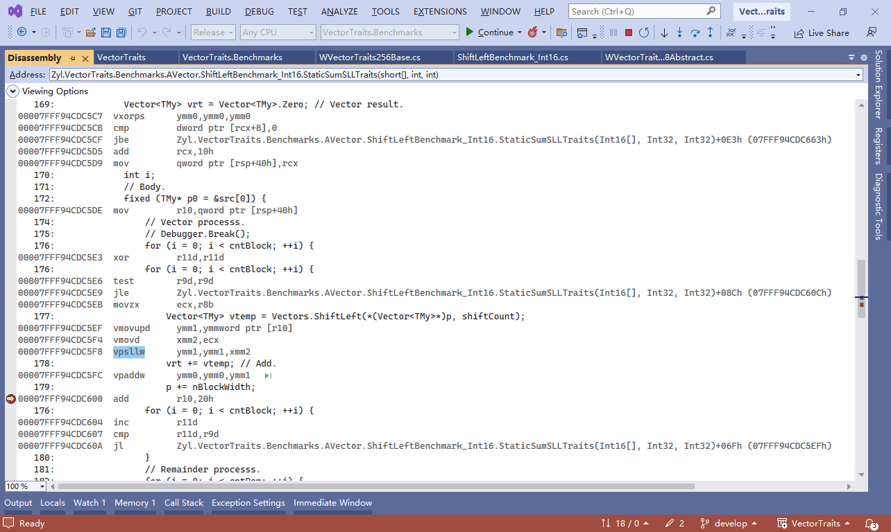

# VectorTraits
[English](README.md) | Chinese(中文)

VectorTraits: SIMD Vector type traits methods (SIMD向量类型的特征方法).

本库为向量类型提供了许多重要的算术方法(如 Shift, Shuffle, NarrowSaturate)及常数, 使向量类型使用起来更加方便。它充分利用了 X86、Arm架构的内在函数实现硬件加速，且能够享受内联编译优化。

常用类型：
- `Vectors`: 为向量类型, 提供了常用工具函数, e.g. Create(T/T[]/Span/ReadOnlySpan), CreatePadding, CreateRotate, CreateByFunc, CreateByDouble ... 它还为向量提供了特征方法, e.g. ShiftLeft、ShiftRightArithmetic、ShiftRightLogical、Shuffle ...
- `Vectors<T>`: 为向量类型, 提供了各种元素类型的常数. e.g. Serial, SerialDesc, XyzwWMask, MantissaMask, MaxValue, MinValue, NormOne, FixedOne, E, Pi, Tau, VMaxByte, VReciprocalMaxSByte ...
- `Vector64s/Vector128s/Vector256s`: 为固定位宽的向量（Vector64/Vector128/Vector256），提供了常用工具函数与特征方法.
- `Vector64s<T>/Vector128s<T>/Vector256s<T>`: 为固定位宽的向量，提供了各种元素类型的常数.
- `Scalars`: 为标量类型, 提供了各种工具函数. e.g. GetByDouble, GetFixedByDouble, GetByBits, GetBitsMask ...
- `Scalars<T>`: 为标量类型, 提供了许多常数. e.g. ExponentBits, MantissaBits, MantissaMask, MaxValue, MinValue, NormOne, FixedOne, E, Pi, Tau, VMaxByte, VReciprocalMaxSByte ...
- `VectorTextUtil`: 提供了一些向量的文本性工具函数. e.g. GetHex, Format, WriteLine ...

特征方法:
- 支持 `.NET Standard 2.1` 新增的向量方法: ConvertToDouble, ConvertToInt32, ConvertToInt64, ConvertToSingle, ConvertToUInt32, ConvertToUInt64, Narrow, Widen .
- 支持 `.NET 5.0` 新增的向量方法: Ceiling, Floor .
- 支持 `.NET 6.0` 新增的向量方法: Sum .
- 支持 `.NET 7.0` 新增的向量方法: ExtractMostSignificantBits, Shuffle, ShiftLeft, ShiftRightArithmetic, ShiftRightLogical .
- 提供缩窄饱和的向量方法: YNarrowSaturate, YNarrowSaturateUnsigned .
- 提供换位的向量方法: YShuffleEach128, YShuffleInsert, YShuffleInsertEach128, YShuffleG4, YShuffleG4X2 . Also provides ShuffleControlG4 classes.
- ...
- 完整列表: [TraitsMethodList](TraitsMethodList.md)

支持的指令集:
- x86
  - 256位向量: Avx, Avx2 .
- Arm
  - 128位向量: AdvSimd .

特点:
- 支持低版本的 `.NET` 程序。虽然在2016年的 `.NET Core 1.0` 就已经支持 `Vector<T>` 等向量类型，但是缺少ShiftLeft、ShiftRightArithmetic、ShiftRightLogical、Shuffle 等重要的向量函数，导致很多算法难以用向量类型来实现。直到2022年推出的 `.NET 7.0`, 才解决不支持ShiftLeft等向量函数等问题。若让类库仅支持 `.NET 7.0` 的话，会造成很多不便。本库解决了这一难题，能使低版本的 `.NET` 程序（`.NET Standard 1.1`, `.NET Core 1.0`, `.NET Framework 4.5`, ...）也能使用ShiftLeft等向量函数。
- 功能强. 除了参考高版本 `.NET` 的向量方法外，本库还参考内在函数，提供了很多有用的向量方法。例如 ShiftLeftFast, YNarrowSaturate ...
- 性能高。本库能充分利用 X86、Arm架构的内在函数对向量类型的运算进行硬件加速，且能够享受内联编译优化。
- 软件算法也很快。若发现向量类型的某个方法不支持硬件加速时，.NET Bcl会切换为软件算法，但它软件算法很多是含有分支语句的，性能较差。而本库的软件算法，是高度优化的无分支算法。
- 使用方便。本库不仅支持 `Vector<T>`，还支持 `Vector128<T>`/`Vector256<T>` 等向量类型。工具类的类名很好记（Vectors/Vector64s/Vector128s/Vector256s），且通过同名的泛型类提供了许多常用的向量常数。
- 提供了向量元祖. e.g. VectorXTuple, VectorX2, VectorX3, VectorX4, Vector128X2, Vector256X2 ...

提示: 在 Visual Studio 的 Disassembly窗口可以查看运行时的汇编代码. 例如在支持 Avx指令集的机器上运行时, `Vectors.ShiftLeft` 会被内联编译优化为使用 `vpsllw` 指令.

## 变更日志

完整列表: [ChangeLog](ChangeLog.md)

### [最新版本] v1.0
