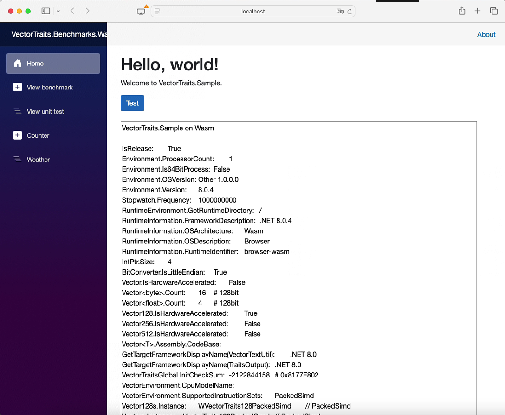
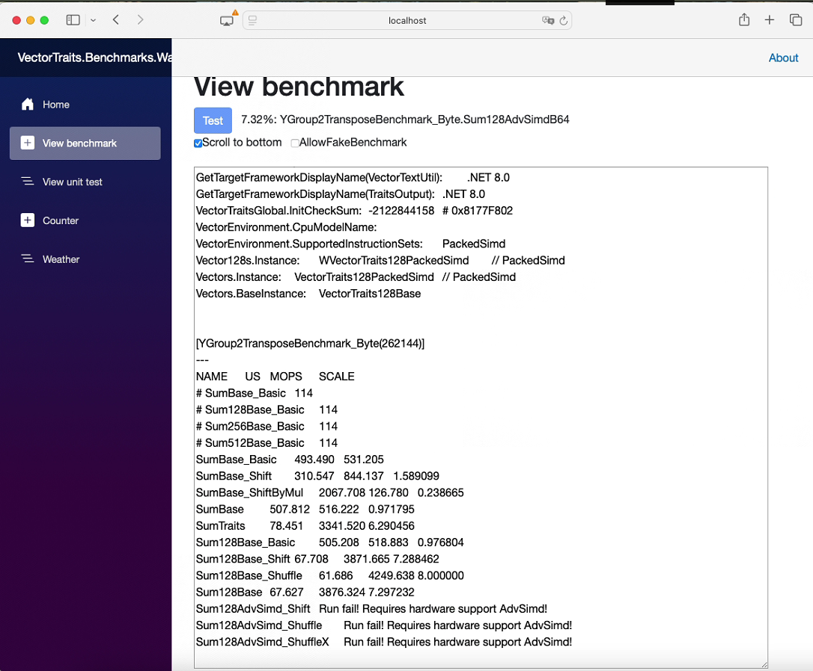
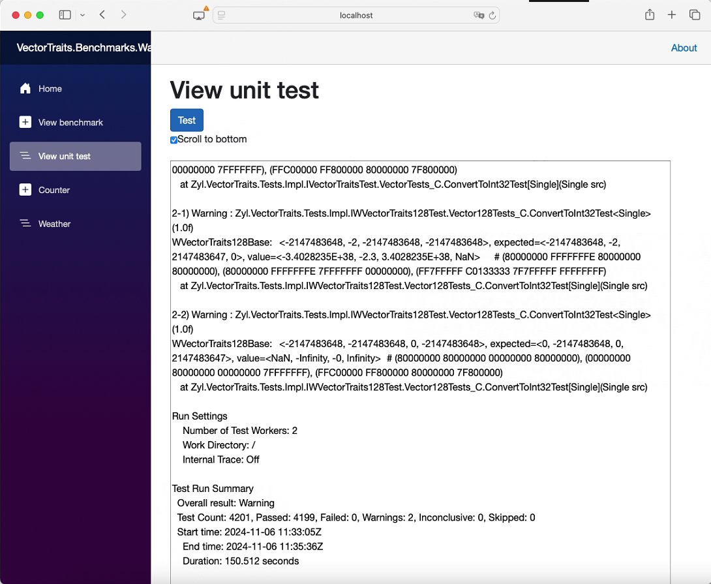

[TOC]

# 发布 VectorTraits v3.0（支持 X86架构的Avx512系列指令集，支持 Wasm架构及PackedSimd指令集等）

VectorTraits已更新至 v3.0版。支持Vector512类型及 X86架构的Avx512系列指令集; 支持 Wasm架构及PackedSimd指令集; 还提供了 多向量换位（YShuffleX2、YShuffleX3）、交织(Group2Zip, Group2Unzip) 等原创的向量方法。

- NuGet: https://www.nuget.org/packages/VectorTraits/3.0.0
- 源代码: https://github.com/zyl910/VectorTraits
- 在线文档: https://zyl910.github.io/VectorTraits_doc/

变更日志如下。

- Supports Vector512 type and X86 architecture's Avx512 family instruction sets (支持Vector512类型及 X86架构的Avx512系列指令集).
- Improved algorithms for 128/256 bit vectors using the Avx512 family instruction sets (使用Avx512系列指令集, 改进了128/256位向量的算法).
- Supports Wasm(WebAssembly) architecture, supports PackedSimd instruction set (支持 Wasm(WebAssembly)架构及PackedSimd指令集).
- Added `VectorTraits.Benchmarks.Wasm` project. Used for unit test and benchmark vector types on the Wasm architecture (增加了 `VectorTraits.Benchmarks.Wasm` 项目. 用于在 Wasm 架构上对向量类型进行单元测试与基准测试).
- Support for `.NET 8.0` new vector methods (支持 `.NET 8.0` 新增的向量方法): WidenLower, WidenUpper.
- Provides vector methods for de-interleave (提供解交织的向量方法): YGroup2Unzip, YGroup2UnzipEven, YGroup2UnzipOdd, YGroup3Unzip, YGroup3UnzipX2, YGroup4Unzip, YGroup6Unzip_Bit128.
- Provides vector methods for interleave (提供交织的向量方法): YGroup2Zip, YGroup2ZipHigh, YGroup2ZipLow, YGroup3Zip, YGroup3ZipX2, YGroup4Unzip, YGroup6Zip_Bit128.
- Provides vector methods for reconstruction groups (提供重新构造组的向量方法): YGroup1ToGroup3, YGroup1ToGroup4, YGroup1ToGroup4WithW, YGroup3ToGroup4, YGroup4ToGroup3.
- Provides vector methods for multi vector shuffle (提供多向量换位的向量方法): YShuffleX2, YShuffleX2Insert, YShuffleX2Kernel, YShuffleX3, YShuffleX3Insert, YShuffleX3Kernel, YShuffleX4, YShuffleX4Insert, YShuffleX4Kernel.
- Provides vector methods for transpose (提供转置的向量方法): YGroup2Transpose, YGroup2TransposeEven, YGroup2TransposeOdd.
- Provides vector methods for compare (提供比较的向量方法): GreaterThan_Unsigned.
- Provides extension method for vectors (提供向量的扩展方法): AsSigned, AsUnsigned.
- VectorSameWExtensions add `As` method. `Vector<T>` add `As` Extension Methods (`Vector<T>` 增加 `As` 扩展方法). 
- The IsHardwareAccelerated property has been added to the Vectors(/Vector128s/Vector256s/Vector512s) classes (Vectors(/Vector128s/Vector256s/Vector512s) 类增加了 IsHardwareAccelerated 属性).
- Added 128-bit integer type - ExInt128/ExUInt128 (增加了128位整数类型 - ExInt128/ExUInt128).
- (Experimental) Experimentally added the ExType(Extended type) mechanism to enable vector types to support 128-bit integers(ExInt128/ExUInt128). However, it is found that some functions do not work properly under some .NET versions. Therefore, it is recommended to prioritize using functions with the suffix "_Bit128" instead of ExType (实验性的增加了 ExType(扩展类型) 机制, 使向量类型能支持128位整数(ExInt128/ExUInt128). 但发现某些.NET版本下，个别函数的工作不正常. 故建议优先使用“_Bit128”后缀的函数, 而不是 ExType).
- The MathBitOperations class has been added. It provides these functions (增加了 MathBitOperations 类. 它提供了这些函数): Crc32C, IsPow2, LeadingZeroCount, Log2, PopCount, RoundUpToPowerOf2, RotateLeft, RotateRight, TrailingZeroCount.
- Package "System.Runtime.CompilerServices.Unsafe" upgraded to version `5.0.0`. UnsafeUtil obsoletes methods such as IsNullRef, NullRef, SkipInit (Unsafe包升级到 `5.0.0` 版. UnsafeUtil 废弃了 IsNullRef 等函数).
- The UnsafeUtil class add methods (UnsafeUtil类增加了方法): GetArrayDataReference, Dec, Inc, PreDec, PreInc, PostDec, PostDecExcept, PostDecExceptZero, PostInc, PostIncExcept, PostIncExceptZero .
- Optimize type conversion for vector generic types by replacing `(object)` with the As method (优化向量泛型类型的类型转换, 用 As 方法取代 `(object)`).
- Optimize the combining of two vectors, using WithUpper instead of Create (优化两个向量的组合, 用 WithUpper 代替 Create). e,g, Narrow and more.
- Optimized hardware acceleration of YBitToByte, YBitToInt16, YBitToInt32, YBitToInt64 methods on all architecture. It no longer uses OnesComplement (优化YBitToByte, YBitToInt16, YBitToInt32, YBitToInt64方法在所有架构的硬件加速. 它不再使用 OnesComplement).
- Optimized hardware acceleration of Shuffle/YShuffleInsert methods on X86 architecture. Use EqualsShift arithmetic (优化Shuffle/YShuffleInsert方法在X86架构的硬件加速. 使用 EqualsShift 算法). For 16~64 bit types.
- Fix all YShuffleG4X2 methods, remove redundant ConstantExpected attribute(修正所有 YShuffleG4X2 方法, 移除多余的 ConstantExpected 特性).
- Removal of obsolete project file `VectorTraits_vs2019.sln` (移除过时的项目文件 `VectorTraits_vs2019.sln`).
- Deprecation notice: Deprecation notice: The next version will remove such as WVectorTraits128AdvSimdB64/WVectorTraits128Avx2 classes (废弃预告: 下个版本将会移除 WVectorTraits128AdvSimdB64, WVectorTraits128Avx2 等类).

完整列表: [ChangeLog](https://github.com/zyl910/VectorTraits/blob/main/ChangeLog.md)

## 支持 X86架构的Avx512系列指令集

相关日志:

- Supports Vector512 type and X86 architecture's Avx512 family instruction sets (支持Vector512类型及 X86架构的Avx512系列指令集).
- Improved algorithms for 128/256 bit vectors using the Avx512 family instruction sets (使用Avx512系列指令集, 改进了128/256位向量的算法).

本库已经支持了X86架构的Avx512系列指令集。既：Avx512BW, Avx512DQ, Avx512F, Avx512Vbmi, Avx512VL。

提示，目前支持Avx512系列指令集的CPU有——

- Intel: 第11代酷睿处理器，如“Intel Core i7-11700”。注意从第12代酷睿处理器开始，Intel对消费级处理器禁用了Avx512，仅部分服务器级处理器有Avx512。
- AMD: Zen4架构及之后机构的处理器，例如“AMD Ryzen 7 7840H”.

为了方便处理Vector512, 本库增加了以下类型：

- `Vector512s`: 为512位向量（Vector512）提供了常用工具函数与特征方法. 在支持Avx512系列指令集的电脑上运行时, 会获得充分的硬件加速。
- `Vector512s<T>`: 为512位向量（Vector512）提供了各种元素类型的常数.

而且本库根据 Avx512系列指令集中 128/256位向量指令，改进 128/256位向量中（Vector128s、Vector256s、Vectors）各个方法的算法，使它们的性能得到了进一步的提升。

在运行 .NET 程序时，可以通过环境变量来控制是否启用Avx512。例如加上“COMPlus_EnableAVX512F=0”的环境变量后，便会禁用Avx512。

遗憾的是，`.NET 8.0` 里的Vector类型，仅是128~256位的长度。当“Vector512.IsHardwareAccelerated”为true时（CPU支持Avx512指令集），Vector的长度并未升级到512位，而是仍然保持 256位。据说 `.NET 9.0` 会支持，只能期待它发布了。

### 支持Avx512时的输出信息

当支持Avx512指令集，范例程序 `samples/VectorTraits.Sample` 的输出信息如下。

```
VectorTraits.Sample

IsRelease:	True
Environment.ProcessorCount:	16
Environment.Is64BitProcess:	True
Environment.OSVersion:	Microsoft Windows NT 10.0.22631.0
Environment.Version:	8.0.8
Stopwatch.Frequency:	10000000
RuntimeEnvironment.GetRuntimeDirectory:	C:\Program Files\dotnet\shared\Microsoft.NETCore.App\8.0.8\
RuntimeInformation.FrameworkDescription:	.NET 8.0.8
RuntimeInformation.OSArchitecture:	X64
RuntimeInformation.OSDescription:	Microsoft Windows 10.0.22631
RuntimeInformation.RuntimeIdentifier:	win-x64
IntPtr.Size:	8
BitConverter.IsLittleEndian:	True
Vector.IsHardwareAccelerated:	True
Vector<byte>.Count:	32	# 256bit
Vector<float>.Count:	8	# 256bit
Vector128.IsHardwareAccelerated:	True
Vector256.IsHardwareAccelerated:	True
Vector512.IsHardwareAccelerated:	True
Vector<T>.Assembly.CodeBase:	file:///C:/Program Files/dotnet/shared/Microsoft.NETCore.App/8.0.8/System.Private.CoreLib.dll
GetTargetFrameworkDisplayName(VectorTextUtil):	.NET 8.0
GetTargetFrameworkDisplayName(TraitsOutput):	.NET 8.0
VectorTraitsGlobal.InitCheckSum:	-2122844161	# 0x8177F7FF
VectorEnvironment.CpuModelName:	AMD Ryzen 7 7840H w/ Radeon 780M Graphics
VectorEnvironment.SupportedInstructionSets:	Aes, Avx, Avx2, Avx512BW, Avx512CD, Avx512DQ, Avx512F, Avx512Vbmi, Avx512VL, Bmi1, Bmi2, Fma, Lzcnt, Pclmulqdq, Popcnt, Sse, Sse2, Sse3, Ssse3, Sse41, Sse42, X86Base
Vector128s.Instance:	WVectorTraits128Avx2	// Sse, Sse2, Sse3, Ssse3, Sse41, Sse42, Avx, Avx2, Avx512VL
Vector256s.Instance:	WVectorTraits256Avx2	// Avx, Avx2, Sse, Sse2, Avx512VL
Vector512s.Instance:	WVectorTraits512Avx512	// Avx512BW, Avx512DQ, Avx512F, Avx512Vbmi, Avx, Avx2, Sse, Sse2
Vectors.Instance:	VectorTraits256Avx2	// Avx, Avx2, Sse, Sse2, Avx512VL
Vectors.BaseInstance:	VectorTraits256Base

src:    <0, 1, 2, 3, 4, 5, 6, 7, 0, 1, 2, 3, 4, 5, 6, 7>        # (0000 0001 0002 0003 0004 0005 0006 0007 0000 0001 0002 0003 0004 0005 0006 0007)
ShiftLeft:      <0, 2, 4, 6, 8, 10, 12, 14, 0, 2, 4, 6, 8, 10, 12, 14>  # (0000 0002 0004 0006 0008 000A 000C 000E 0000 0002 0004 0006 0008 000A 000C 000E)
Equals to BCL ShiftLeft:        True
Equals to ShiftLeft_Const:      True

desc:   <15, 14, 13, 12, 11, 10, 9, 8, 7, 6, 5, 4, 3, 2, 1, 0>  # (000F 000E 000D 000C 000B 000A 0009 0008 0007 0006 0005 0004 0003 0002 0001 0000)
Shuffle:        <14, 12, 10, 8, 6, 4, 2, 0, 14, 12, 10, 8, 6, 4, 2, 0>  # (000E 000C 000A 0008 0006 0004 0002 0000 000E 000C 000A 0008 0006 0004 0002 0000)
Equals to BCL Shuffle:  True
Equals to Shuffle_Core: True

ShiftLeft_AcceleratedTypes:     SByte, Byte, Int16, UInt16, Int32, UInt32, Int64, UInt64        # (00001FE0)
Shuffle_AcceleratedTypes:       SByte, Byte, Int16, UInt16, Int32, UInt32, Int64, UInt64, Single, Double        # (00007FE0)
```

其中最关键的是这几行，分别展示了各种向量类型所用的指令集。

```
Vector128s.Instance:	WVectorTraits128Avx2	// Sse, Sse2, Sse3, Ssse3, Sse41, Sse42, Avx, Avx2, Avx512VL
Vector256s.Instance:	WVectorTraits256Avx2	// Avx, Avx2, Sse, Sse2, Avx512VL
Vector512s.Instance:	WVectorTraits512Avx512	// Avx512BW, Avx512DQ, Avx512F, Avx512Vbmi, Avx, Avx2, Sse, Sse2
Vectors.Instance:	VectorTraits256Avx2	// Avx, Avx2, Sse, Sse2, Avx512VL
```

输出信息中的“Vector512.IsHardwareAccelerated:	True”，表示512位向量支持硬件加速。

## 支持 Wasm架构及PackedSimd指令集

相关日志:

- Supports Wasm(WebAssembly) architecture, supports PackedSimd instruction set (支持 Wasm(WebAssembly)架构及PackedSimd指令集).
- Added `VectorTraits.Benchmarks.Wasm` project. Used for unit test and benchmark vector types on the Wasm architecture (增加了 `VectorTraits.Benchmarks.Wasm` 项目. 用于在 Wasm 架构上对向量类型进行单元测试与基准测试).

本库已经支持了支持 Wasm(WebAssembly)架构，以及PackedSimd指令集。

PackedSimd指令集是一个128位的SIMD硬件加速指令集。故在使用 Vector128s 时，能获得充分的硬件加速。

遗憾的是，目前`.NET 8.0` 里的Vector类型，在WASM架构上运行时是没有硬件加速的，仅Vector128有硬件加速。这就导致了 Vectors 的部分方法也是没有硬件加速的，需改为使用 Vector128s。

### 支持PackedSimd时的输出信息

当在WASM环境下运行，且支持PackedSimd指令集，范例程序的输出信息如下。

```
VectorTraits.Sample on Wasm

IsRelease:	True
Environment.ProcessorCount:	1
Environment.Is64BitProcess:	False
Environment.OSVersion:	Other 1.0.0.0
Environment.Version:	8.0.4
Stopwatch.Frequency:	1000000000
RuntimeEnvironment.GetRuntimeDirectory:	/
RuntimeInformation.FrameworkDescription:	.NET 8.0.4
RuntimeInformation.OSArchitecture:	Wasm
RuntimeInformation.OSDescription:	Browser
RuntimeInformation.RuntimeIdentifier:	browser-wasm
IntPtr.Size:	4
BitConverter.IsLittleEndian:	True
Vector.IsHardwareAccelerated:	False
Vector<byte>.Count:	16	# 128bit
Vector<float>.Count:	4	# 128bit
Vector128.IsHardwareAccelerated:	True
Vector256.IsHardwareAccelerated:	False
Vector512.IsHardwareAccelerated:	False
Vector<T>.Assembly.CodeBase:	
GetTargetFrameworkDisplayName(VectorTextUtil):	.NET 8.0
GetTargetFrameworkDisplayName(TraitsOutput):	.NET 8.0
VectorTraitsGlobal.InitCheckSum:	-2122844158	# 0x8177F802
VectorEnvironment.CpuModelName:	
VectorEnvironment.SupportedInstructionSets:	PackedSimd
Vector128s.Instance:	WVectorTraits128PackedSimd	// PackedSimd
Vectors.Instance:	VectorTraits128PackedSimd	// PackedSimd
Vectors.BaseInstance:	VectorTraits128Base

src:	<0, 1, 2, 3, 4, 5, 6, 7>	# (0000 0001 0002 0003 0004 0005 0006 0007)
ShiftLeft:	<0, 2, 4, 6, 8, 10, 12, 14>	# (0000 0002 0004 0006 0008 000A 000C 000E)
Equals to BCL ShiftLeft:	True
Equals to ShiftLeft_Const:	True

desc:	<7, 6, 5, 4, 3, 2, 1, 0>	# (0007 0006 0005 0004 0003 0002 0001 0000)
Shuffle:	<14, 12, 10, 8, 6, 4, 2, 0>	# (000E 000C 000A 0008 0006 0004 0002 0000)
Equals to BCL Shuffle:	True
Equals to Shuffle_Core:	True

ShiftLeft_AcceleratedTypes:	None	# (00000000)
Shuffle_AcceleratedTypes:	None	# (00000000)
```

其中最关键的是这几行：

```
Vector.IsHardwareAccelerated:	False
Vector128.IsHardwareAccelerated:	True
Vector256.IsHardwareAccelerated:	False
Vector512.IsHardwareAccelerated:	False
VectorEnvironment.SupportedInstructionSets:	PackedSimd
Vector128s.Instance:	WVectorTraits128PackedSimd	// PackedSimd
Vectors.Instance:	VectorTraits128PackedSimd	// PackedSimd
Vectors.BaseInstance:	VectorTraits128Base
```

可以看出，浏览器支持PackedSimd。于是128位向量（Vector128）具有硬件加速。

### `VectorTraits.Benchmarks.Wasm` 使用说明

传统的 `.NET` 程序，无论是命令行程序，还是UI界面程序，甚至 ASP.Net 后台程序，都是在本机上运行，而不是在浏览器中运行。
为了能直接在浏览器中运行 `.NET` 程序, 需使用“Blazor Wasm”项目类型。它会将 `.NET` 程序 编译为Wasm，用于在浏览器中运行。

本库已经建立了 `VectorTraits.Benchmarks.Wasm` 项目，可以用它来测试 `.NET` 程序在Wasm架构运行时的表现。且支持基准测试与单元测试。

启动`VectorTraits.Benchmarks.Wasm` 项目后，VS会自动打开浏览器，并浏览主页（Home）。如下图。


在左侧的导航栏中点击“View benchmark”，便会打开基准测试的页面，用于对比测试各种算法的性能。点击“Test”按钮，便会开始测试。该测试是异步进行的，还会在“Test”按钮的右侧显示进度。


默认情况下，仅运行少量的基准测试。若勾选了“AllowFakeBenchmark”复选框，会运行所有的基准测试，会花费一个小时或更长的时间。

在左侧的导航栏中点击“View unit test”，便会打开基准测试的页面，用于验证算法的正确性。点击“Test”按钮，便会开始测试。


由于 `.NET 8.0` 时的“Blazor Wasm”尚不支持多线程，且NUnit尚不支持异步执行。故只能以同步方式运行，需等到所有单元测试均执行完毕后，才能获得结果。一般需花费数分钟不等。

## 新增了向量方法

相关日志:

- Support for `.NET 8.0` new vector methods (支持 `.NET 8.0` 新增的向量方法): WidenLower, WidenUpper.
- Provides vector methods for de-interleave (提供解交织的向量方法): YGroup2Unzip, YGroup2UnzipEven, YGroup2UnzipOdd, YGroup3Unzip, YGroup3UnzipX2, YGroup4Unzip, YGroup6Unzip_Bit128.
- Provides vector methods for interleave (提供交织的向量方法): YGroup2Zip, YGroup2ZipHigh, YGroup2ZipLow, YGroup3Zip, YGroup3ZipX2, YGroup4Unzip, YGroup6Zip_Bit128.
- Provides vector methods for reconstruction groups (提供重新构造组的向量方法): YGroup1ToGroup3, YGroup1ToGroup4, YGroup1ToGroup4WithW, YGroup3ToGroup4, YGroup4ToGroup3.
- Provides vector methods for multi vector shuffle (提供多向量换位的向量方法): YShuffleX2, YShuffleX2Insert, YShuffleX2Kernel, YShuffleX3, YShuffleX3Insert, YShuffleX3Kernel, YShuffleX4, YShuffleX4Insert, YShuffleX4Kernel.
- Provides vector methods for transpose (提供转置的向量方法): YGroup2Transpose, YGroup2TransposeEven, YGroup2TransposeOdd.

### 支持 `.NET 8.0` 新增的向量方法

`.NET 8.0` 新增了这些向量方法——

- `WidenLower`: Widens the lower half of a Vector into a Vector (将向量的低半部分扩宽为一个向量).
  Mnemonic: `rt[i] := widen(source[i])`.
- `WidenUpper`: Widens the upper half of a Vector into a Vector (将向量的高半部分扩宽为一个向量).
  Mnemonic: `rt[i] := widen(source[i - Count/2])`.

Vectors/Vector128s/Vector256s/Vector512s 均支持了这些方法。

### 提供交织与解交织的向量方法

在使用向量化运算时，有时需要重新排列元素的位置。例如在做图形、图像处理时，经常需要对 已打包的RGB或RGBA数据 进行交织和解交织运算。

虽然 `.NET 7.0` 开始提供了 Shuffle 方法，但它存在很多问题——变长的Vector类型里还未提供该方法，直到 `.NET 8.0`很多架构上仍没有硬件加速。
为了解决官方的 Shuffle 方法的问题，本库提供 Shuffle 系列方法，能够在 X86、Arm等架构上享受硬件加速。但还存在2个缺点——

- 若让使用者基于Shuffle来开发交织和解交织运算的函数，写起来会比较繁琐。
- 对于交织和解交织算法来说，Shuffle实现的算法的性能并不是最优的。有一些特殊算法，能带来更大的性能提升。

于是本库提供了交织与解交织的向量方法。且将其抽象为 2~4-元素组的处理，使它们能具有更强的通用性。相关方法的说明见下。

- `YGroup2Unzip[/_Bit128]`: De-Interleave 2-element groups into 2 vectors. It converts the 2-element groups AoS to SoA (将2-元素组解交织为2个向量. 它能将2元素组的 数组结构体 转为 结构体数组).
  Mnemonic: `x[i] =: element_ref(2*i, data0, data1)`, `y[i] =: element_ref(2*i+1, data0, data1)`.
- `YGroup2UnzipEven`: De-Interleave the 2-element groups into 2 vectors, and return the vector of even positions (将2-元素组解交织为2个向量, 并返回偶数位置的数据).
  Mnemonic: `rt[i] =: element_ref(2*i, data0, data1)`.
- `YGroup2UnzipOdd`: De-Interleave the 2-element groups into 2 vectors, and return the vector of odd positions (将2-元素组解交织为2个向量, 并返回奇数位置的数据).
  Mnemonic: `rt[i] =: element_ref(2*i+1, data0, data1)`.
- `YGroup2Zip[/_Bit128]`: Interleave 2 vectors into 2-element groups. It converts the 2-element groups SoA to AoS (将2个向量交织为2-元素组. 它能将2元素组的 结构体数组 转为 数组结构体).
  Mnemonic: `element_ref(i, data0, data1) := (0==(i&1))?( x[i2] ):( y[i2] )`, `i2 := i/2`.
- `YGroup2ZipHigh`: Interleave 2 vectors into 2-element groups and returns the data in the high position. (将2个向量交织为2-元素组, 并返回高位置的数据).
  Mnemonic: `rt[i] := (0==(i&1))?( x[i2] ):( y[i2] )`, `i2 := (i+T.Count)/2`.
- `YGroup2ZipLow`: Interleave 2 vectors into 2-element groups and returns the data in the low position. (将2个向量交织为2-元素组, 并返回低位置的数据).
  Mnemonic: `rt[i] := (0==(i&1))?( x[i2] ):( y[i2] )`, `i2 := i/2`.
- `YGroup3Unzip[/_Bit128]`: De-Interleave 3-element groups into 3 vectors. It converts the 3-element groups AoS to SoA. It can also deinterleave packed RGB pixel data into R,G,B planar data (将3-元素组解交织为3个向量. 它能将3元素组的 数组结构体 转为 结构体数组. 它还能将 已打包的RGB像素数据, 解交织为 R,G,B 平面数据).
  Mnemonic: `x[i] =: element_ref(3*i, data0, data1, data2)`, `y[i] =: element_ref(3*i+1, data0, data1, data2)`, `z[i] =: element_ref(3*i+2, data0, data1, data2)`.
- `YGroup3UnzipX2[/_Bit128]`: De-Interleave 3-element groups into 3 vectors and process 2x data (将3-元素组解交织为3个向量, 且处理2倍数据).
  Mnemonic: `(x, y, z) = YGroup3Unzip(data0, data1, data2)`, `(xB, yB, zB) = YGroup3Unzip(data3, data4, data5)`.
- `YGroup3Zip[/_Bit128]`: Interleave 3 vectors into 3-element groups. It converts the 3-element groups SoA to AoS. It can also interleave R,G,B planar data into packed RGB pixel data (将3个向量交织为3-元素组. 它能将3元素组的 结构体数组 转为 数组结构体. 它还能将 R,G,B 平面数据, 交织为 已打包的RGB像素数据).
  Mnemonic: `element_ref(i, data0, data1, data2) := (0==(i%3))?( x[i2] ):( (1==(i%3))?( y[i2] ):( z[i2] ) )`, `i2 := i/3`.
- `YGroup3ZipX2[/_Bit128]`: Interleave 3 vectors into 3-element groups and process 2x data (将3个向量交织为3-元素组, 且处理2倍数据).
  Mnemonic: `(data0, data1, data2) = YGroup3Zip(x, y, z)`, `(data3, data4, data5) = YGroup3Zip(xB, yB, zB)`.
- `YGroup4Unzip[/_Bit128]`: De-Interleave 4-element groups into 4 vectors. It converts the 4-element groups AoS to SoA. It can also deinterleave packed RGBA pixel data into R,G,B,A planar data (将4-元素组解交织为4个向量. 它能将4元素组的 数组结构体 转为 结构体数组. 它还能将 已打包的RGBA像素数据, 解交织为 R,G,B,A 平面数据).
  Mnemonic: `x[i] =: element_ref(4*i, data0, data1, data2, data3)`, `y[i] =: element_ref(4*i+1, data0, data1, data2, data3)`, `z[i] =: element_ref(4*i+2, data0, data1, data2, data3)`, `w[i] =: element_ref(4*i+3, data0, data1, data2, data3)`.
- `YGroup4Zip[/_Bit128]`: Interleave 4 vectors into 4-element groups. It converts the 4-element groups SoA to AoS. It can also interleave R,G,B,A planar data into packed RGBA pixel data (将4个向量交织为4-元素组. 它能将4元素组的 结构体数组 转为 数组结构体. 它还能将 R,G,B,A 平面数据, 交织为 已打包的RGBA像素数据).
  Mnemonic: `element_ref(i, data0, data1, data2, data3) := (0==(i&3))?( x[i2] ):( (1==(i&3))?( y[i2] ):( (2==(i&3))?( z[i2] ):( w[i2] ) ) )`, `i2 := i/4`.
- `YGroup6Unzip_Bit128`: De-Interleave 6-element groups into 6 vectors. It converts the 6-element groups AoS to SoA  (将6-元素组解交织为6个向量. 它能将6元素组的 数组结构体 转为 结构体数组). It is specialized for process 128-bit element (它专门用于处理128位元素).
  Mnemonic: `x[i] =: element_ref(6*i, data0, data1, data2, data3, data4, data5)`, `y[i] =: element_ref(6*i+1, data0, data1, data2, data3, data4, data5)`, `z[i] =: element_ref(6*i+2, data0, data1, data2, data3, data4, data5)`, `w[i] =: element_ref(6*i+3, data0, data1, data2, data3, data4, data5)`, `u[i] =: element_ref(6*i+4, data0, data1, data2, data3, data4, data5)`, `v[i] =: element_ref(6*i+5, data0, data1, data2, data3, data4, data5)`.
- `YGroup6Zip_Bit128`: Interleave 6 vectors into 6-element groups. It converts the 6-element groups SoA to AoS (将6个向量交织为6-元素组. 它能将6元素组的 结构体数组 转为 数组结构体). It is specialized for process 128-bit element (它专门用于处理128位元素).
  Mnemonic: `element_ref(i, data0, data1, data2, data3, data4, data5) := (0==(i%6))?( x[i2] ):( (1==(i%6))?( y[i2] ):( (2==(i%6))?( z[i2] ):( (3==(i%6))?( w[i2] ):( (4==(i%6))?( u[i2] ):( v[i2] ) ) ) ) )`, `i2 := i/6`.

对于 3-元素组的交织，有一种算法是可以同时处理2倍数据的，于是提供了 YGroup3UnzipX2、YGroup3ZipX2 方法。且这些算法的内部需要处理“128位6-元素组”的交织，于是还暴露了 YGroup6Unzip_Bit128、YGroup6Zip_Bit128 方法。

#### YGroup3Unzip的范例代码

下面是范例代码。

```cs
private static void ShowYGroup3Unzip(TextWriter writer) {
    writer.WriteLine("[YGroup3Unzip]");
    // Byte
    int cnt = Vector<byte>.Count;
    var a0 = Vectors.CreateByDoubleLoop<byte>(0, 1);
    var a1 = Vectors.CreateByDoubleLoop<byte>(cnt * 1, 1);
    var a2 = Vectors.CreateByDoubleLoop<byte>(cnt * 2, 1);
    var s0 = Vectors.YGroup3Unzip(a0, a1, a2, out var s1, out var s2);
    var t0 = Vectors.YGroup3Zip(s0, s1, s2, out var t1, out var t2);
    VectorTextUtil.WriteLine(writer, "Before      :\t{0}, {1}, {2}", a0, a1, a2);
    VectorTextUtil.WriteLine(writer, "YGroup3Unzip:\t{0}, {1}, {2}", s0, s1, s2);
    VectorTextUtil.WriteLine(writer, "YGroup3Zip  :\t{0}, {1}, {2}", t0, t1, t2);
    writer.WriteLine();
}
```

这个方法里，先使用 CreateByDoubleLoop 创建向量，使 a0、a1、a2 为连续的数字。

随后使用 YGroup3Unzip 对这3个向量进行 3-元素组的解交织，结果存储到 s0、s1、s2。若 a0、a1、a2 存储的是 已打包的RGB像素值 的话，可以看出 R、G、B 通道的数值正好被分离到 s0、s1、s2 这3个向量里了。

再使用 YGroup3Zip 对这3个向量进行 3-元素组的交织，结果存储到 t0、t1、t2。它们与先前的 a0、a1、a2 的值相同。

下面是输出结果。
```
[YGroup3Unzip]
Before      :   <0, 1, 2, 3, 4, 5, 6, 7, 8, 9, 10, 11, 12, 13, 14, 15, 16, 17, 18, 19, 20, 21, 22, 23, 24, 25, 26, 27, 28, 29, 30, 31>, <32, 33, 34, 35, 36, 37, 38, 39, 40, 41, 42, 43, 44, 45, 46, 47, 48, 49, 50, 51, 52, 53, 54, 55, 56, 57, 58, 59, 60, 61, 62, 63>, <64, 65, 66, 67, 68, 69, 70, 71, 72, 73, 74, 75, 76, 77, 78, 79, 80, 81, 82, 83, 84, 85, 86, 87, 88, 89, 90, 91, 92, 93, 94, 95>      # (00 01 02 03 04 05 06 07 08 09 0A 0B 0C 0D 0E 0F 10 11 12 13 14 15 16 17 18 19 1A 1B 1C 1D 1E 1F), (20 21 22 23 24 25 26 27 28 29 2A 2B 2C 2D 2E 2F 30 31 32 33 34 35 36 37 38 39 3A 3B 3C 3D 3E 3F), (40 41 42 43 44 45 46 47 48 49 4A 4B 4C 4D 4E 4F 50 51 52 53 54 55 56 57 58 59 5A 5B 5C 5D 5E 5F)
YGroup3Unzip:   <0, 3, 6, 9, 12, 15, 18, 21, 24, 27, 30, 33, 36, 39, 42, 45, 48, 51, 54, 57, 60, 63, 66, 69, 72, 75, 78, 81, 84, 87, 90, 93>, <1, 4, 7, 10, 13, 16, 19, 22, 25, 28, 31, 34, 37, 40, 43, 46, 49, 52, 55, 58, 61, 64, 67, 70, 73, 76, 79, 82, 85, 88, 91, 94>, <2, 5, 8, 11, 14, 17, 20, 23, 26, 29, 32, 35, 38, 41, 44, 47, 50, 53, 56, 59, 62, 65, 68, 71, 74, 77, 80, 83, 86, 89, 92, 95>      # (00 03 06 09 0C 0F 12 15 18 1B 1E 21 24 27 2A 2D 30 33 36 39 3C 3F 42 45 48 4B 4E 51 54 57 5A 5D), (01 04 07 0A 0D 10 13 16 19 1C 1F 22 25 28 2B 2E 31 34 37 3A 3D 40 43 46 49 4C 4F 52 55 58 5B 5E), (02 05 08 0B 0E 11 14 17 1A 1D 20 23 26 29 2C 2F 32 35 38 3B 3E 41 44 47 4A 4D 50 53 56 59 5C 5F)
YGroup3Zip  :   <0, 1, 2, 3, 4, 5, 6, 7, 8, 9, 10, 11, 12, 13, 14, 15, 16, 17, 18, 19, 20, 21, 22, 23, 24, 25, 26, 27, 28, 29, 30, 31>, <32, 33, 34, 35, 36, 37, 38, 39, 40, 41, 42, 43, 44, 45, 46, 47, 48, 49, 50, 51, 52, 53, 54, 55, 56, 57, 58, 59, 60, 61, 62, 63>, <64, 65, 66, 67, 68, 69, 70, 71, 72, 73, 74, 75, 76, 77, 78, 79, 80, 81, 82, 83, 84, 85, 86, 87, 88, 89, 90, 91, 92, 93, 94, 95>      # (00 01 02 03 04 05 06 07 08 09 0A 0B 0C 0D 0E 0F 10 11 12 13 14 15 16 17 18 19 1A 1B 1C 1D 1E 1F), (20 21 22 23 24 25 26 27 28 29 2A 2B 2C 2D 2E 2F 30 31 32 33 34 35 36 37 38 39 3A 3B 3C 3D 3E 3F), (40 41 42 43 44 45 46 47 48 49 4A 4B 4C 4D 4E 4F 50 51 52 53 54 55 56 57 58 59 5A 5B 5C 5D 5E 5F)

```

由于是在支持Avx2指令集的X86电脑上运行，故向量是256位的。

使用 YGroup3Unzip与YGroup3Zip，能很方便处理RGB像素值。一般步骤为：先用 YGroup3Unzip进行解交织，然后分别对3个通道的数据进行处理。最后使用 YGroup3Zip，将3个通道的数据，交织为已打包的RGB像素值。

### 提供重新构造组的向量方法

将 3-元素组 与 4-元素组 进行转换，虽然可以先解交织（Unzip），然后再做交织处理（Zip）。但是有些算法的性能更高，于是本库提供了重新构造组的向量方法。相关方法的说明见下。

- `YGroup1ToGroup3`: Convert a 1-element group, to a 3-element group. It also converts grayscale pixel data to packed RGB pixel data (将1-元素组, 转为3-元素组. 它还能将 灰度像素数据, 转换为 已打包的RGB像素数据).
  Mnemonic: View for group: `(result0, result1, result2) = YGroup3Zip(x, x, x)`. View for element: `element_ref(i, result0, result1, result2) := x[i/3]`.
- `YGroup1ToGroup4`: Convert a 1-element group, to a 4-element group. It also converts grayscale pixel data to packed RGBA pixel data (将1-元素组, 转为4-元素组. 它还能将 灰度像素数据, 转换为 已打包的RGBA像素数据).
  Mnemonic: View for group: `(result0, result1, result2, result4) = YGroup4Zip(x, x, x, x)`. View for element: `element_ref(i, result0, result1, result2, result4) := x[i/4]`.
- `YGroup1ToGroup4WithW`: Convert a 1-element group and w argument, to a 4-element group. It also converts grayscale pixel data to packed RGBA pixel data (将1-元素组及w参数, 转为4-元素组. 它还能将 灰度像素数据, 转换为 已打包的RGBA像素数据).
  Mnemonic: View for group: `(result0, result1, result2, result4) = YGroup4Zip(x, x, x, w)`. View for element: `element_ref(i, result0, result1, result2, result4) := ((i%4)<3)?( x[i2] ):( w[i2] )`, `i2 := i/4`.
- `YGroup3ToGroup4`: Convert a 3-element group, to a 4-element group. It also converts packed RGB pixel data to packed RGBA pixel data (将3-元素组, 转为4-元素组. 它还能将 已打包的RGB像素数据, 转换为 已打包的RGBA像素数据).
  Mnemonic: View for group: `(result0, result1, result2, result3) = YGroup4Zip(YGroup3Unzip(data0, data1, data2), Vector.Zero))`. View for element: `element_ref(i, result0, result1, result2, result3) := (3!=(i%4))?element_ref((i/4)*3+(i%4), data0, data1, data2):0`.
- `YGroup4ToGroup3`: Convert a 4-element group, to a 3-element group. It also converts packed RGBA pixel data to packed RGB pixel data (将4-元素组, 转为3-元素组. 它还能将 已打包的RGBA像素数据, 转换为 已打包的RGB像素数据).
  Mnemonic: View for group: `(result0, result1, result2) = YGroup3Zip(YGroup4Unzip(data0, data1, data2, data3)))`. View for element: `element_ref(i, result0, result1, result2) := element_ref((i/3)*4+(i%3), data0, data1, data2, data3)`.

### 提供转置的向量方法

相关方法的说明见下。

- `YGroup2Transpose`: Transpose a 2*2 matrix (对2*2矩阵进行转置).
  Mnemonic: `result0[i] := (0==(i&1))?( x[i&~1] ):( y[i&~1] )`, `result1[i] := (0==(i&1))?( x[(i&~1) + 1] ):( y[(i&~1) + 1] )`.
- `YGroup2TransposeEven`: Transpose a 2*2 matrix and return a data in even positions (对2*2矩阵进行转置, 并返回偶数位置的数据).
  Mnemonic: `rt[i] := (0==(i&1))?( x[i&~1] ):( y[i&~1] )`.
- `YGroup2TransposeOdd`: Transpose a 2*2 matrix and return a data in odd positions (对2*2矩阵进行转置, 并返回奇数位置的数据).
  Mnemonic: `rt[i] := (0==(i&1))?( x[(i&~1) + 1] ):( y[(i&~1) + 1] )`.

对于熟悉 Arm 架构中AdvSimd指令集的朋友来说，很容易看出它们借鉴了 `AdvSimd.Arm64.TransposeEven`、`AdvSimd.Arm64.TransposeOdd`。

### 提供多向量换位的向量方法

.NET8增加了Arm架构的多寄存器的查表函数（VectorTableLookup/VectorTableLookupExtension）。
单个向量查表（如 vqvtbl1q_u8）时，只能在 16字节（128位）的范围内进行查表。而使用4个向量查表（如 vqtbl4q_u8 ）时，能在 16*4=64字节（512位）的范围内进行查表。

且.NET8.0增加了对Avx512系列指令集的支持。Avx512提供了2个向量查表的指令，例如 VPERMI2B。

本库参考了这2类指令，提供了 2~4个向量换位的方法。即下面的这些方法。

- `YShuffleX2[/_Args/_Core]`: Shuffle and clear on 2 vectors (在2个向量上进行换位并清零). Creates a new vector by selecting values from an input vector using a set of indices (通过使用一组索引从输入向量中选择值，来创建一个新向量). If the indices value is out of range, the element will be cleared (若索引值超出范围, 元素会被清零).
  Mnemonic: `rt[i] := (0<=indices[i] && indices[i]<(Count*2))?( element_ref(indices[i], vector0, vector1) ):0`.
- `YShuffleX2Insert[/_Args/_Core]`: Shuffle and insert on 2 vectors (在2个向量上进行换位并插入). Creates a new vector by selecting values from an input vector using a set of indices (通过使用一组索引从输入向量中选择值，来创建一个新向量). If the index value is out of range, the elements of the background vector will be inserted (若索引值超出范围, 会插入背景向量的元素).
  Mnemonic: `rt[i] := (0<=indices[i] && indices[i]<(Count*2))?( element_ref(indices[i], vector0, vector1) ):back[i]`.
- `YShuffleX2Kernel[/_Args/_Core]`: Only shuffle on 2 vectors (在2个向量上进行仅换位). Creates a new vector by selecting values from an input vector using a set of indices (通过使用一组索引从输入向量中选择值，来创建一个新向量). If the index value is out of range, the result is undefined (若索引值超出范围, 结果是未定义的). You can use the IndexMask mask to constrain the parameters (可使用 IndexMask 掩码来约束参数).
  Mnemonic: `rt[i] := element_ref(indices[i], vector0, vector1)`. Conditions: `0<=indices[i] && indices[i]<(Count*2)`.
- `YShuffleX3[/_Args/_Core]`: Shuffle and clear on 3 vectors (在3个向量上进行换位并清零). Creates a new vector by selecting values from an input vector using a set of indices (通过使用一组索引从输入向量中选择值，来创建一个新向量). If the indices value is out of range, the element will be cleared (若索引值超出范围, 元素会被清零).
  Mnemonic: `rt[i] := (0<=indices[i] && indices[i]<3*Count)?( element_ref(indices[i], vector0, vector1, vector2) ):0`.
- `YShuffleX3Insert[/_Args/_Core]`: Shuffle and insert on 3 vectors (在3个向量上进行换位并插入). Creates a new vector by selecting values from an input vector using a set of indices (通过使用一组索引从输入向量中选择值，来创建一个新向量). If the index value is out of range, the elements of the background vector will be inserted (若索引值超出范围, 会插入背景向量的元素).
  Mnemonic: `rt[i] := (0<=indices[i] && indices[i]<3*Count)?( element_ref(indices[i], vector0, vector1, vector2) ):back[i]`.
- `YShuffleX3Kernel[/_Args/_Core]`: Only shuffle on 3 vectors (在3个向量上进行仅换位). Creates a new vector by selecting values from an input vector using a set of indices (通过使用一组索引从输入向量中选择值，来创建一个新向量). If the index value is out of range, the result is undefined (若索引值超出范围, 结果是未定义的).
  Mnemonic: `rt[i] := element_ref(indices[i], vector0, vector1, vector2)`. Conditions: `0<=indices[i] && indices[i]<(Count*3)`.
- `YShuffleX4[/_Args/_Core]`: Shuffle and clear on 4 vectors (在4个向量上进行换位并清零). Creates a new vector by selecting values from an input vector using a set of indices (通过使用一组索引从输入向量中选择值，来创建一个新向量). If the indices value is out of range, the element will be cleared (若索引值超出范围, 元素会被清零).
  Mnemonic: `rt[i] := (0<=indices[i] && indices[i]<(Count*4))?( element_ref(indices[i], vector0, vector1, vector2, vector3) ):0`.
- `YShuffleX4Insert[/_Args/_Core]`: Shuffle and insert on 4 vectors (在4个向量上进行换位并插入). Creates a new vector by selecting values from an input vector using a set of indices (通过使用一组索引从输入向量中选择值，来创建一个新向量). If the index value is out of range, the elements of the background vector will be inserted (若索引值超出范围, 会插入背景向量的元素).
  Mnemonic: `rt[i] := (0<=indices[i] && indices[i]<(Count*4))?( element_ref(indices[i], vector0, vector1, vector2, vector3) ):back[i]`.
- `YShuffleX4Kernel[/_Args/_Core]`: Only shuffle on 4 vectors (在4个向量上进行仅换位). Creates a new vector by selecting values from an input vector using a set of indices (通过使用一组索引从输入向量中选择值，来创建一个新向量). If the index value is out of range, the result is undefined (若索引值超出范围, 结果是未定义的). You can use the IndexMask mask to constrain the parameters (可使用 IndexMask 掩码来约束参数).
  Mnemonic: `rt[i] := element_ref(indices[i], vector0, vector1, vector2, vector3)`. Conditions: `0<=indices[i] && indices[i]<(Count*4)`.

#### Shuffle方法所用到的指令

| Architecture | 8bit                    | 16bit                           |  32bit                            |  64bit                            |
| :----------- | :---------------------- | :------------------------------ | :-------------------------------- | :-------------------------------- |
| Arm          | vqvtbl1q_u8             | (None)                          | (None)                            | (None)                            |
| Wasm         | i8x16.swizzle           | (None)                          | (None)                            | (None)                            |
| X86          | _mm_shuffle_epi8(Ssse3) | _mm_permutexvar_epi16(Avx512BW) | _mm256_permutevar8x32_epi32(Avx2) | _mm256_permutexvar_epi64(Avx512F) |

“(None)”表示该架构没有提供对应的指令，需要多条指令组合才能实现。

#### YShuffleX2方法所用到的指令

| Architecture | 8bit                              | 16bit                            |  32bit                          |  64bit                          |
| :----------- | :-------------------------------- | :------------------------------- | :------------------------------ | :------------------------------ |
| Arm          | vqtbl2q_u8                        | (None)                           | (None)                          | (None)                          |
| Wasm         | (None)                            | (None)                           | (None)                          | (None)                          |
| X86          | _mm_permutex2var_epi8(Avx512Vbmi) | _mm_permutex2var_epi16(Avx512BW) | _mm_permutex2var_epi32(Avx512F) | _mm_permutex2var_epi64(Avx512F) |

#### YShuffleX3方法所用到的指令

| Architecture | 8bit                              | 16bit                            |  32bit                          |  64bit                          |
| :----------- | :-------------------------------- | :------------------------------- | :------------------------------ | :------------------------------ |
| Arm          | vqtbl3q_u8                        | (None)                           | (None)                          | (None)                          |
| Wasm         | (None)                            | (None)                           | (None)                          | (None)                          |
| X86          | (None)                            | (None)                           | (None)                          | (None)                          |

#### YShuffleX4方法所用到的指令

| Architecture | 8bit                              | 16bit                            |  32bit                          |  64bit                          |
| :----------- | :-------------------------------- | :------------------------------- | :------------------------------ | :------------------------------ |
| Arm          | vqtbl4q_u8                        | (None)                           | (None)                          | (None)                          |
| Wasm         | (None)                            | (None)                           | (None)                          | (None)                          |
| X86          | (None)                            | (None)                           | (None)                          | (None)                          |

## 简化了无符号数的处理

相关日志:

- Provides vector methods for compare (提供比较的向量方法): GreaterThan_Unsigned.
- Provides extension method for vectors (提供向量的扩展方法): AsSigned, AsUnsigned.

有时需要对有符号整数元素的向量类型，进行一些无符号处理。这是需要使用 As进行转型，且处理完毕后再用 As 将类型转换回来。As 方法不能自动填充泛型参数，而是需要手动填写，写起来很繁琐、臃肿。

于是本库为向量类型提供了 AsSigned, AsUnsigned 扩展方法。能直接转换为对应的 有符号或无符号 类型，不用再手动填写类型参数。
而且为了最常用的“无符号比较”功能，为向量类型提供了 GreaterThan_Unsigned 方法.

## Vector128s 等类增加了 IsHardwareAccelerated 属性

相关日志:

- The IsHardwareAccelerated property has been added to the Vectors(/Vector128s/Vector256s/Vector512s) classes (Vectors(/Vector128s/Vector256s/Vector512s) 类增加了 IsHardwareAccelerated 属性).

从 `.NET 7.0` 开始, Vector128 等向量类型增加了 IsHardwareAccelerated, 用于检测是否支持硬件加速。
为了便于早期版本 `.NET` 的使用，本库给 Vectors(/Vector128s/Vector256s/Vector512s) 类型也增加了  IsHardwareAccelerated。即使低于 `.NET 7.0`, 也能通过该属性来检测是否有硬件加速。

## 增加了128位整数类型，使向量类型能支持128位整数

相关日志:

- Added 128-bit integer type - ExInt128/ExUInt128 (增加了128位整数类型 - ExInt128/ExUInt128).
- (Experimental) Experimentally added the ExType(Extended type) mechanism to enable vector types to support 128-bit integers(ExInt128/ExUInt128). However, it is found that some functions do not work properly under some .NET versions. Therefore, it is recommended to prioritize using functions with the suffix "_Bit128" instead of ExType (实验性的增加了 ExType(扩展类型) 机制, 使向量类型能支持128位整数(ExInt128/ExUInt128). 但发现某些.NET版本下，个别函数的工作不正常. 故建议优先使用“_Bit128”后缀的函数, 而不是 ExType).

### 增加了128位整数类型

从 `.NET 7.0` 开始, 官方类库中增加了128位整数类型, 即 Int128与UInt128。

在处理某些向量类型的算法时，需要以 128位元素为单位进行处理。由于Int128与UInt128是`.NET 7.0`才提供的，为了兼容早期版本的 `.NET`，本库在“Zyl.VectorTraits.ExTypes”命名空间里增加了128位整数类型。

- ExInt128: 表示 128 位有符号整数. 它与 Int128 是二进制兼容的.
- ExUInt128: 表示 128 位无符号整数. 它与 UInt128 是二进制兼容的.

它们的用法，与 Int128与UInt128 是完全相同的。

### 使向量类型能支持128位整数

Vector128 等向量类型为了避免程序员误操作，故在很多地方增加了类型检查。只有在使用它所允许的数字类型时才能正常工作，而对其他类型，会报异常。

本库实验性的增加了 ExType(扩展类型) 机制, 使向量类型能支持128位整数(ExInt128/ExUInt128). 具体办法是增加了一系列以“Ex”开头的扩展方法，它们利用 Unsafe类的功能，绕过了类型检查。

但发现某些.NET版本下，个别函数的工作不正常. 故建议优先使用“_Bit128”后缀的函数, 而不是 ExType。例如使用“YGroup2Unzip_Bit128”等方法.

### ExType的范例

下面介绍一下ExType机制的范例。虽然目前不建议使用，但可以给有兴趣的开发者试试。

#### ExType的范例1 - ShowExTypes（显示含有扩展类型的向量）

下面是范例代码。

```cs
private static void ShowExTypes(TextWriter writer) {
    writer.WriteLine("[ExTypes]");
    // -- Create (创建) --
    //Vector<ExInt128> temp = new Vector<ExInt128>((ExInt128)0x102); // System.NotSupportedException: Specified type is not supported
    Vector<ExInt128> temp = Vectors.Create((ExInt128)0x102);

    // -- ToString (转字符串) --
    //writer.WriteLine("ToString:\t" + temp.ToString()); // System.NotSupportedException: Specified type is not supported
    //writer.WriteLine(string.Format("Format:\t{0}", temp)); // System.NotSupportedException: Specified type is not supported
    //writer.WriteLine($"InterpolatedString:\t{temp}."); // System.NotSupportedException: Specified type is not supported
    writer.WriteLine("ToString:\t" + ExVectorUtil.Format(temp));
    writer.WriteLine(ExVectorUtil.Format("Format:\t{0}", temp));
#if NETCOREAPP1_0_OR_GREATER || NET461_OR_GREATER
    writer.WriteLine(ExVectorUtil.ToString($"InterpolatedString:\t{temp}."));
#endif
    VectorTextUtil.WriteLine(writer, "ValueWithHex:\t{0}", temp);

    // -- Property (属性) --
    //VectorTextUtil.WriteLine(writer, "Count:\t{0}", Vector<ExInt128>.Count); // System.NotSupportedException: Specified type is not supported
    //VectorTextUtil.WriteLine(writer, "Zero:\t{0}", Vector<ExInt128>.Zero); // System.NotSupportedException: Specified type is not supported
    VectorTextUtil.WriteLine(writer, "Count:\t{0}", Vectors<ExInt128>.Count);
    VectorTextUtil.WriteLine(writer, "Zero:\t{0}", Vectors<ExInt128>.Zero);

    // -- Equals (相等) --
    //VectorTextUtil.WriteLine(writer, "Equals zero:\t{0}", Vectors<ExInt128>.Zero.Equals(temp)); // System.NotSupportedException: Specified type is not supported
    VectorTextUtil.WriteLine(writer, "Equals zero:\t{0}", Vectors<ExInt128>.Zero.BitEquals(temp));

    // -- Reinterprets (重新解释) --
    VectorTextUtil.WriteLine(writer, "ExAsInt64:\t{0}", temp.ExAsInt64());

    // -- Done --
    writer.WriteLine();
}
```

创建变量时，若使用`new Vector<ExInt128>` ，会遇到NotSupportedException异常。改为用 `Vectors.Create((ExInt128)...)` 之后便能顺利的创建 元素类型为ExInt128的向量.

创建好向量后，若直接用 WriteLine输出, 或是用 格式化字符串（`string.Format`）、插值字符串 ，会遇到NotSupportedException异常。 改为使用 ExVectorUtil 的方法后, 能顺利的输出。还可以使用 VectorTextUtil 里的方法，它不仅能输出格式化后的字符串，且自动在末尾拼接了十六进制值，便于观察数据。

在访问 Vector 的属性（如 Count、Zero）或方法（如 Equals）时，会遇到NotSupportedException异常。 改为使用 Vectors 的属性或方法后，便能顺利执行了。

本库还提供了“ExAs”开头的扩展方法，能够对向量类型进行重新解释。例如使用 ExAsInt64，能够将含有扩展类型的向量，安全的转换为 Int64向量。

下面是输出结果。
```
ToString:       <258, 258>
Format: <258, 258>
InterpolatedString:     <258, 258>.
ValueWithHex:   <258, 258>      # (00000000000000000000000000000102 00000000000000000000000000000102)
Count:  2       # (2)
Zero:   <0, 0>  # (00000000000000000000000000000000 00000000000000000000000000000000)
Equals zero:    False
ExAsInt64:      <258, 0, 258, 0>        # (0000000000000102 0000000000000000 0000000000000102 0000000000000000)

```

由于是在支持Avx2指令集的X86电脑上运行，故向量是256位的。

#### ExType的范例2 - YGroup2Zip（2-元素组的交织）

下面是范例代码。

```cs
private static void ShowYGroup2Zip(TextWriter writer) {
    writer.WriteLine("[YGroup2Zip]");
#if NETCOREAPP3_0_OR_GREATER
    // Int64
    var a0 = Vector256s.CreateByDoubleLoop<long>(0, 2);
    var a1 = Vector256s.CreateByDoubleLoop<long>(1, 2);
    var s0 = Vector256s.YGroup2Zip(a0, a1, out var s1);
    var t0 = Vector256s.YGroup2Unzip(s0, s1, out var t1);
    VectorTextUtil.WriteLine(writer, "Before      :\t{0}, {1}", a0, a1);
    VectorTextUtil.WriteLine(writer, "YGroup2Zip  :\t{0}, {1}", s0, s1);
    VectorTextUtil.WriteLine(writer, "YGroup2Unzip:\t{0}, {1}", t0, t1);
    // Int128 - ExType
    var b0 = a0.ExAsExInt128();
    var b1 = a1.ExAsExInt128();
    var c0 = Vector256s.YGroup2Zip(b0, b1, out var c1);
    var d0 = c0.ExAsInt64();
    var d1 = c1.ExAsInt64();
    VectorTextUtil.WriteLine(writer, "ExAsExInt128:\t{0}, {1}", b0, b1);
    VectorTextUtil.WriteLine(writer, "YGroup2Zip  :\t{0}, {1}", c0, c1);
    VectorTextUtil.WriteLine(writer, "ExAsInt64   :\t{0}, {1}", d0, d1);
    // Int128 - _Bit128
    var e0 = Vector256s.YGroup2Zip_Bit128(a0, a1, out var e1);
    VectorTextUtil.WriteLine(writer, "_Bit128     :\t{0}, {1}", e0, e1);
#endif // NETCOREAPP3_0_OR_GREATER
    writer.WriteLine();
}

```

这个方法里，先使用 CreateByDoubleLoop 创建向量——
- a0: 由偶数组成的向量（0, 2, 4, 6）。故CreateByDoubleLoop的参数里，起始值为0，步长为2。
- a1: 由奇数组成的向量（1, 3, 5, 7）。故CreateByDoubleLoop的参数里，起始值为1，步长为2。

随后使用 YGroup2Zip 对这2个向量进行2元素组的交织，会得到连续的数字。s0存储了前半部分（0, 1, 2, 3），s1存储了后半部分（4, 5, 6, 7）。

再使用 YGroup2Unzip 对这2个向量进行2元素组的解交织，得到了——由偶数组成的向量t0、由奇数组成的向量t1。它们与先前的 a0、a1 的值相同。

除了 8~64 位的交织外，有时需要对128位元素进行交织。本库提供了2种办法:

1. 第一种办法是使用 ExType 机制。先使用 ExAsExInt128 扩展方法，将类型转为 `Vector256<ExInt128>`，随后调用 YGroup2Zip 便是按128位元素来处理了。最后使用 ExAsInt64 扩展方法，将类型转回为 `Vector256<Int64>`。
2. 另一种办法是使用“_Bit128”后缀的函数。例如对于2元素组的交织，可使用 YGroup2Zip_Bit128。它是泛型函数，返回值的类型与输入参数相同，都是 `Vector256<Int64>`。

下面是输出结果。

```
Output of 256-bit vectors on X86 architecture:
Before      :   <0, 2, 4, 6>, <1, 3, 5, 7>      # (0000000000000000 0000000000000002 0000000000000004 0000000000000006), (0000000000000001 0000000000000003 0000000000000005 0000000000000007)
YGroup2Zip  :   <0, 1, 2, 3>, <4, 5, 6, 7>      # (0000000000000000 0000000000000001 0000000000000002 0000000000000003), (0000000000000004 0000000000000005 0000000000000006 0000000000000007)
YGroup2Unzip:   <0, 2, 4, 6>, <1, 3, 5, 7>      # (0000000000000000 0000000000000002 0000000000000004 0000000000000006), (0000000000000001 0000000000000003 0000000000000005 0000000000000007)
ExAsExInt128:   <36893488147419103232, 110680464442257309700>, <55340232221128654849, 129127208515966861317>    # (00000000000000020000000000000000 00000000000000060000000000000004), (00000000000000030000000000000001 00000000000000070000000000000005)
YGroup2Zip  :   <36893488147419103232, 55340232221128654849>, <110680464442257309700, 129127208515966861317>    # (00000000000000020000000000000000 00000000000000030000000000000001), (00000000000000060000000000000004 00000000000000070000000000000005)
ExAsInt64   :   <0, 2, 1, 3>, <4, 6, 5, 7>      # (0000000000000000 0000000000000002 0000000000000001 0000000000000003), (0000000000000004 0000000000000006 0000000000000005 0000000000000007)
_Bit128     :   <0, 2, 1, 3>, <4, 6, 5, 7>      # (0000000000000000 0000000000000002 0000000000000001 0000000000000003), (0000000000000004 0000000000000006 0000000000000005 0000000000000007)

```

发现某些.NET版本下，个别函数的ExType工作不正常. 故建议优先使用“_Bit128”后缀的函数, 而不是 ExType。

## 增加了MathBitOperations类，增加了对应的数学函数

相关日志:

- The MathBitOperations class has been added. It provides these functions (增加了 MathBitOperations 类. 它提供了这些函数): Crc32C, IsPow2, LeadingZeroCount, Log2, PopCount, RoundUpToPowerOf2, RotateLeft, RotateRight, TrailingZeroCount.

## 改进UnsafeUtil类

相关日志:

- Package "System.Runtime.CompilerServices.Unsafe" upgraded to version `5.0.0`. UnsafeUtil obsoletes methods such as IsNullRef, NullRef, SkipInit (Unsafe包升级到 `5.0.0` 版. UnsafeUtil 废弃了 IsNullRef 等函数).
- The UnsafeUtil class add methods (UnsafeUtil类增加了方法): GetArrayDataReference, Dec, Inc, PreDec, PreInc, PostDec, PostDecExcept, PostDecExceptZero, PostInc, PostIncExcept, PostIncExceptZero .

Unsafe包升级到 `5.0.0` 版。从而能够使用原生的 IsNullRef 等函数，一些底层操作改善了性能。
UnsafeUtil还增加了Inc、Dec等方法，使引用能像指针那样能够增减地址（`++`、`--`）。简化了地址计算。

## 优化

相关日志:

- Optimize type conversion for vector generic types by replacing `(object)` with the As method (优化向量泛型类型的类型转换, 用 As 方法取代 `(object)`).
- Optimize the combining of two vectors, using WithUpper instead of Create (优化两个向量的组合, 用 WithUpper 代替 Create). e,g, Narrow and more.
- Optimized hardware acceleration of YBitToByte, YBitToInt16, YBitToInt32, YBitToInt64 methods on all architecture. It no longer uses OnesComplement (优化YBitToByte, YBitToInt16, YBitToInt32, YBitToInt64方法在所有架构的硬件加速. 它不再使用 OnesComplement).
- Optimized hardware acceleration of Shuffle/YShuffleInsert methods on X86 architecture. Use EqualsShift arithmetic (优化Shuffle/YShuffleInsert方法在X86架构的硬件加速. 使用 EqualsShift 算法). For 16~64 bit types.
- Fix all YShuffleG4X2 methods, remove redundant ConstantExpected attribute(修正所有 YShuffleG4X2 方法, 移除多余的 ConstantExpected 特性).

## 废弃内容说明

相关日志:

- Removal of obsolete project file `VectorTraits_vs2019.sln` (移除过时的项目文件 `VectorTraits_vs2019.sln`).
- Deprecation notice: Deprecation notice: The next version will remove such as WVectorTraits128AdvSimdB64/WVectorTraits128Avx2 classes (废弃预告: 下个版本将会移除 WVectorTraits128AdvSimdB64, WVectorTraits128Avx2 等类).

## 基准测试结果
数据的单位: 百万次操作/秒. 数字越大, 性能越好.

### ShiftLeft
ShiftLeft: 将向量的每个元素左移指定量.
它是`.NET 7.0`所新增的向量方法.

#### ShiftLeft - X86 - AMD Ryzen 7 7840H
| Type  | Method                 | .NET Framework | .NET Core 2.1 | .NET Core 3.1 |  .NET 5.0 |  .NET 6.0 |  .NET 7.0 |  .NET 8.0 |
| :---- | :--------------------- | -------------: | ------------: | ------------: | --------: | --------: | --------: | --------: |
| Byte  | SumSLLScalar           |       1062.046 |      1025.936 |      1287.865 |  1265.446 |  1445.575 |  1416.712 |  1693.330 |
| Byte  | SumSLLNetBcl           |                |               |               |           |           |  1344.738 |  1109.752 |
| Byte  | SumSLLNetBcl_Const     |                |               |               |           |           |  1281.901 |  1164.382 |
| Byte  | SumSLLTraits           |      11312.499 |     10715.920 |     28897.868 | 28611.234 | 28219.205 | 34068.741 | 57456.802 |
| Byte  | SumSLLTraits_Core      |      55791.675 |     52165.732 |     53563.421 | 68653.359 | 59916.622 | 67868.291 | 74889.177 |
| Byte  | SumSLLConstTraits      |      13408.916 |     12604.412 |     38925.388 | 57842.081 | 57095.294 | 62012.692 | 62729.225 |
| Byte  | SumSLLConstTraits_Core |      56843.523 |     55673.528 |     53642.484 | 62674.397 | 65797.708 | 50869.840 | 73873.979 |
| Int16 | SumSLLScalar           |       1081.716 |       999.767 |      1261.475 |  1198.111 |  1218.767 |  1365.754 |  1547.294 |
| Int16 | SumSLLNetBcl           |                |               |               |           |           | 32011.646 | 34816.284 |
| Int16 | SumSLLNetBcl_Const     |                |               |               |           |           | 39975.924 | 37368.541 |
| Int16 | SumSLLTraits           |       6752.349 |      6185.968 |     25221.856 | 26382.708 | 27125.955 | 32617.944 | 36448.716 |
| Int16 | SumSLLTraits_Core      |      34727.283 |     31457.238 |     31800.310 | 32231.553 | 35687.996 | 37750.305 | 30731.745 |
| Int16 | SumSLLConstTraits      |       6037.367 |      6498.819 |     27783.526 | 37605.559 | 40699.914 | 39598.663 | 36242.630 |
| Int16 | SumSLLConstTraits_Core |      37678.435 |     34784.616 |     32625.543 | 33694.338 | 40019.325 | 39380.404 | 36914.775 |
| Int32 | SumSLLScalar           |       1369.140 |      1315.852 |      1514.690 |  1521.516 |  2284.670 |  2484.407 |  2409.358 |
| Int32 | SumSLLNetBcl           |                |               |               |           |           | 17373.567 | 15954.004 |
| Int32 | SumSLLNetBcl_Const     |                |               |               |           |           | 17967.080 | 15983.409 |
| Int32 | SumSLLTraits           |       3762.374 |      3511.433 |     13343.304 | 12906.293 | 12661.423 | 17279.760 | 15886.410 |
| Int32 | SumSLLTraits_Core      |      17324.275 |     15468.381 |     14587.937 | 17407.823 | 17886.651 | 18052.162 | 14126.571 |
| Int32 | SumSLLConstTraits      |       3910.600 |      3724.412 |     12646.545 | 15290.340 | 17745.992 | 17829.078 | 15991.615 |
| Int32 | SumSLLConstTraits_Core |      16235.154 |     14216.598 |     15282.565 | 16088.400 | 17940.330 | 15961.166 | 16378.506 |
| Int64 | SumSLLScalar           |       1394.719 |      1281.156 |      1517.938 |  1441.160 |  2270.521 |  2508.577 |  2421.558 |
| Int64 | SumSLLNetBcl           |                |               |               |           |           |  7528.184 |  8530.835 |
| Int64 | SumSLLNetBcl_Const     |                |               |               |           |           |  8743.504 |  8471.981 |
| Int64 | SumSLLTraits           |        483.430 |       494.335 |      6677.544 |  6570.711 |  6635.070 |  6891.705 |  7469.236 |
| Int64 | SumSLLTraits_Core      |        479.761 |       488.827 |      7758.515 |  8525.784 |  8596.290 |  8267.855 |  7879.060 |
| Int64 | SumSLLConstTraits      |        509.585 |       525.195 |      7036.223 |  6787.101 |  8246.601 |  8254.880 |  8526.022 |
| Int64 | SumSLLConstTraits_Core |        512.652 |       528.381 |      8229.954 |  8747.125 |  8711.523 |  8871.948 |  8647.339 |

说明:
- SumSLLScalar: 使用标量算法.
- SumSLLNetBcl: 使用BCL的方法(`Vector.ShiftLeft`), 参数是变量. 注意 `.NET 7.0` 才提供该方法.
- SumSLLNetBcl_Const: 使用BCL的方法(`Vector.ShiftLeft`), 参数是常量. 注意 `.NET 7.0` 才提供该方法.
- SumSLLTraits: 使用本库的普通方法(`Vectors.ShiftLeft`), 参数是变量.
- SumSLLTraits_Core: 使用本库的 `Core` 后缀的方法(`Vectors.ShiftLeft_Args`, `Vectors.ShiftLeft_Core`), 参数是变量.
- SumSLLConstTraits: 使用本库的 `Const` 后缀的方法(`Vectors.ShiftLeft_Const`), 参数是常量.
- SumSLLConstTraits_Core: 使用本库的 `ConstCore` 后缀的方法(`Vectors.ShiftLeft_Args`, `Vectors.ShiftLeft_ConstCore`), 参数是常量.

BCL的方法(`Vector.ShiftLeft`) 在X86平台运行时, 仅 Int16/Int32/Int64 有硬件加速, 而 Byte 没有硬件加速. 这是可能是因为 Avx2 指令集仅有 16~64位 的左移位指令, 未提供其他类型的指令, BCL便转为软件算法了.
而本库对于这些数字类型, 会换成由其他指令组合实现的高效算法. 例如对于 Byte类型, SumSLLConstTraits_Core 在`.NET 8.0`的值为“73873.979”, 性能是 标量算法的 `73873.979/1693.330≈43.6264` 倍, 且是BCL方法的 `73873.979/1164.382≈63.4448` 倍.
因为X86的内在函数是从`.NET Core 3.0`开始才提供的. 故对于 Int64类型, 在 `.NET Core 3.0` 之后才有硬件加速.

对于ShiftLeft来说, 当参数`shiftAmount` 是常量时, 性能一般会比用变量时更高. 无论是 BCL还是本库的方法, 都是如此.
使用本库的 `Core` 后缀的方法,  能将部分运算挪到循环外去提前处理, 从而优化了性能. 而当 CPU提供了常数参数的指令时（专业术语是“立即数参数”）, 该指令的性能一般会更高. 于是本库还提供了 `ConstCore` 后缀的方法, 会选择该平台最快的指令.
因“CPU睿频”、“其他进程抢占CPU资源”等因素, 有时性能波动比较大. 但请放心, 已经检查过了Release的程序运行时的汇编指令, 它已经是按最佳硬件指令运行的. 例如下图.


#### ShiftLeft - Arm - AWS Arm t4g.small
| Type  | Method                 | .NET Core 3.1 |  .NET 5.0 |  .NET 6.0 |  .NET 7.0 |  .NET 8.0 |
| :---- | :--------------------- | ------------: | --------: | --------: | --------: | --------: |
| Byte  | SumSLLScalar           |       606.721 |   607.751 |   674.256 |   890.878 |  1238.814 |
| Byte  | SumSLLNetBcl           |               |           |           | 19585.982 | 19831.927 |
| Byte  | SumSLLNetBcl_Const     |               |           |           | 19564.840 | 19840.232 |
| Byte  | SumSLLTraits           |      5541.532 | 13075.259 | 13190.705 | 13209.927 | 19844.497 |
| Byte  | SumSLLTraits_Core      |     14048.511 | 16947.485 | 15828.571 | 19589.430 | 19841.525 |
| Byte  | SumSLLConstTraits      |      9734.870 | 15699.315 | 15853.772 | 19511.952 | 19811.385 |
| Byte  | SumSLLConstTraits_Core |     13007.028 | 16817.247 | 15838.060 | 19422.222 | 19839.627 |
| Int16 | SumSLLScalar           |       606.135 |   603.800 |   605.734 |   820.880 |  1031.035 |
| Int16 | SumSLLNetBcl           |               |           |           |  9943.220 |  9803.495 |
| Int16 | SumSLLNetBcl_Const     |               |           |           |  9937.639 |  9837.136 |
| Int16 | SumSLLTraits           |      4215.369 |  6547.514 |  6558.299 |  9923.088 |  9839.256 |
| Int16 | SumSLLTraits_Core      |      7918.688 |  8431.934 |  7892.235 |  9939.469 |  9839.496 |
| Int16 | SumSLLConstTraits      |      6568.606 |  7829.860 |  7887.842 |  9925.988 |  9839.534 |
| Int16 | SumSLLConstTraits_Core |      8494.550 |  8416.796 |  7902.444 |  9914.384 |  9823.608 |
| Int32 | SumSLLScalar           |       747.656 |   746.013 |   749.108 |  1406.122 |  1410.137 |
| Int32 | SumSLLNetBcl           |               |           |           |  4926.651 |  4826.909 |
| Int32 | SumSLLNetBcl_Const     |               |           |           |  4917.732 |  4840.232 |
| Int32 | SumSLLTraits           |      3293.943 |  3269.129 |  3278.303 |  4925.488 |  4836.941 |
| Int32 | SumSLLTraits_Core      |      4210.811 |  3930.619 |  3927.408 |  4923.867 |  4844.083 |
| Int32 | SumSLLConstTraits      |      3275.986 |  3249.809 |  3923.176 |  4926.463 |  4846.238 |
| Int32 | SumSLLConstTraits_Core |      4205.245 |  4199.155 |  4156.634 |  4925.448 |  4844.679 |
| Int64 | SumSLLScalar           |       739.137 |   729.158 |   741.673 |  1372.480 |  1296.655 |
| Int64 | SumSLLNetBcl           |               |           |           |  2477.025 |  2264.032 |
| Int64 | SumSLLNetBcl_Const     |               |           |           |  2473.102 |  2251.272 |
| Int64 | SumSLLTraits           |       486.734 |  1638.835 |  1636.233 |  1985.596 |  2285.512 |
| Int64 | SumSLLTraits_Core      |       489.554 |  2075.273 |  1967.902 |  2474.105 |  2289.521 |
| Int64 | SumSLLConstTraits      |       467.393 |  1930.821 |  1968.798 |  2471.124 |  2308.745 |
| Int64 | SumSLLConstTraits_Core |       466.293 |  2074.656 |  1968.834 |  2476.602 |  2281.018 |

说明:
- SumSLLScalar: 使用标量算法.
- SumSLLNetBcl: 使用BCL的方法(`Vector.ShiftLeft`), 参数是变量. 注意 `.NET 7.0` 才提供该方法.
- SumSLLNetBcl_Const: 使用BCL的方法(`Vector.ShiftLeft`), 参数是常量. 注意 `.NET 7.0` 才提供该方法.
- SumSLLTraits: 使用本库的普通方法(`Vectors.ShiftLeft`), 参数是变量.
- SumSLLTraits_Core: 使用本库的 `Core` 后缀的方法(`Vectors.ShiftLeft_Args`, `Vectors.ShiftLeft_Core`), 参数是变量.
- SumSLLConstTraits: 使用本库的 `Const` 后缀的方法(`Vectors.ShiftLeft_Const`), 参数是常量.
- SumSLLConstTraits_Core: 使用本库的 `ConstCore` 后缀的方法(`Vectors.ShiftLeft_Args`, `Vectors.ShiftLeft_ConstCore`), 参数是常量.

BCL的方法(`Vector.ShiftLeft`) 在Arm平台运行时, 整数类型都有硬件加速. 对于8~64位整数的左移位, AdvSimd指令集都提供了专用指令.
本库在Arm平台运行时, 也使用了同样的指令. 于是性能接近.
因为从 `.NET 5.0`开始, 才提供了 Arm的内在函数. 故对于 Int64类型, 在 `.NET 5.0` 之后才有硬件加速.


### ShiftRightArithmetic
ShiftRightArithmetic: 将向量的每个有符号元素算术右移指定量.
它是`.NET 7.0`所新增的向量方法.

#### ShiftRightArithmetic - X86 - AMD Ryzen 7 7840H
| Type  | Method                 | .NET Framework | .NET Core 2.1 | .NET Core 3.1 |  .NET 5.0 |  .NET 6.0 |  .NET 7.0 |  .NET 8.0 |
| :---- | :--------------------- | -------------: | ------------: | ------------: | --------: | --------: | --------: | --------: |
| Int16 | SumSRAScalar           |       1085.176 |      1043.731 |      1227.822 |  1215.729 |  1209.230 |  1310.645 |  1397.378 |
| Int16 | SumSRANetBcl           |                |               |               |           |           | 31888.645 | 35102.079 |
| Int16 | SumSRANetBcl_Const     |                |               |               |           |           | 39751.018 | 36630.458 |
| Int16 | SumSRATraits           |       1829.405 |      1861.938 |     25643.096 | 26584.675 | 26634.093 | 31578.602 | 37184.123 |
| Int16 | SumSRATraits_Core      |       1837.663 |      1874.262 |     33248.481 | 36967.972 | 36890.508 | 37648.798 | 37673.670 |
| Int16 | SumSRAConstTraits      |       1836.653 |      1880.351 |     28724.613 | 36985.528 | 39429.041 | 32925.588 | 37356.009 |
| Int16 | SumSRAConstTraits_Core |       1830.444 |      1879.354 |     33935.625 | 37498.165 | 38127.794 | 33120.549 | 35752.947 |
| Int32 | SumSRAScalar           |       1362.876 |      1321.507 |      1508.831 |  1508.378 |  2226.648 |  2555.622 |  2327.611 |
| Int32 | SumSRANetBcl           |                |               |               |           |           | 16806.958 | 15967.982 |
| Int32 | SumSRANetBcl_Const     |                |               |               |           |           | 18365.861 | 16092.208 |
| Int32 | SumSRATraits           |        883.925 |       895.137 |     12901.507 | 12508.762 | 11931.480 | 17609.103 | 16282.512 |
| Int32 | SumSRATraits_Core      |        919.507 |       931.419 |     15956.786 | 15252.829 | 17412.025 | 18296.493 | 16230.128 |
| Int32 | SumSRAConstTraits      |        911.750 |       942.523 |     13450.043 | 17314.816 | 14198.095 | 16799.445 | 16393.351 |
| Int32 | SumSRAConstTraits_Core |        917.228 |       938.789 |     15344.136 | 15470.629 | 17084.816 | 18274.411 | 16054.229 |
| Int32 | SumSRAFastTraits       |        915.754 |       946.521 |     13266.168 | 15337.171 | 14562.129 | 17003.224 | 16124.004 |
| Int64 | SumSRAScalar           |       1393.540 |      1331.963 |      1532.719 |  1544.306 |  1513.245 |  1801.859 |  2560.284 |
| Int64 | SumSRANetBcl           |                |               |               |           |           |   524.702 |  8652.579 |
| Int64 | SumSRANetBcl_Const     |                |               |               |           |           |   557.152 |  8870.207 |
| Int64 | SumSRATraits           |        482.604 |       490.804 |      4949.328 |  4970.328 |  4932.277 |  4902.239 |  7541.726 |
| Int64 | SumSRATraits_Core      |        509.432 |       521.769 |      5941.547 |  6050.322 |  6104.433 |  6043.337 |  8537.297 |
| Int64 | SumSRAConstTraits      |        510.778 |       529.298 |      5526.893 |  5360.460 |  5834.075 |  6217.509 |  7562.071 |
| Int64 | SumSRAConstTraits_Core |        509.597 |       531.344 |      5899.752 |  5978.398 |  6049.756 |  6171.211 |  7720.979 |
| SByte | SumSRAScalar           |        997.067 |       974.147 |      1278.049 |  1350.082 |  1227.788 |  1328.380 |  1387.993 |
| SByte | SumSRANetBcl           |                |               |               |           |           |  1135.177 |  1113.944 |
| SByte | SumSRANetBcl_Const     |                |               |               |           |           |  1165.780 |  1061.118 |
| SByte | SumSRATraits           |       3635.592 |      3696.780 |     24686.302 | 22906.323 | 22437.129 | 24879.962 | 44225.353 |
| SByte | SumSRATraits_Core      |       3652.670 |      3743.427 |     41915.608 | 45147.925 | 45375.300 | 46792.941 | 45642.076 |
| SByte | SumSRAConstTraits      |       3651.109 |      3753.761 |     29819.076 | 42019.515 | 43095.169 | 44048.300 | 47091.982 |
| SByte | SumSRAConstTraits_Core |       3662.694 |      3753.270 |     39588.701 | 46397.665 | 47507.648 | 43046.477 | 46878.753 |

说明:
- SumSRAScalar: 使用标量算法.
- SumSRANetBcl: 使用BCL的方法(`Vector.ShiftRightArithmetic`), 参数是变量. 注意 `.NET 7.0` 才提供该方法.
- SumSRANetBcl_Const: 使用BCL的方法(`Vector.ShiftRightArithmetic`), 参数是常量. 注意 `.NET 7.0` 才提供该方法.
- SumSRATraits: 使用本库的普通方法(`Vectors.ShiftRightArithmetic`), 参数是变量.
- SumSRATraits_Core: 使用本库的 `Core` 后缀的方法(`Vectors.ShiftRightArithmetic_Args`, `Vectors.ShiftRightArithmetic_Core`), 参数是变量.
- SumSRAConstTraits: 使用本库的 `Const` 后缀的方法(`Vectors.ShiftRightArithmetic_Const`), 参数是常量.
- SumSRAConstTraits_Core: 使用本库的 `ConstCore` 后缀的方法(`Vectors.ShiftRightArithmetic_Args`, `Vectors.ShiftRightArithmetic_ConstCore`), 参数是常量.

BCL的方法(`Vector.ShiftRightArithmetic`) 在X86平台运行时, 仅 Int16/Int32 有硬件加速, 而 SByte/Int64 没有硬件加速. 这是可能是因为 Avx2 指令集仅有 16~32位 的算术右移位指令. Avx512 指令集增加了64位的算术右移位指令.
而本库对于这些数字类型, 会换成由其他指令组合实现的高效算法. 从 `.NET Core 3.0` 开始, 具有硬件加速.

#### ShiftRightArithmetic - Arm - AWS Arm t4g.small
| Type  | Method                 | .NET Core 3.1 |  .NET 5.0 |  .NET 6.0 |  .NET 7.0 |  .NET 8.0 |
| :---- | :--------------------- | ------------: | --------: | --------: | --------: | --------: |
| Int16 | SumSRAScalar           |       604.429 |   602.027 |   606.297 |   818.740 |   830.302 |
| Int16 | SumSRANetBcl           |               |           |           |  9941.412 |  9837.372 |
| Int16 | SumSRANetBcl_Const     |               |           |           |  9931.397 |  9838.530 |
| Int16 | SumSRATraits           |      1713.818 |  5611.316 |  4949.502 |  9932.269 |  9837.893 |
| Int16 | SumSRATraits_Core      |      1928.197 |  7881.850 |  8435.043 |  9930.918 |  9707.757 |
| Int16 | SumSRAConstTraits      |      1936.057 |  7776.346 |  8432.064 |  9926.348 |  9834.469 |
| Int16 | SumSRAConstTraits_Core |      1895.291 |  7825.036 |  8426.085 |  9923.414 |  9834.395 |
| Int32 | SumSRAScalar           |       745.287 |   749.467 |   747.486 |  1181.651 |  1244.019 |
| Int32 | SumSRANetBcl           |               |           |           |  4929.438 |  4848.848 |
| Int32 | SumSRANetBcl_Const     |               |           |           |  4937.824 |  4854.964 |
| Int32 | SumSRATraits           |       859.173 |  2815.113 |  2819.116 |  4937.562 |  4813.108 |
| Int32 | SumSRATraits_Core      |       945.694 |  3917.314 |  3916.943 |  4933.939 |  4787.843 |
| Int32 | SumSRAConstTraits      |       967.576 |  3904.750 |  4188.713 |  4901.680 |  4849.051 |
| Int32 | SumSRAConstTraits_Core |       947.955 |  3906.471 |  4192.951 |  4908.354 |  4853.184 |
| Int64 | SumSRAScalar           |       738.902 |   734.754 |   741.343 |  1185.217 |  1243.954 |
| Int64 | SumSRANetBcl           |               |           |           |  2474.620 |  2433.159 |
| Int64 | SumSRANetBcl_Const     |               |           |           |  2478.519 |  2438.677 |
| Int64 | SumSRATraits           |       467.838 |  1233.506 |  1233.401 |  1418.970 |  2424.896 |
| Int64 | SumSRATraits_Core      |       468.470 |  1952.967 |  1971.453 |  2478.229 |  2424.819 |
| Int64 | SumSRAConstTraits      |       467.182 |  1939.969 |  1970.321 |  2474.340 |  2413.790 |
| Int64 | SumSRAConstTraits_Core |       468.634 |  2095.352 |  2102.958 |  2474.473 |  2432.455 |
| SByte | SumSRAScalar           |       608.671 |   609.771 |   652.251 |   889.935 |   830.400 |
| SByte | SumSRANetBcl           |               |           |           | 19779.972 | 19615.987 |
| SByte | SumSRANetBcl_Const     |               |           |           | 19803.799 | 19613.758 |
| SByte | SumSRATraits           |      3482.537 | 11212.340 |  9894.245 | 11352.199 | 19512.654 |
| SByte | SumSRATraits_Core      |      3857.464 | 16756.195 | 15733.712 | 19816.163 | 19419.454 |
| SByte | SumSRAConstTraits      |      3905.027 | 15518.199 | 15732.344 | 19791.972 | 19617.529 |
| SByte | SumSRAConstTraits_Core |      3796.018 | 16708.142 | 16787.090 | 19791.891 | 19619.300 |

说明:
- SumSRAScalar: 使用标量算法.
- SumSRANetBcl: 使用BCL的方法(`Vector.ShiftRightArithmetic`), 参数是变量. 注意 `.NET 7.0` 才提供该方法.
- SumSRANetBcl_Const: 使用BCL的方法(`Vector.ShiftRightArithmetic`), 参数是常量. 注意 `.NET 7.0` 才提供该方法.
- SumSRATraits: 使用本库的普通方法(`Vectors.ShiftRightArithmetic`), 参数是变量.
- SumSRATraits_Core: 使用本库的 `Core` 后缀的方法(`Vectors.ShiftRightArithmetic_Args`, `Vectors.ShiftRightArithmetic_Core`), 参数是变量.
- SumSRAConstTraits: 使用本库的 `Const` 后缀的方法(`Vectors.ShiftRightArithmetic_Const`), 参数是常量.
- SumSRAConstTraits_Core: 使用本库的 `ConstCore` 后缀的方法(`Vectors.ShiftRightArithmetic_Args`, `Vectors.ShiftRightArithmetic_ConstCore`), 参数是常量.

BCL的方法(`Vector.ShiftRightArithmetic`) 在Arm平台运行时, 整数类型都有硬件加速. 对于8~64位整数的算术右移位, AdvSimd指令集都提供了专用指令.
本库在Arm平台运行时, 也使用了同样的指令. 于是性能接近. 从 `.NET 5.0` 开始, 具有硬件加速.

### Shuffle
Shuffle: 换位并清零. 通过使用一组索引从输入向量中选择值，来创建一个新向量.
它是`.NET 7.0`所新增的向量方法. 自 `.NET 7.0` 开始, Vector128/Vector256 里提供了 Shuffle 方法, 但 Vector 里尚未提供 Shuffle 方法.

Shuffle 允许索引超过有效范围, 此次会将对应元素置0. 这个特性会稍微拖慢性能, 于是本库还提供了 YShuffleKernel 方法(仅换位). 若能确保索引总是在有效范围内, 用 YShuffleKernel 更快.

#### Shuffle - X86 - AMD Ryzen 7 7840H
| Type  | Method                | .NET Framework | .NET Core 2.1 | .NET Core 3.1 |  .NET 5.0 |  .NET 6.0 |  .NET 7.0 |  .NET 8.0 |
| :---- | :-------------------- | -------------: | ------------: | ------------: | --------: | --------: | --------: | --------: |
| Int16 | SumScalar             |       1236.944 |      1263.908 |      1214.484 |  1278.657 |  1195.188 |  1408.179 |  1235.365 |
| Int16 | Sum256_Bcl            |                |               |               |           |           |  1074.656 |   938.447 |
| Int16 | Sum512_Bcl            |                |               |               |           |           |           |   918.911 |
| Int16 | SumTraits             |       1221.046 |      1255.341 |      8067.493 | 10943.134 | 10421.696 | 14194.280 | 32579.746 |
| Int16 | SumTraits_Args0       |       1278.650 |      1211.361 |     22661.648 | 25363.988 | 24123.555 | 26722.243 | 34671.910 |
| Int16 | SumTraits_Args        |       1255.109 |      1154.801 |     22911.649 | 26138.766 | 24804.170 | 26585.684 | 33172.777 |
| Int16 | SumKernelTraits       |       1269.733 |      1192.079 |      8698.117 | 12377.326 | 11972.407 | 17610.477 | 35632.301 |
| Int16 | SumKernelTraits_Args0 |       1297.765 |      1199.697 |     23028.564 | 25852.122 | 25176.482 | 24261.582 | 36741.022 |
| Int16 | SumKernelTraits_Args  |       1270.852 |      1142.885 |     23265.595 | 25960.405 | 21744.418 | 23156.078 | 37227.607 |
| Int32 | SumScalar             |        850.057 |       829.782 |       816.013 |   859.672 |   817.223 |   853.140 |   837.720 |
| Int32 | Sum256_Bcl            |                |               |               |           |           |   755.314 |   770.558 |
| Int32 | Sum512_Bcl            |                |               |               |           |           |           |   930.330 |
| Int32 | SumTraits             |        821.394 |       844.388 |     10852.534 | 10832.760 | 10943.342 | 12695.692 | 15067.794 |
| Int32 | SumTraits_Args0       |        864.447 |       818.042 |     12704.591 | 15953.127 | 15574.554 | 14391.785 | 15559.766 |
| Int32 | SumTraits_Args        |        810.166 |       762.183 |     12531.310 | 14746.991 | 14125.335 | 13524.193 | 15368.528 |
| Int32 | SumKernelTraits       |        825.747 |       841.229 |     14515.308 | 14407.190 | 14545.131 | 16276.648 | 15999.993 |
| Int32 | SumKernelTraits_Args0 |        856.015 |       814.055 |     14754.810 | 14880.916 | 17262.390 | 14319.199 | 16261.174 |
| Int32 | SumKernelTraits_Args  |        806.479 |       765.218 |     15073.768 | 14604.621 | 16999.007 | 16367.119 | 16422.220 |
| Int64 | SumScalar             |        425.474 |       430.216 |       457.179 |   497.203 |   465.105 |   432.348 |   425.921 |
| Int64 | Sum256_Bcl            |                |               |               |           |           |   506.686 |   515.520 |
| Int64 | Sum512_Bcl            |                |               |               |           |           |           |   688.892 |
| Int64 | SumTraits             |        474.906 |       431.296 |      3789.327 |  4192.951 |  4280.568 |  4155.819 |  8171.028 |
| Int64 | SumTraits_Args0       |        423.703 |       461.664 |      6979.885 |  7855.241 |  8501.271 |  7846.303 |  8198.449 |
| Int64 | SumTraits_Args        |        446.260 |       420.925 |      6704.874 |  8599.441 |  8317.550 |  7312.362 |  8378.340 |
| Int64 | SumKernelTraits       |        473.823 |       426.081 |      4854.793 |  5862.440 |  5735.074 |  5938.699 |  8560.856 |
| Int64 | SumKernelTraits_Args0 |        424.508 |       458.248 |      7804.575 |  8108.408 |  9181.086 |  8364.106 |  8701.155 |
| Int64 | SumKernelTraits_Args  |        446.097 |       428.538 |      8386.279 |  9239.331 |  9198.798 |  8344.952 |  8673.715 |
| SByte | SumScalar             |       1496.783 |      1403.348 |      1448.660 |  1239.277 |  1468.827 |  1415.139 |  1213.582 |
| SByte | Sum256_Bcl            |                |               |               |           |           |   901.114 |  1022.223 |
| SByte | Sum512_Bcl            |                |               |               |           |           |           |   989.131 |
| SByte | SumTraits             |       1476.771 |      1494.144 |     17086.314 | 24231.464 | 24097.622 | 30243.434 | 60885.250 |
| SByte | SumTraits_Args0       |       1392.158 |      1331.083 |     45038.802 | 50540.409 | 49090.081 | 46979.783 | 60672.985 |
| SByte | SumTraits_Args        |       1389.074 |      1295.641 |     46794.997 | 51069.265 | 50078.249 | 46518.750 | 65261.554 |
| SByte | SumKernelTraits       |       1476.637 |      1242.198 |     27650.933 | 32894.218 | 32711.664 | 39630.939 | 72350.167 |
| SByte | SumKernelTraits_Args0 |       1523.543 |      1440.011 |     44451.891 | 49973.813 | 51540.236 | 48754.502 | 72615.251 |
| SByte | SumKernelTraits_Args  |       1395.106 |      1274.943 |     41001.996 | 50067.099 | 49654.805 | 45904.504 | 71412.964 |

说明:
- SumScalar: 使用标量算法.
- Sum256_Bcl: 使用BCL的256位向量方法(`Vector256.Shuffle`).
- Sum512_Bcl: 使用BCL的512位向量方法(`Vector512.Shuffle`).
- SumTraits: 使用本库的普通方法(`Vectors.Shuffle`).
- SumTraits_Args0: 使用本库的 `Core` 后缀的方法(`Vectors.Shuffle_Args`, `Vectors.Shuffle_Core`), 不使用ValueTuple, 而是用“out”关键字返回多个值.
- SumTraits_Args: 使用本库的 `Core` 后缀的方法(`Vectors.Shuffle_Args`, `Vectors.Shuffle_Core`), 使用ValueTuple.
- SumKernelTraits: 使用本库的YShuffleKernel的普通方法(`Vectors.YShuffleKernel`).
- SumKernelTraits_Args0: 使用本库的YShuffleKernel的 `Core` 后缀的方法(`Vectors.YShuffleKernel_Args`, `Vectors.YShuffleKernel_Core`), 不使用ValueTuple, 而是用“out”关键字返回多个值.
- SumKernelTraits_Args: 使用本库的YShuffleKernel的 `Core` 后缀的方法(`Vectors.YShuffleKernel_Args`, `Vectors.YShuffleKernel_Core`), 使用ValueTuple.

BCL的方法(`Vector.Shuffle`) 在X86平台运行时, 所有数字类型, 均没有硬件加速.
而本库对于这些数字类型, 会换成由其他指令组合实现的高效算法. 从 `.NET Core 3.0` 开始, 具有硬件加速.
使用本库的 `Core` 后缀的方法,  能将部分运算挪到循环外去提前处理, 从而优化了性能. 特别对于Shuffle方法来说, 性能提升幅度较大.
若能确保索引总是在有效范围内, 能用 YShuffleKernel 替代Shuffle. 它更快.
对于`Args` 后缀的方法, 除了可以用“out”关键字返回多个值外, 还可以用 ValueTuple 来接收多个值, 简化了代码. 但得注意 ValueTuple 有时会降低性能.

#### Shuffle - Arm - AWS Arm t4g.small
| Type  | Method                | .NET Core 3.1 |  .NET 5.0 |  .NET 6.0 |  .NET 7.0 |  .NET 8.0 |
| :---- | :-------------------- | ------------: | --------: | --------: | --------: | --------: |
| Int16 | SumScalar             |       427.276 |   421.887 |   421.454 |   526.589 |   516.294 |
| Int16 | Sum128_Bcl            |               |           |           |   482.907 |   468.383 |
| Int16 | SumTraits             |       428.281 |  4922.876 |  5555.655 |  5864.193 |  9711.569 |
| Int16 | SumTraits_Args0       |       428.928 |  7902.420 |  8416.624 |  9925.441 |  9709.555 |
| Int16 | SumTraits_Args        |       405.537 |  2809.483 |  2798.925 |  9880.804 |  9707.490 |
| Int16 | SumKernelTraits       |       427.637 |  5650.913 |  6540.446 |  7957.175 |  9833.813 |
| Int16 | SumKernelTraits_Args0 |       427.578 |  7897.224 |  7891.894 |  9929.863 |  9819.774 |
| Int16 | SumKernelTraits_Args  |       405.223 |  2811.195 |  2797.170 |  9861.330 |  9829.822 |
| Int32 | SumScalar             |       286.900 |   281.167 |   281.838 |   317.876 |   309.427 |
| Int32 | Sum128_Bcl            |               |           |           |   304.320 |   301.222 |
| Int32 | SumTraits             |       286.596 |  2311.209 |  2472.592 |  2917.343 |  4801.979 |
| Int32 | SumTraits_Args0       |       288.066 |  4185.430 |  3928.604 |  4934.590 |  4821.784 |
| Int32 | SumTraits_Args        |       270.249 |  1396.323 |  1401.742 |  4886.669 |  4806.886 |
| Int32 | SumKernelTraits       |       287.386 |  2677.394 |  3247.692 |  3953.573 |  4846.437 |
| Int32 | SumKernelTraits_Args0 |       286.724 |  3919.619 |  4182.617 |  4930.469 |  4852.808 |
| Int32 | SumKernelTraits_Args  |       270.724 |  1399.968 |  1395.953 |  4899.359 |  4853.093 |
| Int64 | SumScalar             |       448.592 |   440.758 |   444.884 |   552.061 |   534.531 |
| Int64 | Sum128_Bcl            |               |           |           |   708.356 |   692.663 |
| Int64 | SumTraits             |       190.913 |  1005.614 |  1064.650 |  1255.025 |  2448.365 |
| Int64 | SumTraits_Args0       |       426.809 |  2090.887 |  2100.527 |  2479.821 |  2451.574 |
| Int64 | SumTraits_Args        |       179.534 |   698.013 |   699.200 |  2457.898 |  2451.414 |
| Int64 | SumKernelTraits       |       448.065 |  1237.258 |  1412.876 |  1753.457 |  2434.096 |
| Int64 | SumKernelTraits_Args0 |       449.857 |  2101.411 |  1967.152 |  2469.054 |  2443.626 |
| Int64 | SumKernelTraits_Args  |       345.877 |   701.805 |   698.753 |  2456.761 |  2451.680 |
| SByte | SumScalar             |       665.739 |   664.224 |   658.168 |   834.224 |   803.566 |
| SByte | Sum128_Bcl            |               |           |           |   647.757 |   610.244 |
| SByte | SumTraits             |       680.590 | 13176.730 | 16739.161 | 19723.567 | 19531.685 |
| SByte | SumTraits_Args0       |       660.595 | 15704.393 | 15724.340 | 19723.852 | 19530.241 |
| SByte | SumTraits_Args        |       637.568 |  5597.644 |  5602.803 | 19605.289 | 19527.338 |
| SByte | SumKernelTraits       |       672.784 | 15604.597 | 16732.629 | 19692.571 | 19533.892 |
| SByte | SumKernelTraits_Args0 |       675.236 | 16718.959 | 15715.512 | 19729.144 | 19534.508 |
| SByte | SumKernelTraits_Args  |       642.795 |  5573.999 |  5598.168 | 19588.655 | 19538.006 |

说明:
- SumScalar: 使用标量算法.
- Sum128_Bcl: 使用BCL的方法(`Vector128.Shuffle`).
- SumTraits: 使用本库的普通方法(`Vectors.Shuffle`).
- SumTraits_Args0: 使用本库的 `Core` 后缀的方法(`Vectors.Shuffle_Args`, `Vectors.Shuffle_Core`), 不使用ValueTuple, 而是用“out”关键字返回多个值.
- SumTraits_Args: 使用本库的 `Core` 后缀的方法(`Vectors.Shuffle_Args`, `Vectors.Shuffle_Core`), 使用ValueTuple.
- SumKernelTraits: 使用本库的YShuffleKernel的普通方法(`Vectors.YShuffleKernel`).
- SumKernelTraits_Args0: 使用本库的YShuffleKernel的 `Core` 后缀的方法(`Vectors.YShuffleKernel_Args`, `Vectors.YShuffleKernel_Core`), 不使用ValueTuple, 而是用“out”关键字返回多个值.
- SumKernelTraits_Args: 使用本库的YShuffleKernel的 `Core` 后缀的方法(`Vectors.YShuffleKernel_Args`, `Vectors.YShuffleKernel_Core`), 使用ValueTuple.

BCL的方法(`Vector.Shuffle`) 在Arm平台运行时, 所有数字类型, 均没有硬件加速.
而本库对于这些数字类型, 会换成由其他指令组合实现的高效算法. 从 `.NET 5.0` 开始, 具有硬件加速.
注意在`.NET 7.0`之前, SumTraits_Args 有时与 SumTraits_Args0 的性能相差较大, 这是因为ValueTuple 在Arm下的性能损失较大.

### YNarrowSaturate
YNarrowSaturate: 将两个 Vector 实例饱和缩窄为一个 Vector .

#### YNarrowSaturate - X86 - AMD Ryzen 7 7840H
| Type   | Method                | .NET Framework | .NET Core 2.1 | .NET Core 3.1 |  .NET 5.0 |  .NET 6.0 |  .NET 7.0 |  .NET 8.0 |
| :----- | :-------------------- | -------------: | ------------: | ------------: | --------: | --------: | --------: | --------: |
| Int16  | SumNarrow_If          |        208.976 |       197.924 |       195.466 |   200.430 |   197.261 |   205.623 |   221.224 |
| Int16  | SumNarrow_MinMax      |        200.034 |       201.184 |       197.505 |   208.715 |   199.736 |   222.635 |   208.102 |
| Int16  | SumNarrowVectorBase   |      21160.119 |     19565.035 |     19063.346 | 19960.925 | 19532.398 | 19258.689 | 24197.090 |
| Int16  | SumNarrowVectorTraits |      20477.038 |     18251.731 |     44050.630 | 45196.128 | 43674.654 | 44677.389 | 47325.429 |
| Int32  | SumNarrow_If          |        211.070 |       218.235 |       225.479 |   211.761 |   207.353 |   223.740 |   232.860 |
| Int32  | SumNarrow_MinMax      |        221.396 |       206.735 |       214.815 |   214.341 |   211.238 |   210.944 |   223.415 |
| Int32  | SumNarrowVectorBase   |       9753.258 |      9549.313 |      9743.042 |  9519.188 |  9577.993 | 10513.071 | 12059.829 |
| Int32  | SumNarrowVectorTraits |       9117.869 |      9253.891 |     20503.088 | 20225.447 | 19198.947 | 19012.815 | 19398.087 |
| Int64  | SumNarrow_If          |        207.654 |       206.920 |       215.020 |   207.405 |   207.239 |   220.198 |   227.592 |
| Int64  | SumNarrow_MinMax      |        205.724 |       201.036 |       203.815 |   200.292 |   213.422 |   213.819 |   231.741 |
| Int64  | SumNarrowVectorBase   |       2951.264 |      2720.663 |      2835.882 |  2949.423 |  2915.473 |  4372.612 |  5917.536 |
| Int64  | SumNarrowVectorTraits |       2941.336 |      2696.543 |      4690.391 |  4875.851 |  4917.149 |  3808.744 |  9411.507 |
| UInt16 | SumNarrow_If          |       1263.960 |      1205.876 |      1247.409 |  1184.537 |  1124.520 |  1175.733 |  1387.128 |
| UInt16 | SumNarrow_MinMax      |       1363.298 |      1283.027 |      1336.103 |  1178.860 |  1344.978 |   761.908 |  1487.848 |
| UInt16 | SumNarrowVectorBase   |      25617.831 |     25358.182 |     25019.795 | 25056.656 | 26527.170 | 25337.769 | 30941.796 |
| UInt16 | SumNarrowVectorTraits |      24795.433 |     24950.279 |     33163.801 | 41303.846 | 40678.067 | 29966.481 | 45560.104 |
| UInt32 | SumNarrow_If          |       1446.297 |      1396.148 |      1364.953 |  1339.805 |  1382.470 |  1240.158 |  1507.078 |
| UInt32 | SumNarrow_MinMax      |       1461.884 |      1346.542 |      1363.853 |  1376.390 |  1373.016 |   960.104 |  1383.498 |
| UInt32 | SumNarrowVectorBase   |      12509.780 |     11160.711 |     11971.259 | 11511.978 | 11080.158 | 11897.237 | 15997.508 |
| UInt32 | SumNarrowVectorTraits |      12962.030 |     11581.014 |     14895.009 | 16343.372 | 17051.602 | 14727.107 | 19760.603 |
| UInt64 | SumNarrow_If          |       1003.570 |      1326.642 |       913.881 |   912.071 |   878.848 |  1312.352 |  1874.180 |
| UInt64 | SumNarrow_MinMax      |       1455.402 |      1404.391 |      1392.157 |   891.629 |   902.245 |   937.792 |   895.795 |
| UInt64 | SumNarrowVectorBase   |       3340.377 |      3102.954 |      3033.044 |  3449.113 |  3649.422 |  5104.550 |  7693.314 |
| UInt64 | SumNarrowVectorTraits |       3306.018 |      3050.492 |      4497.385 |  5401.914 |  5969.621 |  4527.588 |  9530.757 |

说明:
- SumNarrow_If: 基于if语句的标量算法.
- SumNarrow_MinMax: 基于Math类的 Min/Max 方法的标量算法.
- SumNarrowVectorBase: 使用本库的基础方法(`VectorTraitsBase.Statics.YNarrowSaturate`). 它是通过组合使用BCL的向量方法来实现的, 能够利用硬件加速.
- SumNarrowVectorTraits: 使用本库的特征方法(`Vectors.YNarrowSaturate`). 它是通过内在函数来实现的, 能获得更佳硬件加速.

对于 16~32位整数, 在 `.NET Core 3.1` 之后, SumNarrowVectorTraits的性能比SumNarrowVectorBase强很多. 这是因为 X86提供了专门的指令。
对于 64位整数（Int64/UInt64）, 虽然X86没有提供对应指令. 但由于 SumNarrowVectorTraits 版代码使用了更佳的内在函数算法, 所以在很多时候它的性能仍是比SumNarrowVectorBase 更强。

#### YNarrowSaturate - Arm - AWS Arm t4g.small
| Type   | Method                | .NET Core 3.1 |  .NET 5.0 |  .NET 6.0 |  .NET 7.0 |  .NET 8.0 |
| :----- | :-------------------- | ------------: | --------: | --------: | --------: | --------: |
| Int16  | SumNarrow_If          |       157.270 |   154.692 |   157.383 |   181.610 |   193.265 |
| Int16  | SumNarrow_MinMax      |       160.909 |   165.733 |   108.425 |   184.240 |   189.973 |
| Int16  | SumNarrowVectorBase   |      6100.275 |  6193.938 |  6308.118 |  7201.735 |  8261.974 |
| Int16  | SumNarrowVectorTraits |      6102.238 | 13460.358 | 13445.824 | 15514.261 | 13674.647 |
| Int32  | SumNarrow_If          |       163.854 |   165.352 |   165.160 |   190.240 |   213.807 |
| Int32  | SumNarrow_MinMax      |       154.976 |   162.019 |   161.884 |   195.349 |   194.881 |
| Int32  | SumNarrowVectorBase   |      3047.923 |  3268.933 |  3253.378 |  3532.128 |  4034.752 |
| Int32  | SumNarrowVectorTraits |      3125.498 |  6121.553 |  6162.533 |  7914.641 |  6782.358 |
| Int64  | SumNarrow_If          |       161.788 |   160.690 |   161.656 |   203.670 |   190.163 |
| Int64  | SumNarrow_MinMax      |       160.836 |   157.655 |   164.693 |   194.496 |   201.793 |
| Int64  | SumNarrowVectorBase   |       728.629 |  1157.104 |  1139.372 |  1231.877 |  1326.584 |
| Int64  | SumNarrowVectorTraits |       727.603 |  3114.720 |  3307.205 |  4088.677 |  3409.341 |
| UInt16 | SumNarrow_If          |       527.761 |   515.076 |   531.818 |   608.056 |   832.441 |
| UInt16 | SumNarrow_MinMax      |       573.087 |   525.410 |   576.628 |   608.744 |   893.594 |
| UInt16 | SumNarrowVectorBase   |      8361.120 |  8439.577 |  7945.486 |  8853.731 | 11829.808 |
| UInt16 | SumNarrowVectorTraits |      8307.680 | 13106.613 | 14179.297 | 13964.213 | 16532.648 |
| UInt32 | SumNarrow_If          |       537.550 |   534.718 |   539.467 |   620.874 |   989.646 |
| UInt32 | SumNarrow_MinMax      |       539.997 |   537.029 |   545.333 |   620.923 |   827.472 |
| UInt32 | SumNarrowVectorBase   |      4099.703 |  4021.154 |  3963.463 |  4356.804 |  5896.924 |
| UInt32 | SumNarrowVectorTraits |      4024.310 |  6340.994 |  6977.151 |  6619.009 |  7993.300 |
| UInt64 | SumNarrow_If          |       619.788 |   621.120 |   620.256 |   827.649 |   995.113 |
| UInt64 | SumNarrow_MinMax      |       619.494 |   620.151 |   620.119 |   818.259 |   994.695 |
| UInt64 | SumNarrowVectorBase   |      1229.723 |  1821.232 |  1848.632 |  1805.499 |  2169.309 |
| UInt64 | SumNarrowVectorTraits |      1228.911 |  3489.303 |  3526.548 |  3480.212 |  4100.727 |

说明:
- SumNarrow_If: 基于if语句的标量算法.
- SumNarrow_MinMax: 基于Math类的 Min/Max 方法的标量算法.
- SumNarrowVectorBase: 使用本库的基础方法(`VectorTraitsBase.Statics.YNarrowSaturate`). 它是通过组合使用BCL的向量方法来实现的, 能够利用硬件加速.
- SumNarrowVectorTraits: 使用本库的特征方法(`Vectors.YNarrowSaturate`). 它是通过内在函数来实现的, 能获得更佳硬件加速.

因为从 `.NET 5.0`开始，提供了 Arm的内在函数. 故从 `.NET 5.0` 开始, SumNarrowVectorTraits的性能比SumNarrowVectorBase强很多.

### YGroup3Unzip
YGroup3Unzip: 将3-元素组解交织为3个向量. 它能将3元素组的 数组结构体 转为 结构体数组. 它还能将 已打包的RGB像素数据, 解交织为 R,G,B 平面数据 .

YGroup3UnzipX2: 将3-元素组解交织为3个向量, 且处理2倍数据.

#### YGroup3Unzip - X86 - AMD Ryzen 7 7840H
| Type  | Method        | .NET Framework | .NET Core 2.1 | .NET Core 3.1 |  .NET 5.0 |  .NET 6.0 |  .NET 7.0 |  .NET 8.0 |
| :---- | :------------ | -------------: | ------------: | ------------: | --------: | --------: | --------: | --------: |
| Byte  | SumBase_Basic |        255.172 |       496.713 |       501.725 |   499.601 |   566.925 |   505.052 |   670.702 |
| Byte  | SumBase       |       1140.616 |      1053.352 |      1089.103 |  1138.235 |  1111.114 |  1478.675 |  1463.708 |
| Byte  | SumTraits     |       1121.904 |      1086.799 |      7468.216 | 11280.246 | 11541.671 | 12438.171 | 21865.365 |
| Byte  | SumX2Base     |       2169.025 |      2088.353 |      2171.143 |  2111.332 |  2179.099 |  2812.575 |  2973.122 |
| Byte  | SumX2Traits   |       2229.977 |      2160.516 |     10419.951 | 10989.673 | 10985.330 | 11472.251 | 22393.695 |
| Int16 | SumBase_Basic |        213.465 |       389.617 |       439.760 |   352.833 |   453.870 |   404.842 |   533.252 |
| Int16 | SumBase       |        738.972 |       723.809 |       686.669 |   739.079 |   728.061 |  1015.709 |  1008.942 |
| Int16 | SumTraits     |        759.109 |       691.273 |      3767.055 |  5383.595 |  5638.094 |  6270.971 | 10452.168 |
| Int16 | SumX2Base     |       1327.217 |      1262.400 |      1260.547 |  1312.866 |  1288.727 |  1723.543 |  1761.102 |
| Int16 | SumX2Traits   |       1320.545 |      1227.530 |      6120.175 |  6190.444 |  6208.993 |  5798.718 | 10909.299 |
| Int32 | SumBase_Basic |        186.128 |       276.261 |       295.992 |   219.993 |   323.416 |   280.863 |   391.511 |
| Int32 | SumBase       |        184.001 |       273.403 |       306.846 |   224.431 |   320.332 |   551.148 |   555.068 |
| Int32 | SumTraits     |        189.108 |       277.059 |      6262.687 |  6454.641 |  6392.289 |  6488.127 |  6951.683 |
| Int32 | SumX2Base     |        155.218 |       257.316 |       284.894 |   247.659 |   318.492 |  1072.598 |  1093.091 |
| Int32 | SumX2Traits   |        160.252 |       253.319 |      5049.720 |  6341.390 |  6285.681 |  6215.097 |  7422.183 |
| Int64 | SumBase_Basic |        136.976 |       170.057 |       187.362 |   131.130 |   193.633 |   175.953 |   240.232 |
| Int64 | SumBase       |        135.652 |       170.323 |       187.933 |   125.485 |   192.634 |   168.300 |   238.422 |
| Int64 | SumTraits     |        135.704 |       167.900 |      4095.410 |  3868.199 |  4015.411 |  4061.920 |  4385.505 |
| Int64 | SumX2Base     |        108.319 |       151.252 |       178.444 |   137.145 |   182.990 |   155.501 |   243.663 |
| Int64 | SumX2Traits   |        109.441 |       151.243 |      2684.613 |  3883.237 |  3978.648 |  3893.358 |  4785.675 |

说明:
- SumBase_Basic: 使用标量算法.
- SumBase: 使用本库的基础方法(`VectorTraitsBase.Statics.YGroup3Unzip`). 它是通过组合使用BCL的向量方法来实现的, 能够利用硬件加速.
- SumTraits: 使用本库的特征方法(`Vectors.YGroup3Unzip`). 它是通过内在函数来实现的, 能获得更佳硬件加速.
- SumX2Base: 使用 `VectorTraitsBase.Statics.YGroup3UnzipX2`. 对于 8~16位整数, YGroup3UnzipX2 一般比 YGroup3Unzip 更快, 在早期版本的.NET下更明显.
- SumX2Traits: 使用 `Vectors.YGroup3UnzipX2`.

#### YGroup3Unzip - Arm - AWS Arm t4g.small
| Type  | Method        | .NET Core 3.1 | .NET 6.0 | .NET 7.0 | .NET 8.0 |
| :---- | :------------ | ------------: | -------: | -------: | -------: |
| Byte  | SumBase_Basic |       263.957 |  265.524 |  327.819 |  381.159 |
| Byte  | SumBase       |       380.369 |  406.259 |  430.545 |  443.813 |
| Byte  | SumTraits     |       378.710 | 4381.575 | 4113.304 | 6510.157 |
| Byte  | SumX2Base     |       702.851 |  728.691 |  740.690 |  767.491 |
| Byte  | SumX2Traits   |       700.539 | 4412.785 | 4273.763 | 5294.112 |
| Int16 | SumBase_Basic |       188.885 |  189.823 |  222.856 |  279.398 |
| Int16 | SumBase       |       213.360 |  228.410 |  235.157 |  242.377 |
| Int16 | SumTraits     |       213.356 | 1926.559 | 2134.925 | 3037.124 |
| Int16 | SumX2Base     |       419.434 |  448.638 |  466.043 |  475.565 |
| Int16 | SumX2Traits   |       419.442 | 2413.794 | 2650.031 | 2638.161 |
| Int32 | SumBase_Basic |       138.088 |  143.089 |  154.241 |  196.818 |
| Int32 | SumBase       |       141.071 |  143.390 |  186.784 |  198.177 |
| Int32 | SumTraits     |       144.696 | 1033.899 | 1069.974 | 1494.205 |
| Int32 | SumX2Base     |       121.726 |  138.986 |  275.479 |  310.983 |
| Int32 | SumX2Traits   |       119.468 | 1598.185 | 1547.795 | 1618.239 |
| Int64 | SumBase_Basic |       109.766 |  100.523 |   84.039 |  189.270 |
| Int64 | SumBase       |       109.531 |  102.084 |   81.358 |  185.056 |
| Int64 | SumTraits     |       107.335 | 1153.333 | 1176.315 | 1191.362 |
| Int64 | SumX2Base     |        97.857 |   96.111 |   79.729 |  203.008 |
| Int64 | SumX2Traits   |        98.162 | 1216.716 | 1155.302 | 1374.619 |

### YGroup3Zip
YGroup3Zip: 将3个向量交织为3-元素组. 它能将3元素组的 结构体数组 转为 数组结构体. 它还能将 R,G,B 平面数据, 交织为 已打包的RGB像素数据.

YGroup3ZipX2: 将3个向量交织为3-元素组, 且处理2倍数据.

#### YGroup3Zip - X86 - AMD Ryzen 7 7840H
| Type  | Method        | .NET Framework | .NET Core 2.1 | .NET Core 3.1 |  .NET 5.0 |  .NET 6.0 |  .NET 7.0 |  .NET 8.0 |
| :---- | :------------ | -------------: | ------------: | ------------: | --------: | --------: | --------: | --------: |
| Byte  | SumBase_Basic |        320.545 |       532.958 |       571.109 |   523.083 |   555.271 |   600.353 |   679.783 |
| Byte  | SumBase       |        305.180 |       519.605 |       553.415 |   467.029 |   549.762 |  1589.642 |  1708.570 |
| Byte  | SumTraits     |        290.232 |       529.108 |      8108.844 | 12125.735 | 11513.732 | 12224.632 | 21531.572 |
| Byte  | SumX2Base     |        604.991 |       596.515 |       601.072 |   579.109 |   591.315 |  3092.986 |  3409.277 |
| Byte  | SumX2Traits   |        602.261 |       596.798 |      6290.095 |  2711.253 |  8337.479 | 11463.088 | 22736.985 |
| Int16 | SumBase_Basic |        254.953 |       426.213 |       487.379 |   305.837 |   522.485 |   483.501 |   563.462 |
| Int16 | SumBase       |        268.055 |       442.283 |       490.271 |   297.784 |   493.898 |  1095.126 |  1146.176 |
| Int16 | SumTraits     |        259.538 |       444.525 |      4016.255 |  5534.713 |  5845.907 |  6165.240 | 10349.838 |
| Int16 | SumX2Base     |        248.608 |       387.791 |       468.835 |   430.473 |   495.950 |  1897.174 |  2065.269 |
| Int16 | SumX2Traits   |        253.817 |       394.047 |      3148.790 |  1355.513 |  4127.791 |  5693.957 | 10673.106 |
| Int32 | SumBase_Basic |        187.137 |       275.319 |       365.431 |   178.558 |   362.014 |   332.869 |   376.437 |
| Int32 | SumBase       |        183.103 |       288.307 |       356.854 |   178.660 |   362.193 |   560.215 |   643.577 |
| Int32 | SumTraits     |        184.919 |       307.032 |      5705.539 |  6074.149 |  5954.770 |  5886.480 |  6313.509 |
| Int32 | SumX2Base     |        164.949 |       244.899 |       334.504 |   271.947 |   349.692 |  1124.193 |  1286.062 |
| Int32 | SumX2Traits   |        165.592 |       245.669 |      4987.932 |  5943.090 |  5998.708 |  5822.141 |  6613.310 |
| Int64 | SumBase_Basic |        120.917 |       160.615 |       209.369 |    96.724 |   219.178 |   199.561 |   226.295 |
| Int64 | SumBase       |        119.616 |       158.049 |       217.464 |    97.743 |   214.023 |   198.233 |   225.900 |
| Int64 | SumTraits     |        118.939 |       157.722 |      4001.016 |  4190.347 |  4236.178 |  4017.094 |  4583.389 |
| Int64 | SumX2Base     |        106.922 |       138.779 |       203.837 |   156.484 |   207.290 |   184.203 |   207.557 |
| Int64 | SumX2Traits   |        105.277 |       137.511 |      2688.523 |  4121.396 |  4146.674 |  4052.023 |  4574.568 |

说明:
- SumBase_Basic: 使用标量算法.
- SumBase: 使用本库的基础方法(`VectorTraitsBase.Statics.YGroup3Zip`). 它是通过组合使用BCL的向量方法来实现的, 能够利用硬件加速.
- SumTraits: 使用本库的特征方法(`Vectors.YGroup3Zip`). 它是通过内在函数来实现的, 能获得更佳硬件加速.
- SumX2Base: 使用 `VectorTraitsBase.Statics.YGroup3ZipX2`. 对于 8~16位整数, YGroup3ZipX2 一般比 YGroup3Zip 更快, 在早期版本的.NET下更明显.
- SumX2Traits: 使用 `Vectors.YGroup3ZipX2`.

#### YGroup3Zip - Arm - AWS Arm t4g.small
| Type  | Method        | .NET Core 3.1 | .NET 6.0 | .NET 7.0 | .NET 8.0 |
| :---- | :------------ | ------------: | -------: | -------: | -------: |
| Byte  | SumBase_Basic |       277.096 |  281.447 |  408.006 |  334.832 |
| Byte  | SumBase       |       277.206 |  281.101 |  779.019 |  786.843 |
| Byte  | SumTraits     |       276.877 | 3952.702 | 4015.509 | 6498.419 |
| Byte  | SumX2Base     |       242.179 |  275.444 | 1290.483 | 1375.898 |
| Byte  | SumX2Traits   |       241.586 | 4410.979 | 4079.757 | 4416.939 |
| Int16 | SumBase_Basic |       214.291 |  218.814 |  299.398 |  283.789 |
| Int16 | SumBase       |       214.247 |  217.945 |  422.929 |  432.557 |
| Int16 | SumTraits     |       214.400 | 1947.694 | 2124.489 | 3037.442 |
| Int16 | SumX2Base     |       209.544 |  212.671 |  807.496 |  817.343 |
| Int16 | SumX2Traits   |       209.557 | 2537.141 | 2565.981 | 2618.864 |
| Int32 | SumBase_Basic |       177.759 |  180.043 |  226.880 |  218.206 |
| Int32 | SumBase       |       177.694 |  178.579 |  343.191 |  358.961 |
| Int32 | SumTraits     |       177.434 | 1072.026 | 1053.063 | 1494.637 |
| Int32 | SumX2Base     |       171.969 |  172.323 |  504.015 |  552.706 |
| Int32 | SumX2Traits   |       171.872 | 1592.314 | 1582.689 | 1611.841 |
| Int64 | SumBase_Basic |       167.955 |  186.335 |  184.875 |  188.208 |
| Int64 | SumBase       |       168.658 |  187.520 |  189.109 |  187.830 |
| Int64 | SumTraits     |       168.315 | 1146.498 | 1177.373 | 1182.660 |
| Int64 | SumX2Base     |       162.566 |  169.710 |  163.148 |  174.322 |
| Int64 | SumX2Traits   |       160.891 | 1220.258 | 1237.215 | 1232.484 |

### YShuffleX2Kernel

YShuffleX2Kernel: 在2个向量上进行仅换位. 通过使用一组索引从输入向量中选择值，来创建一个新向量. 若索引值超出范围, 结果是未定义的.

#### YShuffleX2Kernel - X86 - AMD Ryzen 7 7840H

| Type  | Method          | .NET Framework | .NET Core 2.1 | .NET Core 3.1 |  .NET 5.0 |  .NET 6.0 |  .NET 7.0 |  .NET 8.0 |
| :---- | :-------------- | -------------: | ------------: | ------------: | --------: | --------: | --------: | --------: |
| Byte  | SumBase_Basic   |        323.974 |       734.453 |       745.261 |   769.117 |   808.343 |   694.312 |   917.774 |
| Byte  | SumBase         |        317.773 |       740.475 |       710.133 |   772.591 |   786.548 |   686.563 |   945.338 |
| Byte  | SumTraits       |        315.705 |       728.772 |     14191.125 | 15884.949 | 15029.381 | 17839.090 | 71478.251 |
| Byte  | SumTraits_Args  |        325.706 |       744.519 |     21591.461 | 26073.822 | 26028.372 | 24511.025 | 71714.983 |
| Byte  | SumTraits_ArgsT |        311.284 |       622.356 |     20485.055 | 20918.021 | 17473.814 | 20592.448 | 70119.520 |
| Int16 | SumBase_Basic   |        262.677 |       558.062 |       564.900 |   599.893 |   584.054 |   502.700 |   779.558 |
| Int16 | SumBase         |        248.341 |       540.558 |       556.204 |   605.246 |   593.512 |   501.510 |   775.105 |
| Int16 | SumTraits       |        239.209 |       558.114 |      5683.816 |  6581.965 |  6700.738 |  7620.087 | 37391.696 |
| Int16 | SumTraits_Args  |        281.617 |       559.992 |     11638.058 | 13238.999 | 13545.552 | 12500.398 | 36420.577 |
| Int16 | SumTraits_ArgsT |        261.851 |       410.867 |     10411.032 |  9997.559 |  9456.905 |  9407.757 | 37826.671 |
| Int32 | SumBase_Basic   |        198.312 |       348.275 |       353.172 |   367.747 |   357.773 |   308.903 |   492.810 |
| Int32 | SumBase         |        191.235 |       336.581 |       343.131 |   368.362 |   352.331 |   315.974 |   518.975 |
| Int32 | SumTraits       |        195.942 |       346.714 |      7304.367 |  7885.910 |  6948.860 |  7046.240 | 16615.500 |
| Int32 | SumTraits_Args  |        208.612 |       353.263 |      8449.771 | 10713.378 | 10380.918 | 10909.322 | 16363.912 |
| Int32 | SumTraits_ArgsT |        160.571 |       244.793 |      6886.688 |  6318.448 |  5231.069 |  5865.793 | 15985.566 |
| Int64 | SumBase_Basic   |        124.441 |       188.368 |       191.286 |   203.016 |   190.671 |   166.312 |   257.693 |
| Int64 | SumBase         |        124.435 |       188.868 |       183.416 |   191.652 |   187.988 |   176.683 |   283.904 |
| Int64 | SumTraits       |        128.463 |       186.299 |      2806.858 |  3304.073 |  3102.730 |  3224.097 |  8778.706 |
| Int64 | SumTraits_Args  |        123.925 |       186.085 |      4587.777 |  5516.020 |  5302.754 |  5455.595 |  9174.376 |
| Int64 | SumTraits_ArgsT |         97.554 |       132.443 |      3185.618 |  3228.487 |  2710.207 |  2940.019 |  9023.532 |

说明:
- SumBase_Basic: 使用标量算法.
- SumBase: 使用本库的基础方法(`VectorTraitsBase.Statics.YShuffleX2Kernel`). 它是通过组合使用BCL的向量方法来实现的, 能够利用硬件加速.
- SumTraits: 使用本库的特征方法(`Vectors.YShuffleX2Kernel`). 它是通过内在函数来实现的, 能获得更佳硬件加速.
- SumTraits_Args: 使用本库的 `Core` 后缀的方法来组合计算(`Vectors.YShuffleX2Kernel_Args`, `Vectors.YShuffleX2Kernel_Core`), 不使用ValueTuple, 而是用“out”关键字返回多个值.
- SumTraits_ArgsT: 使用本库的 `Core` 后缀的方法来组合计算(`Vectors.YShuffleX2Kernel_Args`, `Vectors.YShuffleX2Kernel_Core`), 使用ValueTuple. 注意早期版本的 .NET 中运行时，SumTraits_ArgsT 一般比 SumTraits_Args 慢一些。

#### YShuffleX2Kernel - Arm - AWS Arm t4g.small
| Type  | Method          | .NET Core 3.1 | .NET 6.0 |  .NET 7.0 |  .NET 8.0 |
| :---- | :-------------- | ------------: | -------: | --------: | --------: |
| Byte  | SumBase_Basic   |       386.442 |  382.735 |   375.880 |   472.929 |
| Byte  | SumBase         |       383.493 |  381.257 |   373.670 |   473.065 |
| Byte  | SumTraits       |       384.179 | 8557.709 |  9853.451 | 19777.508 |
| Byte  | SumTraits_Args  |       384.360 | 9929.816 | 11028.413 | 19826.109 |
| Byte  | SumTraits_ArgsT |       369.320 | 4873.877 |  9841.672 | 19825.366 |
| Int16 | SumBase_Basic   |       250.954 |  240.990 |   257.083 |   372.974 |
| Int16 | SumBase         |       250.149 |  239.824 |   258.794 |   371.933 |
| Int16 | SumTraits       |       250.192 | 3210.904 |  4228.682 |  9733.244 |
| Int16 | SumTraits_Args  |       250.334 | 4413.405 |  4972.675 |  9736.750 |
| Int16 | SumTraits_ArgsT |       242.408 | 2251.130 |  4965.893 |  9734.258 |
| Int32 | SumBase_Basic   |       189.683 |  174.949 |   175.262 |   285.014 |
| Int32 | SumBase         |       193.693 |  171.892 |   175.936 |   284.895 |
| Int32 | SumTraits       |       193.562 | 1796.586 |  2121.620 |  4781.900 |
| Int32 | SumTraits_Args  |       192.625 | 2466.335 |  2477.755 |  4793.132 |
| Int32 | SumTraits_ArgsT |       181.194 | 1186.055 |  2476.604 |  4801.014 |
| Int64 | SumBase_Basic   |       118.550 |  104.197 |   100.764 |   283.201 |
| Int64 | SumBase         |       116.596 |  101.670 |   101.495 |   283.035 |
| Int64 | SumTraits       |       118.071 |  887.114 |   986.764 |  2387.789 |
| Int64 | SumTraits_Args  |       116.024 | 1234.155 |  1404.804 |  2423.836 |
| Int64 | SumTraits_ArgsT |       108.289 |  593.640 |  1239.561 |  2421.120 |

### 更多结果
详见: [BenchmarkResults](../BenchmarkResults/AVector/README.md)

## 附录

参考资料:

- [[译] .NET 8 中的硬件内在函数（支持 Wasm 和 AVX-512）](https://www.cnblogs.com/zyl910/p/18133514/dotnet-8-hardware-intrinsics)
- [[C#] .NET8增加了Arm架构的多寄存器的查表函数（VectorTableLookup/VectorTableLookupExtension）](https://www.cnblogs.com/zyl910/p/18091851/cs_simd_net8_VectorTableLookup)

以前的发布日志:

- [发布 VectorTraits v1.0, 它是C#下增强SIMD向量运算的类库](https://www.cnblogs.com/zyl910/p/dotnet_dll_VectorTraits_v1_0.html)
- [发布 VectorTraits v2.0（支持 X86的Sse系列指令集等）](https://www.cnblogs.com/zyl910/p/18078844/dotnet_dll_VectorTraits_v2_0)
